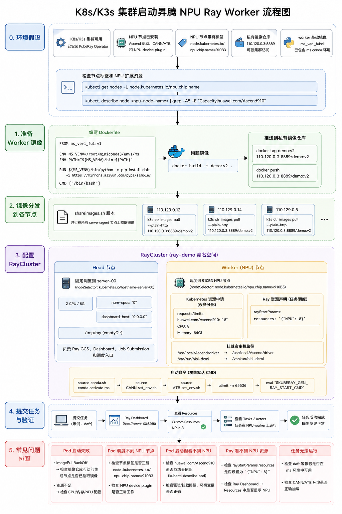

# K8s/K3s 集群启动昇腾 NPU Ray Worker 记录

本文记录如何在 K8s/K3s 集群中为 `RayCluster` 启动昇腾 NPU worker 节点。内容覆盖 worker 镜像准备、镜像分发、KubeRay 配置、任务提交验证，以及常见问题排查。



这套流程要解决两个层面的调度问题：

1. Kubernetes 要知道哪些节点有 Ascend 910B3 NPU，并把 worker Pod 调度到这些节点。
2. Ray 要知道 worker 进程拥有多少 NPU 资源，并把需要 NPU 的任务调度到对应 worker。

如果只完成其中一个层面，集群通常会出现两类问题：Pod 能启动但 Ray 不会分配 NPU 任务，或者 Ray 配置了 NPU 资源但 Kubernetes 没有真正把容器放到 NPU 节点上。

Ray 的基础概念可以参考 [Ray 基础知识整理](docs/ray-basics.md)。

## 仓库结构

- `README.md`：K8s/K3s 集群启动昇腾 NPU Ray worker 的主流程文档。
- `docs/ray-basics.md`：Ray 基础概念、资源模型和 Kubernetes 集成说明。
- `manifests/raycluster-npu-pipeline.yaml`：KubeRay `RayCluster` 配置示例，已去除导出快照中的运行时状态字段。
- `examples/submit_ray_job.py`：通过 Ray Job Submission API 提交任务的脚本。
- `examples/vllm_embedding_benchmark.py`：基于 Ray Data + vLLM 的 NPU embedding 测试脚本。
- `assets/images/`：Markdown 文档使用的 PNG 图片。
- `assets/diagrams/`：可继续编辑或复用的 SVG 架构图。

## 0. 环境假设

开始前默认已经具备以下条件：

- K8s/K3s 集群可用，并已经安装 KubeRay Operator。
- NPU 节点已经安装 Ascend 驱动、CANN/ATB 运行环境和 NPU device plugin。
- NPU 节点带有可用于调度的标签，例如 `node.kubernetes.io/npu.chip.name=910B3`。
- 私有镜像仓库 `110.120.0.3:8889` 能被所有 K3s server/agent 节点访问。

可以先检查节点标签和 NPU 扩展资源：

```bash
kubectl get nodes -L node.kubernetes.io/npu.chip.name
kubectl describe node <npu-node-name> | grep -A5 -E "Capacity|huawei.com/Ascend910"
```

## 1. 整体思路

RayCluster 通常由 head 节点和 worker 节点组成：

- head 节点负责 Ray GCS、Dashboard、Job Submission、集群元数据和调度入口。
- worker 节点负责实际执行任务。
- Kubernetes 负责创建 Pod、挂载宿主机资源、注入设备，并保证 Pod 运行在正确节点上。
- Ray 负责在已启动的 worker 之间调度 Python task/actor。

因此，NPU worker 的关键不是单独写一份 YAML，而是让“镜像、Pod、节点、Ray 资源声明”四件事保持一致：

- 镜像中要有任务运行所需的 Python 包，例如 `daft`。
- Pod 要申请 `huawei.com/Ascend910`，让 Kubernetes 分配真实 NPU 设备。
- Pod 要挂载 Ascend driver/DCMI 路径，并在启动时加载 CANN/ATB 环境变量。
- Ray worker 启动参数要声明 `resources: '{"NPU": 8}'`，让 Ray 调度器看到自定义 NPU 资源。

## 2. 准备 Worker 镜像

worker 镜像基于已有的 `ms_verl_ful:v1`，并把 Python 依赖安装到 `ms` conda 环境中。这样做的原因是：Ray 的 `runtime_env` 适合分发项目代码和轻量依赖，但系统库、NPU 运行时、重量级 Python 环境更适合固定在镜像里，避免 worker 启动后再临时安装导致版本不一致或启动过慢。

### Dockerfile

```dockerfile
FROM ms_verl_ful:v1

ENV MS_VENV=/root/miniconda3/envs/ms
ENV PATH="${MS_VENV}/bin:${PATH}"

# 安装到 Ray worker 实际使用的 ms conda 环境中。
RUN ${MS_VENV}/bin/python -m pip install daft -i https://mirrors.aliyun.com/pypi/simple/

CMD ["/bin/bash"]
```

### 构建与推送镜像

```bash
docker build -t demo:v2 .
docker tag demo:v2 110.120.0.3:8889/demo:v2
docker push 110.120.0.3:8889/demo:v2
```

K3s 默认使用 containerd 运行 Pod，本机 Docker 里存在的镜像不会自动出现在每个节点的 containerd 中。因此需要把镜像推送到私有仓库，再让各个节点拉取同一个镜像。这样可以避免 worker Pod 在不同节点上出现 `ImagePullBackOff` 或镜像版本不一致。

如果私有仓库是 HTTP 服务，`k3s ctr images pull` 需要加 `--plain-http`；如果仓库已经配置 HTTPS，可以去掉这个参数。

```bash
#!/usr/bin/env bash
set -euo pipefail

IMAGE="110.120.0.3:8889/demo:v2"
NODES=("110.129.0.12" "110.129.0.14" "110.129.0.5")
SSH_OPTS="-o StrictHostKeyChecking=no"

echo "Start pulling ${IMAGE} on all target nodes."

for NODE in "${NODES[@]}"; do
  echo "Trigger ${NODE}..."
  ssh ${SSH_OPTS} root@"${NODE}" "k3s ctr images pull --plain-http ${IMAGE}" &
done

wait
echo "All image pull tasks finished."
```

保存为 `shareimages.sh` 后执行：

```bash
chmod +x shareimages.sh
./shareimages.sh
```

建议优先使用 SSH key 登录节点，不要把明文密码写进脚本或提交到仓库。

## 3. 配置 RayCluster

下面是整理后的核心配置。仓库中对应文件位于 `manifests/raycluster-npu-pipeline.yaml`，可以根据集群实际情况继续调整。

配置重点如下：

- `metadata.namespace` 需要和实际命名空间保持一致。本文内联示例使用 `ray-demo`，仓库中的 pipeline 示例文件使用 `ray-testfieldv2`。
- head 节点通过 `nodeSelector` 固定调度到 `server-00`，方便访问 Dashboard 和 Job Submission 服务。
- worker 节点通过 `nodeSelector` 调度到 910B3 NPU 节点。
- worker Pod 通过 `requests/limits` 申请 `huawei.com/Ascend910: "8"`，这是 Kubernetes 层面的设备分配。
- worker 通过 `rayStartParams.resources` 注册 `NPU: 8`，这是 Ray 层面的任务调度资源。
- worker 挂载宿主机 Ascend driver 和 DCMI 路径，让容器内程序能够访问 NPU 驱动和管理接口。
- worker 启动命令中显式加载 conda、CANN 和 ATB 环境，保证 Python 包与 NPU 运行库都在同一个进程环境中生效。

```yaml
apiVersion: ray.io/v1
kind: RayCluster
metadata:
  name: raycluster-npu-demo
  namespace: ray-demo
  labels:
    app.kubernetes.io/instance: raycluster-npu
spec:
  rayVersion: "2.10.0"
  enableInTreeAutoscaling: true
  autoscalerOptions:
    idleTimeoutSeconds: 60

  headGroupSpec:
    serviceType: ClusterIP
    rayStartParams:
      dashboard-host: "0.0.0.0"
      num-cpus: "0"
    template:
      spec:
        nodeSelector:
          kubernetes.io/hostname: server-00
        tolerations:
          - key: node-role.kubernetes.io/control-plane
            operator: Exists
            effect: NoSchedule
        containers:
          - name: ray-head
            image: crpi-gcyqahoi1kzpijkb.cn-hangzhou.personal.cr.aliyuncs.com/panxy1019/panxy:ray-2.10.0-py3100-amd64
            imagePullPolicy: IfNotPresent
            resources:
              requests:
                cpu: "2"
                memory: 8Gi
              limits:
                cpu: "2"
                memory: 8Gi
            volumeMounts:
              - name: log-volume
                mountPath: /tmp/ray
        volumes:
          - name: log-volume
            emptyDir: {}

  workerGroupSpecs:
    - groupName: npu-workers
      replicas: 1
      minReplicas: 1
      maxReplicas: 4
      numOfHosts: 1
      rayStartParams:
        resources: '"{\"NPU\": 8}"'
      scaleStrategy:
        workersToDelete: []
      template:
        metadata:
          annotations:
            ray.io/overwrite-container-cmd: "true"
            volcano.sh/network-topology-highest-tier: "1"
            volcano.sh/network-topology-mode: hard
        spec:
          nodeSelector:
            node.kubernetes.io/npu.chip.name: 910B3
          containers:
            - name: ray-worker
              image: 110.120.0.3:8889/demo:v2
              imagePullPolicy: IfNotPresent
              command:
                - /bin/bash
                - -lc
                - --
              args:
                - |
                  set -e
                  source /root/miniconda3/etc/profile.d/conda.sh
                  conda activate ms
                  source /usr/local/Ascend/cann/ascend-toolkit/set_env.sh
                  source /usr/local/Ascend/cann/nnal/atb/set_env.sh
                  ulimit -n 65536
                  eval "$KUBERAY_GEN_RAY_START_CMD"
              resources:
                requests:
                  cpu: "8"
                  memory: 32Gi
                  huawei.com/Ascend910: "8"
                limits:
                  cpu: "8"
                  memory: 32Gi
                  huawei.com/Ascend910: "8"
              volumeMounts:
                - name: log-volume
                  mountPath: /tmp/ray
                - name: ascend-driver
                  mountPath: /usr/local/Ascend/driver
                  readOnly: true
                - name: ascend-dcmi
                  mountPath: /usr/local/dcmi
                  readOnly: true
          volumes:
            - name: log-volume
              emptyDir: {}
            - name: ascend-driver
              hostPath:
                path: /usr/local/Ascend/driver
            - name: ascend-dcmi
              hostPath:
                path: /usr/local/dcmi
```

应用配置：

```bash
# 使用本文内联示例时，可以保存为自己的 YAML 文件后应用。
kubectl create namespace ray-demo
kubectl apply -f <your-raycluster-yaml>

# 使用仓库中的 pipeline 示例文件时，注意它的 namespace 是 ray-testfieldv2。
kubectl create namespace ray-testfieldv2
kubectl apply -f manifests/raycluster-npu-pipeline.yaml
```

查看启动状态：

```bash
kubectl get raycluster -n ray-demo
kubectl get pods -n ray-demo -o wide
kubectl logs -n ray-demo -l ray.io/node-type=head --tail=100
kubectl logs -n ray-demo -l ray.io/group=npu-workers --tail=100
```

## 4. 提交测试任务

Dashboard 默认在 head Pod 的 8265 端口上。可以通过 SSH 端口转发在本地访问，例如 head Pod IP 为 `10.42.0.23`：

```bash
ssh -L 8265:10.42.0.23:8265 admin@110.120.0.3
```

然后在浏览器打开：

```text
http://127.0.0.1:8265
```

提交任务前，可以准备一个简单的测试脚本。仓库中的 `examples/vllm_embedding_benchmark.py` 用来确认 Ray 能把任务调度到带 NPU 资源的 worker 上，并执行 vLLM embedding 测试。

```python
import time
from typing import Any, Dict

import ray


# ======================================================
# 每个 Actor 持有一个 vLLM Engine
# ======================================================
class VLLMEmbeddingPredictor:

    def __init__(self):
        from vllm import LLM

        print("🚀 初始化 vLLM Engine...")

        self.llm = LLM(
            model="/tmp/ms_cache/qwen/Qwen2-0___5B",
            task="embed",
            trust_remote_code=True,
            enforce_eager=True,
            max_model_len=512,
            gpu_memory_utilization=0.9,
        )

    def __call__(self, batch: Any) -> Dict[str, list]:
        import numpy as np
        texts = batch["text"].tolist()

        outputs = self.llm.embed(texts)

        # vLLM embed 输出
        embeddings = [x.outputs.embedding for x in outputs]
        return {
    "text": texts,
    "embedding": np.array(embeddings, dtype=np.float32), # 强制类型转换
}

# ======================================================
# Main
# ======================================================
def main():

    ray.init(
        address="auto",
        runtime_env={
            "env_vars": {
                "LD_LIBRARY_PATH": (
                    "/usr/local/Ascend/cann/ascend-toolkit/8.3.RC1/hccl/lib64:"
                    "/usr/local/Ascend/cann/ascend-toolkit/8.3.RC1/aarch64-linux/lib64:"
                    "/usr/local/Ascend/cann/ascend-toolkit/8.3.RC1/fwkacllib/lib64:"
                    "/usr/local/Ascend/cann/ascend-toolkit/8.3.RC1/tools/aml/lib64:"
                    "/usr/local/Ascend/cann/ascend-toolkit/8.3.RC1/tools/aml/lib64/plugin:"
                    "/usr/local/Ascend/cann/ascend-toolkit/8.3.RC1/lib64:"
                    "/usr/local/Ascend/cann/ascend-toolkit/8.3.RC1/lib64/plugin/opskernel:"
                    "/usr/local/Ascend/cann/ascend-toolkit/8.3.RC1/lib64/plugin/nnengine:"
                    "/usr/local/Ascend/cann/ascend-toolkit/8.3.RC1/opp/built-in/op_impl/ai_core/tbe/op_tiling/lib/linux/aarch64:"
                    "/usr/local/Ascend/driver/lib64/driver:"
                    "/usr/local/Ascend/driver/lib64/common:"
                    "/usr/local/Ascend/driver/lib64:"
                    "/usr/local/Ascend/cann/nnal/atb/8.3.RC1/atb/cxx_abi_1/lib:"
                    "/usr/local/lib"
                )
            }
        },
    )

    print("=" * 60)
    print("Connected!")
    print(ray.available_resources())
    print("=" * 60)

    # --------------------------------------------------
    # 生成测试数据
    # --------------------------------------------------

    num_records = 100000

    dataset = ray.data.from_items(
        [{"text": f"这是第{i}条测试文本"} for i in range(num_records)],
        override_num_blocks=24,
    )

    print("Dataset Ready.")

    start = time.time()

    # --------------------------------------------------
    # 分布式 Embedding
    # --------------------------------------------------

    embedded = dataset.map_batches(
        VLLMEmbeddingPredictor,
        batch_format="pandas",

        # 每张卡一个 Actor
        concurrency=16,

        # 每批大小
        batch_size=128,

        # 每个 Actor 占一个 NPU
        resources={
            "NPU": 1
        },
    )
    results = embedded.take_all()

    # 保存路径：改成你提交端机器上你想放的位置
    output_dir = "/ray_job_test/vllm"
    os.makedirs(output_dir, exist_ok=True)
    output_file = os.path.join(output_dir, "embeddings.jsonl")

    df = pd.DataFrame(results)

    # embedding 可能是 numpy array，转成纯 Python list，避免 JSON 序列化失败
    if "embedding" in df.columns:
        df["embedding"] = df["embedding"].apply(
            lambda x: x.tolist() if hasattr(x, "tolist") else x
        )

    df.to_json(output_file, orient="records", lines=True, force_ascii=False)
    total = embedded.count()

    elapsed = time.time() - start

    print("=" * 60)
    print(f"Total Rows : {total}")
    print(f"Elapsed    : {elapsed:.2f}s")
    print(f"Throughput : {total/elapsed:.2f} req/s")
    print("=" * 60)


if __name__ == "__main__":
    main()


```

再通过 Ray Job Submission API 提交。仓库中对应脚本为 `examples/submit_ray_job.py`：

```python
import time
from ray.job_submission import JobSubmissionClient

# 1. 连接到 Head 节点的 Dashboard 端口
client = JobSubmissionClient("http://10.42.0.23:8265")

print("🔄 正在打包并提交任务到 Ray 集群...")

# 2. 提交任务
job_id = client.submit_job(
    # 集群执行的命令
    entrypoint="python examples/vllm_embedding_benchmark.py",
    # runtime_env 的 working_dir 会把当前目录和 examples/ 一起打包传给集群
    runtime_env={
        "working_dir": "./"
    }
)

print(f"✅ 任务已成功提交！")
print(f"🆔 Job ID: {job_id}")
print("-" * 50)
print("📜 以下是集群实时传回的运行日志：\n")

# 3. 实时跟踪并打印集群的日志输出
try:
    for line in client.tail_job_logs(job_id):
        print(line, end="")
except KeyboardInterrupt:
    print("\n\n⚠️ 你在本地按下了 Ctrl+C。")
    print("ℹ️ 任务仍然在集群上继续运行。如果想停止它，请使用：")
    print(f"    ray job stop {job_id} --address http://10.42.0.21:8265")

# 4. 获取最终状态
status = client.get_job_status(job_id)
print("\n" + "-" * 50)
print(f"🏁 任务最终状态: {status}")


```

如果测试成功，通常能同时看到三类信息：

- Ray job 状态为 `SUCCEEDED`。
- 任务日志中能打印 Ray 可用资源、处理总量和吞吐。
- NPU worker 能正常加载 vLLM、模型路径和 Ascend 运行时环境。

## 5. 常见问题排查

### Pod 一直 Pending

优先检查 Kubernetes 是否能看到 NPU 扩展资源，以及 worker 的 `nodeSelector` 是否能匹配到节点：

```bash
kubectl describe pod -n ray-demo <worker-pod-name>
kubectl get nodes -L node.kubernetes.io/npu.chip.name
kubectl describe node <npu-node-name> | grep huawei.com/Ascend910 -A3
```

如果 `huawei.com/Ascend910` 不存在，通常是 NPU device plugin 未安装、未正常运行，或者节点驱动没有被正确识别。

### Worker 已启动，但 Ray Dashboard 看不到 NPU

检查 `workerGroupSpecs[].rayStartParams.resources` 是否存在，并确认转义格式正确：

```yaml
rayStartParams:
  resources: '"{\"NPU\": 8}"'
```

这里的 `NPU` 是 Ray 自定义资源名称，后续 Ray 任务也要用同一个名字申请资源：

```python
@ray.remote(resources={"NPU": 1})
def run_on_npu():
    ...
```

### 任务中无法导入 daft

确认 `daft` 安装到了 worker 实际激活的 conda 环境中：

```bash
/root/miniconda3/envs/ms/bin/python -m pip show daft
```

如果包安装在系统 Python 或其他 conda 环境里，Ray worker 启动后就可能找不到。

### 容器内找不到 Ascend 动态库

检查 hostPath 挂载和环境变量加载：

```bash
kubectl exec -n ray-demo -it <worker-pod-name> -- bash
ls /usr/local/Ascend/driver
ls /usr/local/dcmi
echo $ASCEND_HOME_PATH
```

如果路径存在但环境变量为空，重点检查 worker 启动命令中的：

```bash
source /usr/local/Ascend/cann/ascend-toolkit/set_env.sh
source /usr/local/Ascend/cann/nnal/atb/set_env.sh
```

### 镜像拉取失败

如果 Pod 报 `ImagePullBackOff`，需要检查私有仓库地址、节点网络连通性，以及 containerd 是否允许 HTTP 仓库：

```bash
k3s ctr images pull --plain-http 110.120.0.3:8889/demo:v2
```

## 6. 小结

这份配置的核心逻辑是：Kubernetes 负责把 worker Pod 放到真实 NPU 节点并分配设备，Ray 负责把需要 NPU 的任务调度到已经注册 `NPU` 自定义资源的 worker 上。镜像、设备申请、hostPath 挂载和 Ray 资源声明必须同时正确，NPU 任务才能稳定运行。
