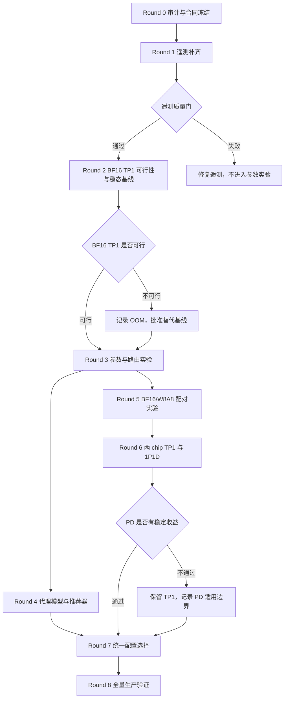

# 面向昇腾 910C 的 K12 数据生产与 SLA 感知推理优化实施计划

## 1. 文档目的

本文基于《面向昇腾 910C 的 K12 大模型数据生产与 SLA 感知推理优化项目总纲》和当前已经跑通的生产工程，制定 Round 0 至 Round 8 的详细实施计划。

本计划只定义后续代码改造、受控实验、质量门和交付物，不立即修改生产链路，也不启动大规模实验。所有性能结论必须由完整 Manifest、逐请求 Trace 和设备时序共同支持。

## 2. 当前系统事实

### 2.1 已验证能力

当前生产链路已经完成以下闭环：

```text
MinIO PDF
  -> Daft Manifest
  -> Ray 文档状态机
  -> MinerU 双 Serve 解析
  -> CPU 确定性清洗
  -> 六路 Qwen TP1 vLLM
  -> QA/MCQ 生成与 Schema 校验
  -> MinIO 原子发布
  -> Dagster 书籍级和资源级可视化
```

最近一次资源层级 Smoke：

| 项目 | 结果 |
|---|---:|
| Dagster Run ID | `bffe0caa-58c7-4192-b353-120975a38936` |
| Dagster 步骤 | 139/139 成功 |
| Ray 文档 | 10/10 成功 |
| Ray 墙钟 | 1172.245 秒 |
| Qwen 逻辑请求 | 301 |
| 成功模型响应 | 286 |
| 耗尽重试请求 | 15 |
| 最终 NPU Worker | 0 |

当前资源布局：

```text
MinerU：
  Phy-ID 14、15
  一个 Worker Pod
  两个独立 MinerU Serve

Qwen：
  Phy-ID 8 至 13
  三个 Worker Pod
  每个 Pod 两个独立 TP1 vLLM Serve
  共六个 endpoint
```

### 2.2 当前真实推理配置

当前 Qwen 服务不是 BF16 基线，而是 W8A8：

```text
模型路径：/models/Qwen3.6-35B-A3B-w8a8
quantization：ascend
dtype：bfloat16
tensor_parallel_size：1
max_num_seqs：8
max_num_batched_tokens：4096
gpu_memory_utilization：0.85
ACLGraph：FULL_DECODE_ONLY
路由：least-inflight
单 endpoint 最大客户端并发：8
Judge：关闭
```

`dtype=bfloat16` 只表示部分计算数据类型，不能把已经使用 W8A8 权重和 `--quantization ascend` 的服务称为 BF16 权重基线。

### 2.3 当前遥测缺口

当前代码已经记录总请求延迟、token、重试、活跃请求和实际 Pod/Serve/Chip 分配，但还不能支持严格的 SLA 性能归因：

1. HTTP 客户端等待完整响应，未记录逐请求 first token，缺少 TTFT 和 TPOT。
2. Qwen attempt error 仍聚合计数，未按 HTTP、连接、超时、模型、JSON、Schema 等原因分类。
3. `/metrics` 能力没有接入 autoscale no-Judge 正式链路。
4. 缺少每秒 AICore、HBM、功耗和温度时序。
5. 缺少 vLLM running、waiting 和 KV Cache 水位的完整分布。
6. `recent_assignments` 只保留最近 1000 条，不适合作为全量实验 Trace。
7. 当前 1192 秒基线同时包含 Worker 冷启动、模型加载、MinerU、Cleaning 和 QA，不能替代稳态推理基线。
8. 当前改进同时包含六副本、Judge 关闭等变化，不能用于单变量归因。

### 2.4 两个前置风险

#### BF16 TP1 可行性

当前每个 chip 的 HBM 为 64 GiB，W8A8 服务空闲 HBM 已约 53.75 GiB。Qwen 35B 级模型的 BF16 权重可能无法在单 chip TP1 中安全加载。

Round 2 必须先做 BF16 TP1 加载可行性门。若出现确定性 OOM，不得把 TP2 结果伪装成 TP1 基线。应客观记录失败，并在以下方案中单独立项：

```text
方案 A：BF16 TP2，明确 topology 已变化
方案 B：保持 TP1，使用同系列更小 BF16 模型
方案 C：将 BF16 仅作为质量参考，不纳入同拓扑吞吐对照
```

#### Prefill-Decode 支持性

当前镜像为 `vllm-ascend-worker:v0.21.0rc1-a3-20260713-s3`。Round 6 前必须验证该版本是否完整支持目标 KV Connector、分离式调度、指标暴露和故障恢复。若不支持，应构建独立实验镜像，不能替换生产镜像。

## 3. 总体实施策略

### 3.1 生产与实验隔离

新增独立实验工程边界：

```text
k12_clean_qa_pipeline/
├── performance_lab/
│   ├── contracts/
│   ├── replay/
│   ├── telemetry/
│   ├── runners/
│   ├── analysis/
│   ├── optimizer/
│   ├── quality/
│   ├── topologies/
│   └── tests/
├── configs/
│   └── performance/
├── dagster_defs/
│   └── performance_jobs.py
├── scripts/
│   └── performance/
└── reports/
    └── performance/
```

隔离原则：

1. 当前 `k12_e2e_autoscale_nojudge_job` 保留为生产回退基线。
2. 性能实验使用独立 RayCluster，例如 `raycluster-k12-perf`。
3. 稳态实验提前创建 Worker 和模型服务，不启用 Worker autoscale。
4. 实验输出统一写入 `s3://k12-performance-runs/`，不覆盖生产结果。
5. 性能回放直接使用冻结的 Stage 1 结构化输入和 HTTP 请求体，不重复执行 MinerU。
6. Round 8 之前不把实验推荐参数写回生产默认配置。

### 3.2 统一运行产物

每轮每个重复实验写入：

```text
s3://k12-performance-runs/
  <round>/<experiment_id>/<run_id>/
  ├── config.json
  ├── config.sha256
  ├── environment_manifest.json
  ├── workload_manifest.json
  ├── request_payloads.parquet
  ├── request_traces.parquet
  ├── request_attempts.parquet
  ├── endpoint_timeseries.parquet
  ├── npu_timeseries.parquet
  ├── ray_timeseries.parquet
  ├── error_samples.jsonl
  ├── quality_metrics.json
  ├── service_events.jsonl
  └── run_summary.json
```

`run_summary.json` 必须最后写入，并包含所有文件 SHA256。原始 Trace 和时序一旦完成，不允许原地覆盖。

### 3.3 统一实验状态机

```text
CREATED
  -> ENV_AUDITED
  -> SERVICES_READY
  -> WARMED_UP
  -> REPLAYING
  -> DRAINING
  -> VALIDATING
  -> SUCCEEDED / FAILED / ABORTED
```

主计时区间只使用 `REPLAYING`。Worker 创建、模型加载和预热进入独立冷启动指标。

### 3.4 统一安全阈值

阈值在 Round 0 冻结，首版建议：

```text
HBM 硬停止：>= 61 GiB/chip 或连续增长无回落
Pod RSS 硬停止：>= limit 的 90%
连续健康失败：2 次
连续请求失败：10 次或 60 秒内失败率 > 20%
服务 P95：超过基线 2 倍并持续 60 秒
NPU 温度：达到运维规定上限
输出质量：Schema 有效率低于冻结基线
```

具体温度和 HBM 阈值必须以设备运维规范及 Round 0 实测为准，不能只凭经验写入生产。

## 4. 实验数据集与回放合同

### 4.1 固定数据集

建立三个互不混用的数据集：

| 数据集 | 用途 | 组成 |
|---|---|---|
| `K12-PERF-SMOKE-10` | 功能和遥测 Smoke | 当前已验证 10 本 |
| `K12-PERF-30` | 参数实验和代理模型 | 按学科、页数、块数、输入输出长度分层的固定 30 本 |
| `K12-QUALITY-400` | BF16/W8A8 配对质量评估 | 200 条 QA、200 条 MCQ，来源教材互不泄漏 |

`K12-PERF-30` 需要覆盖：

```text
短、中、长教材
短、中、长 prompt
短、中、长 completion
公式密集
表格密集
图像描述密集
OCR 噪声
QA/MCQ 不同比例
请求平稳到达和突发到达
```

### 4.2 固定请求

Round 2 至 Round 7 使用同一组预生成请求：

```json
{
  "request_id": "...",
  "document_id": "...",
  "block_ids": ["..."],
  "task_type": "qa_mcq_generation",
  "messages": [],
  "temperature": 0,
  "max_tokens": 1200,
  "prompt_version": "k12-qa-zh-v1.2",
  "payload_sha256": "..."
}
```

请求回放顺序、到达间隔和随机种子进入 `workload_manifest.json`。每次实验不得临时重新切块或重新生成 Prompt。

### 4.3 工作负载 Profile

至少固定四类：

```text
REAL：
  真实 K12 请求长度和到达顺序

STEADY：
  固定到达率，用于容量边界

BURST：
  周期性突发，用于队列和尾延迟

LONG-TAIL：
  保留真实长尾 prompt/completion，用于调度公平性
```

Round 6 另增加：

```text
LONG-PREFILL：长输入、短输出
DECODE-HEAVY：短输入、长输出
```

## 5. 实验依赖图



## 6. Round 0：只读审计与实验合同冻结

### 6.1 研究假设

当前生产代码可以作为功能参考，但现有数据不足以支持稳态推理和 SLA 归因。先冻结环境、请求和指标合同，可以避免后续实验因 Prompt、模型或数据变化而失效。

### 6.2 唯一主要变量

无性能变量。本轮只冻结实验合同。

### 6.3 代码修改范围

只读审计：

```text
dagster_defs/autoscale_nojudge_job.py
autoscale_nojudge/driver.py
autoscale_nojudge/qwen_pool.py
autoscale_nojudge/k8s/render_cluster.py
stage2_qa/core.py
stage2_qa/qwen.py
```

新增：

```text
performance_lab/contracts/schema.py
performance_lab/contracts/environment.py
performance_lab/contracts/workload.py
performance_lab/contracts/config_hash.py
configs/performance/slo.yaml
configs/performance/workload_sets.yaml
```

### 6.4 新增配置

```text
experiment_id
round_id
code_revision
image_digest
model_path
model_revision
tokenizer_revision
prompt_version
random_seed
workload_manifest
slo_profile
output_prefix
```

### 6.5 具体工作

1. 记录宿主机、容器和 NPU 的软件版本。
2. 记录镜像 RepoDigest，不只记录 tag。
3. 记录 CANN、驱动、固件、torch、torch_npu、vLLM Ascend、Ray、Python。
4. 建立 10 本、30 本和质量 400 条 Manifest。
5. 生成固定请求 payload 和 token 长度统计。
6. 冻结 no-Judge 性能回放合同。
7. 冻结独立质量评估合同，避免把性能测试中的 Judge 开关混入主变量。
8. 定义所有 Parquet 和 JSON Schema。

本轮实验矩阵不使用 NPU：

```text
C0：Schema 静态校验
C1：相同输入重复生成两次，比较 Manifest 和 payload SHA256
C2：生产前缀只读检查与实验前缀写入检查
```

教材和请求范围为当前固定 10 本、候选 30 本及其 Stage 1 结构化产物。

### 6.6 遥测

本轮只检查字段合同，不采集正式性能数据。

### 6.7 验收指标

```text
所有 Manifest 可解析
所有输入对象 SHA256 已记录
请求 payload 可重复生成且 SHA256 稳定
相同请求的 token 统计稳定
环境 Manifest 不包含明文密钥
生产前缀只读
实验前缀独立
```

### 6.8 失败停止条件

1. 无法确定模型精确版本或 tokenizer 版本。
2. 请求无法稳定重建。
3. 输出前缀可能覆盖生产数据。
4. 环境版本无法采集。

### 6.9 回滚

只新增合同和 Manifest，不修改生产代码。删除未发布的实验目录即可。

### 6.10 输出

```text
s3://k12-performance-runs/round0/contracts/<contract_version>/
reports/performance/ROUND0_AUDIT_AND_CONTRACT_REPORT.md
```

### 6.11 下一轮依赖

Round 1 只能使用本轮冻结的 Trace Schema、设备映射和时间同步规范。

## 7. Round 1：逐请求与一秒级遥测补齐

### 7.1 研究假设

补齐 TTFT、TPOT、vLLM 队列和 NPU 时序后，能够把排队、Prefill、Decode、客户端解析和设备空闲区分开，而不是只观察总延迟。

### 7.2 唯一主要变量

遥测开关。模型、endpoint 数、并发、Prompt 和请求顺序保持不变。

### 7.3 代码修改

新增：

```text
performance_lab/telemetry/request_trace.py
performance_lab/telemetry/sse_client.py
performance_lab/telemetry/vllm_scraper.py
performance_lab/telemetry/npu_sampler.py
performance_lab/telemetry/ray_sampler.py
performance_lab/telemetry/parquet_sink.py
performance_lab/telemetry/error_classifier.py
performance_lab/tests/test_telemetry_contract.py
```

小范围修改：

```text
autoscale_nojudge/qwen_pool.py
  增加可选 trace sink 和 attempt 级事件
  不再依赖 recent_assignments 作为持久 Trace

stage2_qa/core.py
  透传 run_id、request_id、config_hash

autoscale_nojudge/k8s/render_cluster.py
  暴露实验模式 metrics 端口
  增加实验采样容器或采样进程
```

### 7.4 新增配置

```text
telemetry_enabled
streaming_enabled
sample_interval_seconds=1
trace_flush_rows
trace_flush_seconds
metrics_scrape_timeout
redact_error_payload
clock_sync_tolerance_ms
```

### 7.5 实验矩阵

| 实验 | 遥测 | streaming | 目的 |
|---|---|---|---|
| T0 | 关闭 | 关闭 | 原客户端参考 |
| T1 | 开启 | 关闭 | 测采样本身开销 |
| T2 | 开启 | 开启 | 获取 TTFT/TPOT |

固定六 endpoint、并发 8、W8A8、10 本 Smoke。每项重复 3 次，模型预热后计时。

教材和请求固定使用 `K12-PERF-SMOKE-10`，三组实验共享完全相同的 payload、顺序和到达间隔。

### 7.6 采集字段

逐逻辑请求：

```text
submit、dispatch、first_token、finish
queue_wait、TTFT、TPOT、E2E
prompt/completion tokens
endpoint、pod、chip、actor
inflight、retry_count、result_status
```

逐 attempt：

```text
attempt_index
HTTP status
连接耗时
首字节时间
错误分类
脱敏错误摘要
退避时间
```

每秒：

```text
AICore、HBM、功耗、温度
vLLM running、waiting、KV Cache
endpoint inflight
Ray pending/active
Pod CPU、RSS、throttling
```

### 7.7 验收指标

```text
Trace 覆盖率 = 100%
request_id 唯一率 = 100%
成功流式响应可重建 JSON = 100%
设备样本缺失率 < 1%
vLLM 样本缺失率 < 1%
跨数据源时间偏差 <= 200 ms
遥测导致吞吐下降 <= 3%
遥测导致 P95 上升 <= 5%
```

### 7.8 失败停止条件

1. streaming 改变最终 JSON 内容或 Schema 有效率。
2. 采样导致服务健康异常。
3. 时钟无法对齐。
4. Trace 丢失或 request_id 无法关联。

### 7.9 回滚

遥测全部受 `telemetry_enabled` 控制。关闭后回到原同步请求路径，生产默认保持关闭，直到 Round 1 验收通过。

### 7.10 输出

```text
s3://k12-performance-runs/round1/telemetry-overhead/
reports/performance/ROUND1_TELEMETRY_VALIDATION_REPORT.md
```

### 7.11 下一轮依赖

Round 2 必须使用 T2 验证通过的统一客户端和采样器。

## 8. Round 2：BF16 普通 TP1 稳态可复现基线

### 8.1 研究假设

在相同请求、Prompt 和服务拓扑下，可以建立独立于冷启动的 BF16 TP1 稳态基线。该假设首先受 64 GiB HBM 可行性约束。

### 8.2 唯一主要变量

本轮首先只验证 BF16 TP1 是否能加载。可行后只固定 BF16 配置重复测量，不扫描参数。

### 8.3 代码修改

新增：

```text
performance_lab/topologies/tp1.py
configs/performance/services/bf16_tp1.yaml
scripts/performance/run_bf16_tp1_feasibility.sh
scripts/performance/run_round2_baseline.sh
```

修改实验版 K8s 渲染器，使以下参数显式化：

```text
model_path
precision
quantization
active_endpoints
max_num_seqs
max_num_batched_tokens
gpu_memory_utilization
compilation_config
```

### 8.4 实验矩阵

阶段 A，单 chip 加载 Smoke：

```text
1 endpoint
TP1
BF16 权重
并发 1
一个最短请求
```

阶段 B，六 endpoint 稳态基线，仅在阶段 A 通过后：

```text
6 endpoint
并发 8
max_num_seqs=8
max_num_batched_tokens=4096
least-inflight
REAL workload
3 次正式重复
```

如果阶段 A OOM，停止 BF16 TP1，并输出可行性报告。替代方案需重新审批后单列配置，不能直接进入阶段 B。

### 8.5 教材与请求

Smoke 使用 `K12-PERF-SMOKE-10` 中最短请求；正式基线使用 `K12-PERF-30` 的固定 REAL 回放。

### 8.6 遥测

使用 Round 1 全量遥测，并额外记录：

```text
权重加载时间
预热时间
空闲 HBM
峰值 HBM
首次请求 ACLGraph 编译时间
稳态前若干请求排除标记
```

### 8.7 验收指标

```text
3 次重复全部成功
请求成功率 >= 99%
Schema 有效率不低于冻结基线
HBM 保留 >= Round 0 安全余量
关键指标变异系数 <= 5%
所有 Trace 和时序完整
```

### 8.8 失败停止条件

```text
模型加载 OOM
HBM 达硬阈值
连续健康失败
正式重复之间配置哈希不一致
请求失败率 > 1%
```

### 8.9 回滚

删除实验 Worker，保留 W8A8 生产镜像和配置不变。

### 8.10 输出

```text
s3://k12-performance-runs/round2/bf16-tp1/
reports/performance/ROUND2_BF16_TP1_FEASIBILITY_REPORT.md
reports/performance/ROUND2_BF16_TP1_STEADY_BASELINE.md
```

### 8.11 下一轮依赖

Round 3 使用本轮安全基线。若 BF16 TP1 不可行，则使用审批后的替代基线，并在所有报告中明确 topology 差异。

## 9. Round 3：endpoint、并发、batch 与路由试验

### 9.1 研究假设

有效吞吐不是 endpoint 和并发的单调函数。队列、长尾请求、KV Cache 和 HBM 会形成饱和点；length-aware 路由可能降低尾延迟和负载不均衡。

### 9.2 本轮唯一主要变量

本轮分成五个独立 Campaign。每个 Campaign 只改变一个主要变量，前一 Campaign 选出的安全值成为下一 Campaign 的固定值。

### 9.3 代码修改

新增：

```text
performance_lab/replay/runner.py
performance_lab/replay/arrival.py
performance_lab/replay/profiles.py
performance_lab/runners/matrix_runner.py
performance_lab/runners/repetition.py
performance_lab/analysis/statistics.py
performance_lab/analysis/pareto.py
performance_lab/optimizer/routing.py
configs/performance/round3_matrix.yaml
```

`qwen_pool.py` 的生产 least-inflight 保持不变；实验路由实现放在 `performance_lab/optimizer/routing.py`。

### 9.4 实验矩阵

共同条件：

```text
固定模型精度
固定 Prompt
固定生成参数
固定 REAL workload
固定预热
每配置重复 3 次
请求顺序采用预注册 Latin square 轮换
```

Campaign A，endpoint：

```text
2、4、6
```

Campaign B，单 endpoint 并发：

```text
2、4、8
```

Campaign C，`max_num_seqs`：

```text
8、16、32
```

Campaign D，`max_num_batched_tokens`：

```text
2048、4096、8192
```

每升一档先做 HBM Smoke，8192 不安全时不得进入正式回放。

Campaign E，路由：

```text
least-inflight
length-aware least-work
```

完成单变量筛选后，再使用 12 个预注册 D-optimal 组合验证二阶交互，每个组合重复 3 次。该阶段的目的只是估计交互，不替代前面的单变量归因。

所有正式 Campaign 使用 `K12-PERF-30`。10 本集合只用于每个新参数档位的安全 Smoke。

### 9.5 length-aware 定义

首版估计工作量：

```text
estimated_work =
  alpha * prompt_tokens
  + beta * requested_max_tokens
  + gamma * endpoint_inflight_tokens
```

参数只使用训练轮历史数据拟合，不能读取当前请求真实 completion 长度。

### 9.6 遥测

Round 1 全量字段，并增加：

```text
路由决策分数
endpoint 预测工作量
endpoint 实际 token 工作量
请求迁移次数
每 endpoint 请求数和 token 数 CV
```

### 9.7 验收指标

每个配置必须给出：

```text
成功请求/s
generation tokens/s
schema-valid samples/min
P50/P95/P99 E2E
P50/P95 TTFT
P50/P95 TPOT
retry 和 error 分类
HBM peak
AICore 分布
NPU-seconds/sample
NPU-seconds/1000 valid tokens
95% 置信区间
```

路由候选只有同时满足以下条件才胜出：

```text
P95 不劣化
成功率不下降
endpoint token 工作量 CV 下降
有效吞吐提高或持平
```

### 9.8 失败停止条件

1. HBM 或温度触发安全阈值。
2. waiting 持续增长且不能排空。
3. P95 连续超过基线 2 倍。
4. 成功率低于 99%。
5. 三次重复配置或工作负载哈希不一致。

### 9.9 回滚

每个配置使用独立服务启动参数。失败后销毁实验服务，恢复 Round 2 安全配置。

### 9.10 输出

```text
s3://k12-performance-runs/round3/<campaign>/<config_hash>/
reports/performance/ROUND3_PARAMETER_SENSITIVITY_REPORT.md
reports/performance/ROUND3_ROUTING_COMPARISON_REPORT.md
```

### 9.11 下一轮依赖

Round 4 使用所有通过质量门的 Round 2、Round 3 数据训练代理模型。失败和 OOM 样本保留，用于安全边界建模。

## 10. Round 4：性能代理模型与 SLA/SLO 推荐器

### 10.1 研究假设

工作负载特征和推理配置可以预测吞吐、P95/P99、失败概率和资源风险；带不确定度的离线推荐器可以优于固定默认配置。

### 10.2 唯一主要变量

代理模型类型。本轮不运行新的服务参数矩阵，主要复用 Round 2 和 Round 3 数据。

### 10.3 代码修改

新增：

```text
performance_lab/analysis/features.py
performance_lab/analysis/group_split.py
performance_lab/optimizer/linear_baseline.py
performance_lab/optimizer/tree_surrogate.py
performance_lab/optimizer/quantile_model.py
performance_lab/optimizer/uncertainty.py
performance_lab/optimizer/recommender.py
performance_lab/optimizer/safe_fallback.py
performance_lab/tests/test_recommender.py
configs/performance/slo_profiles.yaml
```

### 10.4 模型顺序

1. 规则基线。
2. 线性或广义线性基线。
3. XGBoost/LightGBM；依赖不可用时使用 sklearn HistGradientBoosting。
4. P95/P99 分位数回归。
5. Gaussian Process 或 bootstrap ensemble 不确定度模型。

### 10.5 新增配置和实验矩阵

```text
feature_version
target_version
group_split_seed
surrogate_type
quantile_levels=[0.50,0.95,0.99]
uncertainty_method
maximum_prediction_uncertainty
safe_baseline_config_hash
```

固定比较：

| 候选 | 目标 |
|---|---|
| 规则基线 | 验证复杂模型是否真正有收益 |
| 线性模型 | 建立可解释基线 |
| 树模型 | 学习非线性和交互 |
| 分位数模型 | 预测 P95/P99 |
| 不确定度模型 | 决定推荐或安全回退 |

使用 Round 2 和 Round 3 的 `K12-PERF-30` 运行数据，不新增在线请求。每个模型使用相同教材级划分和相同特征版本。

### 10.6 数据划分

必须按完整教材 Group Split：

```text
训练：60%
验证：20%
测试：20%
```

同一本书的请求不得跨集合。重复实验以 run_id 分组，避免同源泄漏。

### 10.7 遥测和数据输入

本轮不重新采集 NPU。输入必须包含已经通过 Round 1 合同验证的：

```text
request_traces.parquet
endpoint_timeseries.parquet
npu_timeseries.parquet
quality_metrics.json
environment_manifest.json
```

缺少任一关键数据源的 Run 不进入训练集。

### 10.8 推荐器输入输出

输入：

```text
请求数
prompt/completion 分布估计
QA/MCQ 比例
arrival rate 和 burstiness
可用 chip
P95/P99 阈值
成功率阈值
HBM 安全阈值
```

输出：

```text
endpoint 数
并发
max_num_seqs
max_num_batched_tokens
路由
预测吞吐
预测 P95/P99
预测失败率
预测 HBM
不确定度
回退配置
```

### 10.9 验收指标

在冻结测试集上：

```text
吞吐 MAPE <= 10%
P95 MAPE <= 15%
HBM peak MAE <= 2 GiB
失败风险召回率 >= 95%
SLA 违规配置漏判率 <= 2%
推荐配置实测 SLA 通过率 >= 95%
```

若样本量不足以达到指标，报告学习曲线和不确定度，不得通过随机拆请求提高表面精度。

### 10.10 失败停止条件

1. 教材级数据泄漏。
2. SLA 违规漏判超过阈值。
3. 推荐配置超出已验证安全边界。
4. 不确定度过高却未回退。

### 10.11 回滚

推荐器首版只离线输出，不自动修改运行配置。生产继续使用冻结安全基线。

### 10.12 输出

```text
s3://k12-performance-runs/round4/models/<model_version>/
reports/performance/ROUND4_SURROGATE_MODEL_REPORT.md
reports/performance/ROUND4_SLA_RECOMMENDER_REPORT.md
```

### 10.13 下一轮依赖

Round 7 才把 precision 和 topology 加入统一推荐空间。

## 11. Round 5：BF16 与 W8A8 配对质量和性能实验

### 11.1 研究假设

W8A8 可以降低 HBM 或提高吞吐，但必须通过配对质量评估证明其质量损失处于预注册非劣效边界内。

### 11.2 唯一主要变量

权重精度：BF16 与 W8A8。其余参数使用两者都安全的共同配置。

### 11.3 代码修改

新增：

```text
performance_lab/quality/pairing.py
performance_lab/quality/programmatic.py
performance_lab/quality/evidence.py
performance_lab/quality/mcq.py
performance_lab/quality/noninferiority.py
configs/performance/round5_precision.yaml
```

新增配置：

```text
precision
model_path
model_digest
quantization
common_topology
common_concurrency
quality_set_manifest
noninferiority_thresholds
```

### 11.4 实验矩阵

```text
BF16，共同 topology，共同并发，3 次
W8A8，共同 topology，共同并发，3 次
```

同一请求必须保持：

```text
相同 payload
相同到达顺序
相同 temperature=0
相同 max_tokens
相同 endpoint 数
相同路由
```

若 BF16 TP1 不可行，只能在经过批准的共同 topology 上比较，例如两者都使用 TP2。不能用 BF16 TP2 对 W8A8 TP1 后声称差异来自量化。

### 11.5 质量集

`K12-QUALITY-400` 采用盲化 model label。自动质量门包括：

```text
Schema 有效率
证据子串和 block_id 一致性
程序数学复算
MCQ 唯一正确答案
数学等价选项冲突
答案非空和可回答性
去重后最终可用率
```

需要语义判断的指标使用冻结 Judge 模型和 Prompt，在 BF16/W8A8 两组完成后离线统一评估。Judge 本身不参与性能计时。

### 11.6 遥测

Round 1 全量遥测，并记录模型加载和空闲/峰值 HBM。

### 11.7 验收指标

非劣效边界在 Round 0 冻结，建议：

```text
最终可用率下降不超过 2 个百分点
答案正确性下降不超过 2 个百分点
证据一致性下降不超过 1 个百分点
MCQ 唯一正确率不下降
Schema 有效率不下降
```

性能输出 Pareto 前沿，不用单一加权分数掩盖质量损失。

### 11.8 失败停止条件

1. 两组请求或 topology 不一致。
2. 质量集存在数据泄漏。
3. W8A8 超出任一硬性非劣效边界。
4. BF16 发生不可恢复 OOM。

### 11.9 回滚

实验服务独立销毁。生产继续使用现有 W8A8，除非最终报告和审批明确更新。

### 11.10 输出

```text
s3://k12-performance-runs/round5/precision-paired/
reports/performance/ROUND5_BF16_W8A8_PARETO_REPORT.md
```

### 11.11 下一轮依赖

Round 6 使用 Round 5 证明质量合格且 HBM 可行的精度。

## 12. Round 6：两 chip TP1 与 1P1D 对照

### 12.1 研究假设

PD 分离只会在特定 prompt/output 分布下降低 TTFT 或提高有效吞吐，其收益必须覆盖 KV 传输和双队列开销。

### 12.2 唯一主要变量

拓扑：

```text
2 x TP1 独立副本
1 x Prefill + 1 x Decode
```

总 chip 数固定为 2。

### 12.3 代码修改

新增：

```text
performance_lab/topologies/pd.py
performance_lab/telemetry/pd_trace.py
performance_lab/runners/pd_runner.py
configs/performance/services/pd_1p1d.yaml
scripts/performance/run_pd_capability_smoke.sh
```

必要时构建独立实验镜像：

```text
110.120.0.3:8889/mineru/vllm-ascend-perf:<version>-pd
```

不得覆盖当前生产镜像 tag。

新增配置：

```text
topology=tp1_replicas|pd_1p1d
prefill_endpoint
decode_endpoint
kv_connector
kv_transfer_timeout
prefill_max_inflight
decode_max_inflight
```

### 12.4 实验矩阵

先做能力门：

```text
KV Connector 建链
一个请求完整 Prefill -> KV transfer -> Decode
故障和超时可见
指标可采集
```

能力门通过后：

| 工作负载 | 2 x TP1 | 1P1D |
|---|---:|---:|
| REAL | 3 次 | 3 次 |
| LONG-PREFILL | 3 次 | 3 次 |
| DECODE-HEAVY | 3 次 | 3 次 |

### 12.5 分段时序

每个请求必须记录：

```text
Prefill queue
Prefill compute
KV transfer
Decode queue
Decode compute
总 TTFT
总 TPOT
```

教材和请求使用 `K12-PERF-30` 的固定回放子集，并从同一请求集合派生 REAL、LONG-PREFILL 和 DECODE-HEAVY 三类 Profile。

### 12.6 遥测

除 Round 1 全量字段外，分别采集 Prefill 和 Decode endpoint 的 running、waiting、KV Cache、AICore、HBM，并保存 KV 传输字节数、带宽、延迟和失败原因。

### 12.7 验收指标

只有满足以下条件，才允许进入六 chip PD：

```text
至少一类预注册负载的有效吞吐提高 >= 10%
或 P95 TTFT 降低 >= 15%
成功率不下降
质量指标不下降
KV 传输 P95 可控
无持续队列积压
故障可隔离且可恢复
```

### 12.8 失败停止条件

1. 当前 vLLM Ascend/CANN 不支持所需连接器。
2. KV 传输错误或数据不一致。
3. 1P1D P95 和吞吐均无收益。
4. 服务故障导致请求不可恢复丢失。

### 12.9 回滚

删除 PD 实验 Worker 和镜像引用，恢复两路 TP1 实验配置。

### 12.10 输出

```text
s3://k12-performance-runs/round6/two-chip-pd/
reports/performance/ROUND6_TP1_VS_1P1D_ATTRIBUTION_REPORT.md
```

### 12.11 下一轮依赖

只有 PD 质量门通过，Round 7 才包含六 chip PD 候选；否则统一推荐器只保留普通 TP1。

## 13. Round 7：六 chip 拓扑扩展与统一配置选择

### 13.1 研究假设

把 precision 和 topology 加入代理模型后，可以在六 chip 资源内根据负载自动选择普通 TP1 或 PD，并满足 SLA。

### 13.2 本轮唯一主要变量

本轮主变量为六 chip topology：

```text
6 x TP1
3 x 1P1D
```

只有 Round 6 通过才测试第二项。

### 13.3 代码修改

新增：

```text
performance_lab/optimizer/unified_space.py
performance_lab/optimizer/constrained_search.py
performance_lab/optimizer/runtime_probe.py
performance_lab/optimizer/policy.py
configs/performance/round7_unified.yaml
dagster_defs/performance_jobs.py
```

Dagster 新增独立 Job：

```text
k12_inference_perf_smoke_job
k12_inference_perf_matrix_job
k12_inference_recommendation_validate_job
```

这些 Job 不注册到生产 Asset 自动化，也不自动运行全量数据。

新增配置：

```text
precision
topology
active_endpoints
prefill_decode_pairs
recommender_model_version
slo_profile
fallback_config_hash
runtime_probe_request_count
```

### 13.4 实验矩阵

对 REAL、BURST、LONG-PREFILL、DECODE-HEAVY：

```text
固定安全精度下 6 x TP1
固定安全精度下 3 x 1P1D
代理推荐配置
固定生产安全配置
```

每项重复 3 次。precision 比较已在 Round 5 完成，本轮不重新混合无控制的精度变化。

### 13.5 遥测

使用 `K12-PERF-30` 和 Round 6 的三类负载。采集 Round 1 全量遥测，并额外记录：

```text
推荐决策
预测值和实测值
预测误差
回退原因
topology 切换事件
```

### 13.6 验收指标

```text
推荐配置 SLA 通过率 >= 95%
相对固定安全配置，有效吞吐中位数提高 >= 10%
P95/P99 不违反目标
失败率不增加
HBM 安全门 100% 通过
不确定度过高时 100% 回退
```

### 13.7 失败停止条件

1. 推荐器选择未验证配置。
2. 实测连续两轮违反 SLA。
3. PD 任一池健康异常。
4. 回退机制未生效。

### 13.8 回滚

运行时策略为显式开关。关闭后固定使用 Round 3 安全配置。

### 13.9 输出

```text
s3://k12-performance-runs/round7/unified/
reports/performance/ROUND7_SIX_CHIP_TOPOLOGY_REPORT.md
reports/performance/ROUND7_UNIFIED_RECOMMENDER_REPORT.md
```

### 13.10 下一轮依赖

Round 8 只使用本轮通过的安全策略，不再继续探索未知配置。

## 14. Round 8：全量教材生产验证

### 14.1 研究假设

经过受控实验选出的配置可以在真实全量链路中保持正确性、吞吐、稳定性和资源释放行为。

### 14.2 唯一主要变量

生产配置策略：

```text
当前固定生产基线
经过验证的 SLA 推荐策略
```

不再同时改变 Prompt、清洗规则、Judge 或 MinerU 参数。

### 14.3 实验矩阵与执行阶段

```text
阶段 A：10 本 E2E 回归
阶段 B：固定 30 本生产规模验证
阶段 C：10% 数据湖 Canary
阶段 D：全量生产
```

每阶段通过后才进入下一阶段。全量任务必须由用户显式提交，计划和部署过程不自动启动。

新增配置：

```text
policy_mode=fixed|recommended
policy_version
slo_profile
canary_fraction
maximum_failed_documents
maximum_sla_violations
fallback_config_hash
resume
```

### 14.4 代码修改

```text
dagster_defs/performance_jobs.py
  增加 Canary 和生产验证 Job

autoscale_nojudge/driver.py
  仅在推荐策略正式批准后接入可选 policy

scripts/performance/show_perf_progress.sh
scripts/performance/abort_perf_run.sh
scripts/performance/rollback_policy.sh
```

### 14.5 遥测

Round 8 使用真实全链路遥测。除逐请求和设备指标外，还记录 MinerU、Cleaning、QA、发布各阶段墙钟及重叠时间。10 本和 30 本继续使用冻结集合，Canary 和全量使用新的只读生产 Manifest。

### 14.6 验收指标

```text
文档成功率 >= 99.5%
原子 _SUCCESS 合同 100% 保持
最终 JSON/JSONL 可解析率 = 100%
Schema-valid 指标不低于生产基线
SLA 通过率 >= 95%
无 NPU OOM
无 vLLM 非预期重载
无原始数据修改
失败文档可断点续跑
所有 NPU Worker 最终释放
```

### 14.7 失败停止条件

1. 原始或现有生产结果存在覆盖风险。
2. 数学或 Schema 错误进入最终集合。
3. 文档失败率超过 0.5%。
4. 推荐配置连续违反 SLA。
5. NPU OOM、服务重载或 HBM 越界。

### 14.8 回滚

1. 停止新请求。
2. 等待在途请求排空。
3. 切回 Round 3 固定安全配置。
4. 从独立输出前缀和 `_SUCCESS` 继续。
5. 不删除失败实验 Trace。

### 14.9 输出

```text
s3://k12-performance-runs/round8/production-validation/
reports/performance/ROUND8_FULL_PRODUCTION_VALIDATION_REPORT.md
reports/performance/FINAL_ASCEND_910C_K12_AI_INFRA_REPORT.md
```

## 15. 冷启动辅助实验

冷启动不混入 Round 2 至 Round 7 稳态主指标。单独记录：

```text
T_worker
T_container
T_vllm_process
T_model_load
T_warmup
T_cold_total
```

测试策略：

```text
Worker 冷、模型冷
Worker 热、模型冷
Worker 热、模型热
保留 2/4/6 个热 endpoint
不同 idleTimeoutSeconds
```

输出：

```text
s3://k12-performance-runs/cold-start/
reports/performance/COLD_START_AND_RETENTION_POLICY_REPORT.md
```

冷启动结论用于 Worker 保留策略，不参与稳态代理模型训练，除非作为独立目标变量明确建模。

## 16. Dagster 可视化计划

实验 Job 在 UI 中展示：

```text
resolve_experiment_contract
audit_environment
materialize_workload
start_worker_pods
start_vllm_endpoints
warmup_endpoints
run_replay_<config_hash>
collect_request_traces
collect_npu_timeseries
collect_vllm_timeseries
validate_trace_contract
compute_quality_metrics
compute_sla_metrics
fit_or_load_surrogate
recommend_configuration
validate_recommendation
publish_run_summary
release_resources
```

动态节点按 `config_hash` 和 `repeat_index` 展开。每个节点元数据展示：

```text
run_id
config_hash
model/precision/topology
Pod、Serve、chip
workload hash
请求数
成功率
P95/P99
TTFT/TPOT
tokens/s
HBM peak
SLA status
MinIO 输出
```

Dagster 只负责编排和汇总。高频采样和请求 Trace 直接由 Ray/采样器写 MinIO，避免大量日志和轮询进程再次造成 Dagster OOM。

## 17. 代码改动总览

### 17.1 优先新增

```text
performance_lab/contracts/*
performance_lab/replay/*
performance_lab/telemetry/*
performance_lab/runners/*
performance_lab/analysis/*
performance_lab/optimizer/*
performance_lab/quality/*
performance_lab/topologies/*
configs/performance/*
scripts/performance/*
dagster_defs/performance_jobs.py
```

### 17.2 受控小改

```text
autoscale_nojudge/qwen_pool.py
  可选 Trace、错误分类和 routing policy 接口

stage2_qa/core.py
  透传 request_id/config_hash，不改变业务 Prompt

autoscale_nojudge/k8s/render_cluster.py
  提取实验可配置模板，保留当前生产默认值

dagster_defs/jobs.py
  注册独立性能 Job
```

### 17.3 不应修改

```text
Stage 1 清洗规则
当前生产 Prompt
原始 MinerU 数据
当前生产输出
现有成功 Run 的 Manifest
Ascend 物理卡分配规则
```

## 18. 测试计划

### 18.1 单元测试

```text
config_hash 稳定性
Manifest Schema
SSE chunk 重组
TTFT/TPOT 计算
Prometheus 指标解析
npu-smi 解析
错误分类
Parquet Schema
length-aware 路由
教材级 Group Split
SLA 约束判定
不确定度回退
PD 分段时间计算
```

### 18.2 合同测试

```text
生产输入只读
输出前缀安全
run_summary 最后写入
Trace request_id 关联
时间单调性
服务失败局部隔离
采样器失败不破坏推理结果
实验配置不可在运行中变化
模型和镜像 digest 不匹配时 fail-closed
```

### 18.3 集成测试

```text
单 endpoint 8 请求
双 endpoint 16 请求
六 endpoint Smoke
遥测开关 A/B
Worker 和模型预热
中断恢复
服务健康失败
HBM 阈值模拟
推荐器回退
```

## 19. 建议里程碑

| 里程碑 | 内容 | 预计工作量 |
|---|---|---:|
| M0 | Round 0 合同冻结 | 2 至 3 天 |
| M1 | Round 1 遥测完成 | 5 至 7 天 |
| M2 | Round 2 基线与 BF16 可行性 | 3 至 5 天 |
| M3 | Round 3 参数实验 | 1 至 2 周 |
| M4 | Round 4 代理模型 | 1 周 |
| M5 | Round 5 精度 Pareto | 1 周 |
| M6 | Round 6 两 chip PD | 1 至 2 周 |
| M7 | Round 7 六 chip统一推荐 | 1 周 |
| M8 | Round 8 生产验证与报告 | 1 至 2 周 |

时间不包含 NPU 排队、模型权重准备、实验镜像构建和全量数据湖运行时间。

## 20. 第一批执行清单

建议下一次实际执行只启动 Round 0，不直接进入 NPU 实验：

1. 创建 `performance_lab/contracts/` 和 Schema。
2. 采集当前生产环境 Manifest 和镜像 digest。
3. 固定 `K12-PERF-SMOKE-10`。
4. 从 Stage 1 输出构造 `K12-PERF-30` 候选统计。
5. 冻结请求 payload、顺序和 token 分布。
6. 定义 SLO、安全阈值和输出前缀。
7. 生成 Round 0 审计报告。
8. 在没有任何 NPU Worker 的情况下完成全部合同测试。

Round 0 验收通过后，再实现 Round 1 遥测。这个顺序能最大限度保护当前已经验证的生产链路，并保证后续每一项性能结论都可复现、可解释、可回滚。
