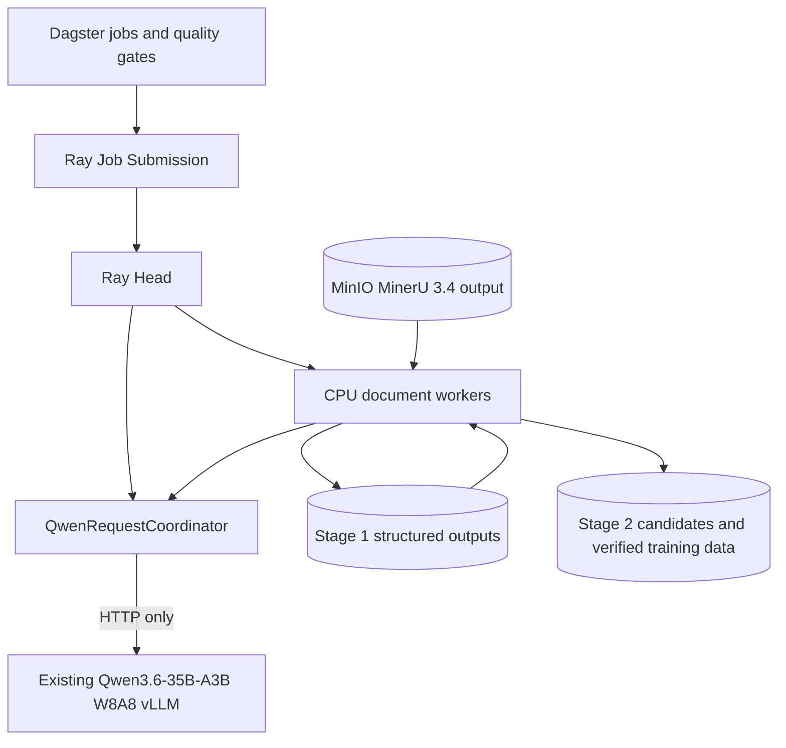

# K12 Stage 1 and Stage 2 Implementation Report

## Final Status

```text
cleanjopbstage1_10: run and passed
cleanjopbstage1_ful: implemented, registered, dry-run passed, not executed
qajobstage2_10: run and passed
qajobstage2_ful: implemented, registered, dry-run passed, not executed
```

The MinerU source, existing Stage 1 input, Qwen Deployment, Ray Head, and
existing MinIO objects were not modified. The two production jobs were not
submitted.

## Architecture



Stage 1 uses Ray CPU tasks and never requests NPU resources. Stage 2 document
tasks also request only CPU. The Qwen coordinator is constrained to the Ray
node resource `QWEN36_A3B_API=0.001`, so it can reach the existing sidecar at
`127.0.0.1:8000`; workers do not load a model and no extra vLLM is created.

## Source Audit

Read-only MinerU input:

```text
s3://k12-mineru-output/full-output/mineru34-hybrid-a3-full-20260722T104600Z
```

The audited MinerU summary reported 2,595 documents, 2,365 newly successful,
230 resumed/skipped, zero failures, and 250,750 pages. The existing Qwen model
endpoint reported model ID `qwen3.6-35b-a3b` with a 32,768-token context.

## Stage 1

Implementation version: `stage1-v1.0.2`.

The canonical transformation is:

```text
MinerU Markdown + content_list + metadata
  -> atomic details/image parsing
  -> chapter/block classification
  -> deterministic noise and OCR quarantine
  -> formula/table normalization
  -> blocks.jsonl
  -> clean.md rendered only from blocks.jsonl
  -> artifacts
  -> _SUCCESS.json written last
```

Core code:

- `stage1_clean/core.py`: block parser, image/details classification,
  deterministic filters, formula normalization, stable IDs, renderer.
- `stage1_clean/driver.py`: Ray document fan-out, progress, resume,
  idempotency and recovery validation.
- `stage1_clean/validation.py`: artifact and content quality gates.
- `common/minio_client.py` and `common/atomic_writer.py`: the single shared S3
  client and temporary-object/copy atomic writes.

Execution:

- Dagster Run ID: `da49649e-e412-43e1-8bac-b73de3dd6a4a`
- Ray Job ID: `stage1-clean-run-da49649e`
- Output: `s3://k12-cleaned-corpus/stage1/test-10/stage1-v1.0.2-20260724`
- Result: 10 success, 0 failed, 0 skipped in the initial pass
- Wall time: 5.088 seconds
- Kept/removed/quarantined blocks: 23,228 / 259 / 1,352
- Formula repairs: 2,595
- Exercises/image records: 9,232 / 9,497

Fixed documents:

```text
pdf-8e99cca84a22a2a45575  image dense elementary
pdf-3f4b908d0b6a2b8ffc31  formula dense high school
pdf-47a06b38e95544cf6e59  complex geometry
pdf-cbf051211167bf331eb6  tables and statistics
pdf-9cd9a2e91ed2c8e7c3bf  OCR anomaly / low vision
pdf-0f86dc9170e2de5b09a8  text dense advanced math
pdf-0007de8572f8fa6b2f70  accessible deaf school
pdf-574715b69a999353c1e6  elementary exercises
pdf-3880d0920802ce222b89  algebra and geometry
pdf-55c0a9403857ee1abe48  life mathematics
```

All required output checks passed. A second run skipped all ten documents; after
one generated `_SUCCESS.json` was removed, only that document was rebuilt and
all content hashes remained stable. Source ETags remained unchanged.

`cleanjopbstage1_ful` is registered. Dry-run Dagster Run
`e7f19e35-03da-47e9-acda-d87b0e92e3e2` validated the full MinerU manifest and
Ray entrypoint without submitting a Ray job. **The full Stage 1 job was not
executed.**

## Stage 2

Implementation version: `stage2-v1.0.2`; prompt version:
`k12-qa-zh-v1.1`. Qwen thinking was explicitly disabled after an exploratory
run showed excessive reasoning-token latency.

The processing path is:

```text
Stage 1 blocks
  -> deterministic prefilter
  -> representative block selection
  -> generation/fact extraction microbatches
  -> structure + evidence + Decimal/Fraction math validation
  -> independent Qwen Judge
  -> exact/near duplicate filtering
  -> verified-only SFT and Alpaca exports
  -> _SUCCESS.json written last
```

Core code:

- `stage2_qa/qwen.py`: named-resource Ray actor, separate generation/Judge
  semaphores, HTTP pool, health check, timeout, retries, backoff and token/latency
  metrics.
- `stage2_qa/core.py`: per-document block streaming, immediate shard writes,
  candidate construction, program validation, Judge and atomic final outputs.
- `stage2_qa/validation.py`: safe arithmetic AST, Decimal/Fraction equivalence,
  units, evidence and MCQ uniqueness.
- `stage2_qa/validation_report.py`: batch-level final training-data gates.
- `stage2_qa/prompts/`: compact, versioned generation and independent Judge
  prompts.

Execution:

- Dagster Run ID: `9db60387-fcf4-44e5-8cfa-747e08153038`
- Ray Job ID: `stage2-qa-run-9db60387`
- Output: `s3://k12-cleaned-corpus/stage2/test-10/stage2-v1.0.2-20260724`
- QA: 25 candidates, 11 verified, 14 rejected
- MCQ: 24 candidates, 16 verified, 8 rejected
- Textbook original solutions: 1 verified
- Root rejection reasons: 20,363 source-not-answerable, 1,352 OCR quarantine,
  7 unsupported evidence, 7 unit errors, 6 Judge rejections, 1 arithmetic
  error, and 1 multiple-correct-option rejection
- Math/program recheck: 100% for all verified items
- Unique correct MCQ option: 100%
- Invalid block references and quarantine leaks: zero
- Near-duplicate pairs at character-bigram Jaccard threshold 0.9: zero

Throughput A/B:

| Config | Wall | Docs/hour | Candidate/s | Verified/s | HTTP gen P50/P95 |
|---|---:|---:|---:|---:|---:|
| conservative | 492.959 s | 73.028 | 0.0974 | 0.0588 | 10.228/22.531 s |
| optimized | 205.724 s | 174.992 | 0.2382 | 0.1312 | 18.048/35.109 s |

The optimized pipeline improved total wall time by 58.3% and verified
throughput by 2.23x. Selected defaults:

```text
document_inflight=3
block_inflight=8
generation_max_inflight=8
judge_max_inflight=4
http_pool_size=16
microbatch_size=2
max_blocks_per_document=4 (test coverage cap only)
```

`qajobstage2_ful` is registered and its dry-run validates the Stage 1 contract,
Qwen parameters, output safety, and generated Ray entrypoint without submission.
Its final dry-run Dagster Run ID is
`7b28e73f-c1ac-4866-aa65-64b86dffe09c`; the smoke-only four-block cap is
disabled for production, so every eligible Stage 1 block is scheduled.
**The full Stage 2 job was not executed.**

## Training Files

Only verified rows are exported:

```text
s3://k12-cleaned-corpus/stage2/test-10/stage2-v1.0.2-20260724/<document_id>/sft_messages.jsonl
s3://k12-cleaned-corpus/stage2/test-10/stage2-v1.0.2-20260724/<document_id>/alpaca_format.jsonl
```

The source-level verified files are `qa_verified.jsonl` and
`mcq_verified.jsonl`; candidate and rejected files are never mixed into
training exports.

## Operation

On `server-00`:

```bash
cd /home/admin/testpanxy/ray_job_test/mineru_dual_npu_20260717/k12_clean_qa_pipeline
sudo ./scripts/run_clean_stage1_count.sh 10
sudo ./scripts/run_qa_stage2_count.sh 10
watch -n 5 ./scripts/show_stage1_progress.sh
watch -n 5 ./scripts/show_stage2_progress.sh
```

User-controlled production entrypoints:

```bash
sudo ./scripts/run_clean_stage1_ful.sh
sudo ./scripts/run_qa_stage2_ful.sh
```

Before running production, edit the source/output prefixes and the small
user-facing concurrency/version set in `configs/cleanjopbstage1_ful.yaml` and
`configs/qajobstage2_ful.yaml`. Production outputs are separate from both smoke
prefixes. Resume is enabled and a version, prompt, model, source contract or
artifact hash change invalidates the relevant success marker.

## Verification

- Stage 1 unit tests: 13 passed
- Stage 2 unit tests: 13 passed
- Contract tests: 3 passed
- Python compilation: passed
- Shell syntax checks: passed
- Dagster cluster load: all four required jobs and their named ops loaded
- Local all-package discovery: Dagster definitions cannot import in the local
  Python because Dagster is not installed there; the deployed Dagster container
  loaded and executed the same definitions successfully.
