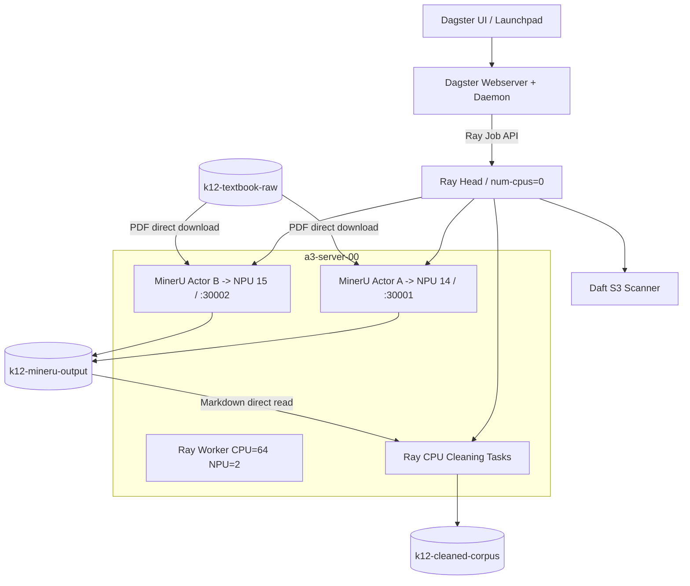
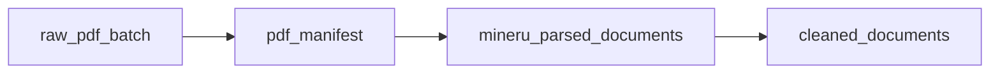
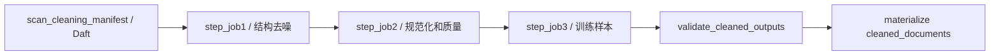

# K12 文档湖 Dagster、Ray、Daft 与 MinerU 技术架构

## 1. 目的与范围

本文说明当前 K12 文档平台如何构建为两条可观测、可重跑的数据湖流水线：

1. PDF 解析：S3 原始 PDF -> Daft manifest -> Ray -> 双 Ascend 910C MinerU -> S3 解析产物。
2. 文档清洗：S3 MinerU Markdown -> Daft manifest -> Ray CPU 清洗 -> 训练语料和质量报告。

内容以 2026-07-21 已部署并验证的代码和运行状态为准。核心原则是“大文件不经过 Dagster 和 Ray Head”：Dagster 只传递批次状态，Worker 直接从 S3 读取输入并把产物直接写回 S3。

## 2. 当前部署

### 2.1 节点和职责

| 节点 | 架构 | 职责 |
| --- | --- | --- |
| `server-00` | amd64 | Kubernetes control plane、Ray Head、Dagster Webserver/Daemon、Daft manifest 扫描 |
| `a3-server-00` | arm64 | Ray Worker、Ascend 910C、MinerU/vLLM-Ascend、CPU 清洗 task |

```text
Kubernetes namespace: k12
Dagster UI: http://110.120.0.3:30080
RayCluster: raycluster-k12-smoke
Ray Dashboard service: raycluster-k12-smoke-head-svc.k12.svc.cluster.local:8265
```

### 2.2 软件和镜像

| 组件 | 版本或镜像 |
| --- | --- |
| Ray | `2.48.0` |
| Daft | `0.7.19` |
| Dagster | `1.13.13` |
| Dagster Python | `3.11.13` |
| MinerU | 官方 `0.11.0` 路径 |
| NPU Worker | `110.120.0.3:8889/mineru/mineru-vllm-a3:official-v0.11.0-20260715-ray248-lake-20260716` |
| Dagster | `110.120.0.3:8889/mineru/ray-data:py3.11.13-ray2.48.0-daft0.7.19-dagster1.13.13-web-20260720` |

Worker 镜像以官方 MinerU Ascend 基线为基础，补充 Ray、boto3/MinIO、Daft、压缩和数据湖依赖。Ascend 驱动由宿主机挂载，镜像内 CANN、torch-npu、vLLM-Ascend 必须与宿主机驱动兼容。

## 3. 总体架构



### 3.1 组件边界

**Dagster**

- 管理 Job、Run、Asset、Asset Check、动态分区和 Launchpad 参数。
- 通过 Ray Job Submission API 提交作业。
- 展示节点颜色、日志、输入输出数量和耗时。
- 不下载 PDF，不执行 MinerU，不传输图片归档。

**Ray Head**

- `num-cpus=0`，避免普通 task 落到 Head。
- 提供 GCS、Dashboard、Job Submission 和调度。
- 运行轻量 Driver，不申请 NPU，不加载模型。

**Daft**

- 通过 MinIO S3 IOConfig 扫描前缀。
- 生成按路径排序的稳定 manifest。
- 处理路径、大小、ETag 等元数据，不把完整 PDF 带到 Head。

**Ray Worker**

- 直接从 S3 下载输入。
- 调用本机常驻 vLLM-Ascend 服务。
- 直接上传解析或清洗产物。
- 只向 Head 返回小型状态对象。

## 4. Kubernetes 和 Ray 构建

### 4.1 Ray Head

Ray Head 固定在 `server-00`，关键设置：

```text
Ray 2.48.0
num-cpus=0
dashboard-host=0.0.0.0
```

Head 镜像包含 Ray、Daft、boto3 和数据湖依赖，只负责 manifest、Driver 和调度。

### 4.2 双 NPU Worker

当前 Pod：

```text
mineru-npu-worker-ascend910-14
```

Kubernetes 资源：

```yaml
requests:
  cpu: "64"
  memory: 256Gi
  huawei.com/Ascend910: "2"
limits:
  cpu: "64"
  memory: 256Gi
  huawei.com/Ascend910: "2"
```

Ray 注册：

```text
CPU=64
NPU=2
MINERU_NPU=2
```

Kubernetes 注解申请物理 NPU 14、15。Pod 重建后不能假定容器逻辑编号不变，必须验证：

```bash
npu-smi info
npu-smi info -m
ls -l /dev/davinci*
```

映射发现代码：`dual_npu/discover_npu_mapping.py`。

### 4.3 两个独立单卡服务

没有使用 `tensor_parallel_size=2`，而是每张卡加载一个完整模型副本：

| 服务 | 物理 NPU | 地址 | CPU 亲和 |
| --- | --- | --- | --- |
| A | 14 | `127.0.0.1:30001` | 0-31 |
| B | 15 | `127.0.0.1:30002` | 32-63 |

启动脚本：`dual_npu/start_dual_vllm.sh`。

```bash
curl --noproxy '*' -fsS http://127.0.0.1:30001/health
curl --noproxy '*' -fsS http://127.0.0.1:30002/health
```

每卡稳定参数：

```text
inference_slots=4
document_inflight=5
window_prefetch=1
max_num_seqs=288
max_num_batched_tokens=2560
```

最后两个参数属于常驻 vLLM 服务，修改需要受控重启，因此不作为普通 Dagster Run 参数暴露。

## 5. MinerU 解析链路

### 5.1 官方语义

当前实现没有替换识别算法，继续使用：

- MinerU 官方 HTTP client。
- 官方 `aio_concurrent_two_step_extract()`。
- 官方 Layout -> Content 请求顺序。
- 官方 `middle_json`、append 和 `finalize_middle_json()`。
- 64 页 processing window。

改动集中在调度、CPU/NPU 重叠、S3 传输和可观测性。

### 5.2 Worker 流水


渲染后续 window、NPU 推理、文档 finalize、归档和上传可以跨文档重叠，但每本 PDF 内保持官方 window、页序和 Layout/Content 顺序。

关键文件：

| 文件 | 作用 |
| --- | --- |
| `official_window_pipeline.py` | 官方 window、Ready Queue、有序 middle_json |
| `dual_npu/dual_service_actor.py` | 每卡 Actor、线程池、S3 I/O、监控 |
| `dual_npu/dual_ray_job.py` | Global Coordinator 和双服务调度 |
| `official_concurrent_runner.py` | allowlist、图片归档、multipart 上传 |

Coordinator 根据活动 window、预计剩余页数、历史秒/页和健康状态粘性分配整本 PDF。服务异常时停止新分配；未开始任务可转移，已开始 PDF 不跨服务迁移。

### 5.3 S3 产物

```text
s3://k12-mineru-output/<output_prefix>/<document_id>/
  artifacts/<document_id>/vlm/<document_id>.md
  artifacts/<document_id>/vlm/*_content_list.json
  artifacts/<document_id>/vlm/*_content_list_v2.json
  artifacts/images.tar.zst
  _SUCCESS.json
```

上传策略：不上传输入 PDF；上传 MD/JSON/TXT；图片归档为 `images.tar.zst`；multipart 分片 16 MiB，并发 4。

## 6. Dagster 编排层

### 6.1 部署

Dagster Deployment 固定在 `server-00`，包含：

```text
webserver: UI、GraphQL、Launchpad
daemon: sensors 和 run coordination
```

项目挂载：

```text
/home/admin/testpanxy/ray_job_test/mineru_dual_npu_20260717
  -> /opt/mineru-project
```

Dagster Home：`/home/admin/testpanxy/ray_job_test/dagster_home`。

YAML：`mineru_dagster/k8s/dagster-mineru.yaml`。

### 6.2 Resource

`RayJobResource` 封装 Ray Job 提交、状态、日志、等待和停止，并把 `/opt/mineru-project` 作为 runtime working directory。

`S3Resource` 封装 MinIO path-style client、JSON 读写、HEAD 和分页 listing。凭据来自 Kubernetes Secret `minio-k12-root`，代码中不保存明文凭据。

### 6.3 Asset 图



全部 Asset 使用动态 `batch_id` partition。Asset 保存血缘和批次元数据，大文件仍在 S3。

### 6.4 Jobs

**`mineru_smoke_10_job`**

```text
validate_run_config
-> scan_s3_with_daft
-> write_pdf_manifest
-> check_ray_cluster
-> check_mineru_service_a/b
-> submit_ray_job
-> monitor_ray_job + dynamic document monitors
-> validate_existing_outputs
-> register_asset_metadata
```

**`mineru_submit_job`**：异步提交长任务。`ray_job_status_sensor` 监控成功后触发 `mineru_finalize_job`。

**`mineru_finalize_job`**：读取已有 manifest 和 Summary，校验并物化 Asset，不重新执行 MinerU。

**`register_existing_mineru_batch_job`**：把历史成功批次注册进 Dagster 血缘。

### 6.5 MinerU Launchpad

可安全按 Run 修改：

```text
batch_id / input_bucket / input_prefix
output_bucket / output_prefix
mode=count|all / count
mineru_service_count=1|2
inference_slots / document_inflight_per_service / window_prefetch
download_workers / upload_workers
block_prepare_workers / render_workers / finalize_workers / archive_workers
multipart_chunksize_mib / multipart_max_concurrency
document_ui_detail_limit / sample_size
```

每个新批次必须同时更换 `batch_id` 和 `output_prefix`。

## 7. 清洗流水线

### 7.1 阶段图



每个阶段是独立 Ray Job，阶段间通过 S3 中间产物解耦，可继续增加 `step_job4`。

### 7.2 Daft manifest

Ray Head 使用 `daft.from_glob_path()` 扫描：

```text
s3://<bucket>/<prefix>/**/*.md
```

对象按路径排序，manifest 写到：

```text
s3://k12-cleaned-corpus/<output_prefix>/_control/<batch_id>/cleaning_manifest.json
```

字段包括 `document_id`、`source_uri`、`source_etag`、`source_size_bytes`、`current_uri` 和 `output_prefix`。`count>0` 表示指定数量，`count=0` 表示完整前缀。

### 7.3 Ray CPU 并行

全量默认：

```text
parallelism=32
cpus_per_task=1
max_retries=1
task_timeout_seconds=1800
```

每个 task 直接读取一份 S3 Markdown，执行阶段规则，写中间或最终产物和审计 JSON，只向 Driver 返回小结果。

当前没有独立 CPU Worker，清洗实际使用双 NPU Worker 注册的 64 个 CPU，但不声明 `NPU`/`MINERU_NPU`，不调用 vLLM，不增加 HBM。长期建议恢复独立 amd64 CPU Worker。

### 7.4 第一轮规则

**step_job1**

1. 删除图片 Markdown 引用。
2. 删除 `natural_image` details。
3. 分类处理 `text_image` details。
4. 删除重复短行、页眉页脚候选和水印。
5. 删除封面罗马字和无意义孤立文本。
6. 保留标题、正文、列表和习题。

**step_job2**

7. 保护 LaTeX 公式。
8. HTML 表格转 Markdown 表格。
9. NFKC、标点和空白规范化。
10. 检测 OCR 替换字符和异常重复字符。
11. 合并连续空行。

**step_job3**

12. 按 Markdown 标题和字符阈值切分训练样本。

### 7.5 动态节点

每阶段由四部分构成：

```text
step_jobN                  提交 Ray Job
monitor_step_jobN          监控阶段
step_jobN_document_status  文档动态节点
join_step_jobN             汇合校验
```

动态节点黄色表示等待，匹配本次 `run_id` 的成功审计后变绿，文档失败、Ray Job 失败或超时变红。节点元数据包含序号、document_id、输入输出数量、耗时和 run_id。

Smoke 展开全部 10 本。全量只展开前 30 本作为 UI 详情，但所有 2595 本都会处理，避免生成 7785 个 Dagster 子进程。

### 7.6 状态真值

Ray stdout 仅用于展示，不作为最终真值：

```text
文档级: S3 audit JSON + run_id
阶段级: S3 _SUMMARY.json + run_id
批次级: 最终 _SUMMARY.json + required output listing
```

这避免 Actor 日志漏行造成 Dagster 假失败，也避免重跑时误读旧审计。

### 7.7 输出契约

```text
s3://k12-cleaned-corpus/<output_prefix>/
  <document_id>/
    cleaned.md
    pretrain.jsonl
    quality_report.json
    provenance.json
    _SUCCESS.json
  _stages/step_job1/<document_id>.md
  _stages/step_job2/<document_id>.md
  _stages/step_job2/<document_id>.quality.json
  _control/<batch_id>/cleaning_manifest.json
  _control/<batch_id>/stages/<stage>/<document_id>.json
  _control/<batch_id>/stages/<stage>/_SUMMARY.json
  _SUMMARY.json
```

`_SUCCESS.json` 最后写入。最终校验使用一次前缀 listing 构建对象集合，不再串行执行约 1.3 万次 HEAD。

## 8. 已验证结果

### 8.1 双 NPU MinerU

固定 30 PDF 实验验证了双服务单卡副本、PDF 粘性、官方页序、模型常驻和 S3 直读直写。30/30 成功，无页面缺失、OOM 或 vLLM 重载。详见 `dual_npu/DUAL_NPU_EXPERIMENT_REPORT.md`。

### 8.2 全量清洗

```text
输入: s3://k12-mineru-output/production/mineru/batch-002/
输出: s3://k12-cleaned-corpus/cleaning-full-batch-002-001/
Dagster Run: 282fa74c-283f-4336-8ca1-9e7036a419c4
```

| 指标 | 数值 |
| --- | ---: |
| 文档 | 2595 |
| 成功/失败 | 2595 / 0 |
| 训练样本 | 282447 |
| S3 对象 | 28550 |
| 输出大小 | 约 1.31 GB |
| Dagster 总耗时 | 5 分 49 秒 |
| step_job1 | 16.829 秒，154.20 docs/s |
| step_job2 | 19.990 秒，129.81 docs/s |
| step_job3 | 33.560 秒，77.32 docs/s |

该 Run 已物化 `cleaned_documents`，三个阶段和 90 个 UI 详情节点全部成功。

## 9. 构建和部署

### 9.1 Worker 镜像流程

1. 在 A3/arm64 上以官方 MinerU Ascend 镜像为基线。
2. 保留 CANN、torch-npu、vLLM-Ascend、MinerU 兼容组合。
3. 安装 `ray==2.48.0`、boto3、MinIO、压缩和数据湖依赖。
4. 执行 import、NPU 可见性和一页 PDF smoke。
5. 推送私有仓库，再由 Kubernetes 拉取。

代理只用于公网依赖。S3、Ray、Kubernetes Service 和私有仓库必须加入 `NO_PROXY`。

### 9.2 部署和验证

```bash
cd /home/admin/testpanxy/ray_job_test/mineru_dual_npu_20260717
k3s kubectl apply -f k8s/mineru-npu-worker-ascend910-14-15.yaml
k3s kubectl -n k12 wait --for=condition=Ready \
  pod/mineru-npu-worker-ascend910-14 --timeout=300s
k3s kubectl -n k12 exec mineru-npu-worker-ascend910-14 -- npu-smi info
k3s kubectl -n k12 exec raycluster-k12-smoke-head-479l7 -c ray-head -- ray status
```

部署 Dagster：

```bash
k3s kubectl apply -f mineru_dagster/k8s/dagster-mineru.yaml
k3s kubectl -n k12 rollout status deploy/mineru-dagster --timeout=180s
```

更新代码后：

```bash
k3s kubectl -n k12 exec deploy/mineru-dagster -c webserver -- \
  sh -lc 'cd /opt/mineru-project && dagster definitions validate -m mineru_dagster.definitions'
k3s kubectl -n k12 rollout restart deploy/mineru-dagster
```

## 10. 运行命令

```bash
k3s kubectl -n k12 exec -it deploy/mineru-dagster -c webserver -- sh
cd /opt/mineru-project/mineru_dagster
```

```bash
# MinerU 10 PDF
dagster job execute -m mineru_dagster.definitions \
  -j mineru_smoke_10_job -c config/mineru_smoke_10.yaml

# MinerU 异步长任务
dagster job execute -m mineru_dagster.definitions \
  -j mineru_submit_job -c config/mineru_submit_all_example.yaml

# 清洗 10 文档
dagster job execute -m mineru_dagster.definitions \
  -j cleaning_smoke_10_job -c config/cleaning_smoke_10.yaml

# 清洗完整前缀
dagster job execute -m mineru_dagster.definitions \
  -j cleaning_full_job -c config/cleaning_full.yaml
```

## 11. 监控和排障

```bash
k3s kubectl -n k12 get pods -o wide
k3s kubectl -n k12 logs deploy/mineru-dagster -c webserver --tail=200
k3s kubectl -n k12 logs deploy/mineru-dagster -c daemon --tail=200
k3s kubectl -n k12 exec raycluster-k12-smoke-head-479l7 -c ray-head -- ray status
k3s kubectl -n k12 exec mineru-npu-worker-ascend910-14 -- npu-smi info
```

重点观察：每卡 AICore/HBM、vLLM running/waiting、Ready Queue、Worker CPU/RSS、Ray resource demand、每服务 pages/s。

S3 成功判断优先级：文档 `_SUCCESS.json` -> 文档 audit -> 阶段 Summary -> 批次 Summary -> Dagster registration/Asset。不要只依赖 Ray stdout 的事件数量。

## 12. 故障恢复

**Ray 成功、Dagster 失败**：读取 S3 Summary 和审计；若计算成功，使用 `mineru_finalize_job` 或注册 Job 物化 Asset，不重跑 MinerU。

**单服务异常**：停止向异常服务派发；未开始任务可转移，已开始 PDF 不迁移；不要重启健康服务。

**Worker 重建**：重新验证设备映射、Ray 资源、两个服务 PID/端口/HBM，再跑一份 PDF smoke。

**单卡回退**：使用 `dual_npu/rollback_single_worker.sh` 恢复 Pod 配置，再单独启动和验证旧单卡服务。

## 13. 当前限制和下一步

1. 清洗目前占用 NPU Worker CPU，建议增加独立 amd64 CPU Worker 并注册 `CPU_DATA`。
2. 动态 UI 节点有进程开销，全量任务应保持详情上限或改为分片进度节点。
3. 纯 Markdown 缺少页面坐标，重复页眉页脚规则仍是启发式；第二版应结合 page/block JSON。
4. 全量清洗保留阶段中间产物，稳定后应配置 S3 生命周期。
5. `cleaning_sensor` 保持 STOPPED，防止未经审核自动触发全量清洗。
6. NPU 调优必须单变量进行，不能同时修改推理槽、vLLM batch、window 和线程池。

## 14. 代码索引

```text
mineru_dagster/src/mineru_dagster/definitions.py  Dagster Definitions
mineru_dagster/src/mineru_dagster/jobs/           Job 图
mineru_dagster/src/mineru_dagster/ops/            Dagster Ops
mineru_dagster/src/mineru_dagster/assets/         AssetSpec
mineru_dagster/src/mineru_dagster/checks/         Asset Checks
mineru_dagster/src/mineru_dagster/resources/      Ray/S3 Resources
mineru_dagster/src/k12_cleaner/                    清洗实现和 Ray Driver
mineru_dagster/config/                             Launchpad/CLI 配置
mineru_dagster/k8s/                                Dagster Deployment
k8s/mineru-npu-worker-ascend910-14-15.yaml         双 NPU Worker
dual_npu/                                          双服务启动、探测、调度、报告
official_window_pipeline.py                        官方 window 流水
official_concurrent_runner.py                      归档和上传
s3_lake_batch/                                     数据湖批量提交脚本
```
