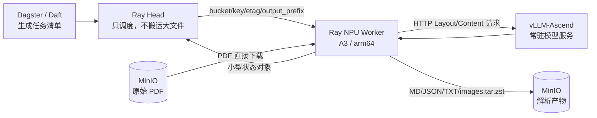
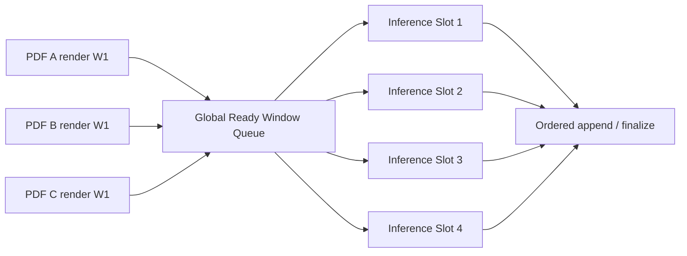
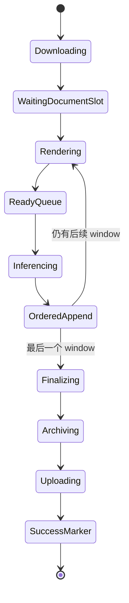

# Ascend 910C MinerU 性能优化：从单 PDF 串行作业到全局异步 Window 流水线

> 文档状态：2026-08-04 整理版  
> 适用代码：`mineru_flash30/` 及其 `dual_npu/` 子目录  
> 适用环境：MinerU 官方 VLM HTTP Client、vLLM-Ascend 常驻服务、Ascend 910C、Ray 2.48、MinIO/S3

## 1. 文档目的

本文系统说明我们如何优化 MinerU，而不只是罗列最终参数。内容包括：

1. 原始链路为什么慢，瓶颈如何从上传迁移到推理供给和调度。
2. 我们对 MinerU 做了什么、没有做什么，以及为什么必须守住官方输出语义。
3. 从 PDF 级并发、页面级原型，到最终官方 Window 全局流水线的演进过程。
4. 常驻 vLLM-Ascend、Ready Window Queue、CPU 线程池隔离和动态第五路的实现原理。
5. 单卡 30 PDF、15 PDF 和双卡 30 PDF 的实测结果及其正确解读。
6. 当前推荐配置、监控方法、故障回退边界和下一轮实验顺序。

本文不是 MinerU 的通用安装手册，也不试图完整移植 Flash-MinerU。它记录的是一条已经在 Ascend 910C 上验证过的工程路线：**保留 MinerU 官方推理与输出逻辑，只重构任务供给、阶段重叠、资源隔离、数据传输和可观测性。**

---

## 2. 一页结论

### 2.1 最重要的结论

- MinerU 的 VLM 路径不是一个持续占满 NPU 的单一 kernel。它由 PDF 渲染、Layout 推理、Layout 响应解析、Block Prepare、Content 推理、页面后处理、跨页合并和输出生成组成，CPU 与 NPU 阶段天然交替。
- 单纯增加 PDF 数量只能增加“候选工作”，不能保证 NPU 持续有请求。真正有效的是把多个 PDF 的**官方 64 页 processing window**放进一个全局 Ready Queue，让 CPU 阶段和 NPU 阶段跨文档重叠。
- 我们没有改写 Layout/Content 模型，也没有替换官方 `aio_concurrent_two_step_extract()`；生产路径继续使用官方 HTTP client、官方 window、官方页序、官方 `middle_json` 和 `finalize_middle_json()`。
- 最初上传慢的根因是数百个图片小对象逐个 PUT，不是 MinerU 本身。将图片打成 `images.tar.zst`、过滤生成 PDF、只上传 MD/JSON/TXT 和图片归档，并启用 multipart 后，上传从百秒级降到通常每本不足 1 秒。
- 1 个常驻 vLLM-Ascend 服务必须在多本 PDF 之间复用。每个 PDF 重启模型会把模型加载时间、HBM 分配和服务冷启动反复带入端到端耗时。
- 单卡 30 PDF 生产测试完成 3233 页，用时 2139.298 秒，吞吐约 **1.511 pages/s**；双卡 30 PDF 完成相同 3233 页，用时 1061.990 秒，吞吐 **3.044 pages/s**。双卡报告按约 1.55 pages/s 的稳定单卡基线计算为 **1.96 倍**，若直接与这份 1.511 pages/s 的单卡归档相除则约为 **2.01 倍**。
- 双卡高负载时每卡 vLLM `running_requests` P90 为 282、最大 287，接近 `max_num_seqs=288`；`waiting_requests` 约一半时间非零。因此在该负载下继续增加文档并发不会线性提升单卡吞吐，调优重点应转向 vLLM 调度容量和 CPU/NPU 阶段间隙。
- 固定第五路曾在冷启动时制造约 `running=250`、`waiting=200` 的请求洪峰并导致健康探针超时。正确做法不是长期固定五路，而是以四路为基线，只在严格条件满足时临时放行一个额外 window，并在拥塞信号出现时立即回退。

### 2.2 当前推荐的单卡高速基线

```text
1 个常驻 vLLM-Ascend 服务
official processing window = 64 页
inference_slots = 4
document_inflight = 5
window_prefetch = 1
block_prepare_workers = 12
render_workers = 6
finalize_workers = 3
archive_workers = 2
download_workers = 4
upload_workers = 4
max_num_seqs = 288
max_num_batched_tokens = 2560
multipart_chunksize = 16 MiB
上传 allowlist = md/json/txt + images.tar.zst
不上传输入 PDF，也不上传 MinerU 生成的 PDF
```

动态第五路已经在代码中实现，但应视为**受控补洞机制**，不是新的固定并发默认值。它还需要独立、完整、同一批输入的生产 A/B 才能决定是否长期启用。

---

## 3. 原始系统与第一性瓶颈模型

### 3.1 数据面拓扑



Ray Head 不下载 PDF，也不接收图片和 JSON 大对象。Worker 从湖中直接读取 PDF，完成解析后直接写回湖，只向 Head 返回状态和指标。这个边界避免了：

- PDF 字节经 Ray Object Store 二次传输；
- Head 成为带宽和内存瓶颈；
- 大输出对象阻塞任务调度；
- Head 与 arm64/NPU 运行时耦合。

### 3.2 一个 PDF 的真实阶段

```text
S3 download
  -> PDFium render                     CPU
  -> layout request preparation        CPU
  -> Layout inference                  NPU
  -> layout response parse             CPU
  -> block crop / encode / prompt       CPU
  -> Content inference                 NPU
  -> page postprocess                  CPU
  -> ordered append                    CPU + file I/O
  -> cross-page / document finalize     CPU
  -> artifact generation               CPU + disk I/O
  -> images.tar.zst                     CPU + disk I/O
  -> S3 upload                          network + MinIO
```

因此，“MinerU 在 NPU 上运行”不等于“MinerU 全过程都在 NPU 上”。在当前官方 VLM HTTP 路径中，Layout 和 Content 模型推理由 vLLM-Ascend 在 NPU 上执行；PDF 渲染、图片处理、请求构造、响应解析、结构恢复和输出生成仍主要由 CPU 完成。

这也解释了一个容易误判的现象：AICore 利用率下降时，不一定是 vLLM batch 太小。可能是上游 CPU 尚未准备好下一批请求，也可能是多个并发调用同时进入 Block Prepare 或 Finalize，导致 NPU 短暂无粮可吃。

### 3.3 吞吐的基本关系

对于一批 PDF：

```text
解析 pages/s = 总页数 / 从第一个推理 window 开始到最后一个推理 window 结束
端到端 pages/s = 总页数 / 整个作业墙钟时间
```

不要把各 PDF 的阶段耗时简单相加后与总墙钟相减。并发执行时，下载、解析、归档和上传会重叠；累计工作量可以大于墙钟时间。

系统吞吐近似受以下最慢环节约束：

```text
min(
  PDF 渲染与 Block Prepare 供给能力,
  vLLM-Ascend Layout/Content 服务能力,
  文档有序组装与 Finalize 能力,
  本地临时存储能力,
  S3 上传能力
)
```

优化过程的核心不是把每个阶段分别做到最快，而是让这些阶段尽可能跨文档重叠，同时保持内存有界、输出语义不变。

---

## 4. 优化演进

### 4.1 阶段 0：先证明 NPU 与数据湖闭环

最早验证的 70 页 PDF 流程如下：

```text
Ray Head 选择 S3 key
-> NPU Worker 下载 50.6 MB PDF
-> MinerU pipeline 调用 NPU
-> 生成 225 个对象，共约 165.4 MB
-> Worker 写回 S3
-> 最后写 _SUCCESS.json
```

实测端到端 Actor 时间为 214.599 秒。MinerU 日志中两个核心模型分析 window 约 13 至 14 秒，但首个输出对象到 `_SUCCESS.json` 之间约 139 秒。

这个结果很关键：它证明 NPU 路径能跑通，也证明当时**端到端慢的主要原因不是模型推理，而是输出物料化和串行上传数百个小文件**。如果只看 MinerU 命令耗时或 NPU 日志，会对系统瓶颈得出错误结论。

对应历史说明见 [K12_RAY_MINERU_FLOW.md](../../mineru-npu-s3-image/K12_RAY_MINERU_FLOW.md)。

### 4.2 阶段 1：先修数据传输，不让 I/O 掩盖推理问题

数据面做了五项调整：

1. 图片不再逐张上传，统一打包为 `images.tar.zst`。
2. 使用 artifact allowlist，只上传 `.md`、`.json`、`.txt` 和图片归档。
3. 明确过滤输入 PDF 与 MinerU 生成的 PDF。
4. 大对象启用 multipart，分片 16 MiB，并发 4。
5. 每个上传对象执行 `HEAD` 校验，记录对象大小、PUT 时间、吞吐、分片数量和校验时间。

当前实现位于 [official_concurrent_runner.py](../official_concurrent_runner.py)。核心策略为：

```text
IMAGE_SUFFIXES -> images.tar.zst
ALLOWLIST_SUFFIXES -> md/json/txt
multipart_threshold = 8 MiB
multipart_chunksize = 16 MiB
max_concurrency = 4
```

双卡 30 PDF 生产实验共上传 180 个工件、约 490.3 MB，累计上传耗时只有 9.895 秒。上传相对累计解析耗时 10190.878 秒已经很小，不再是主瓶颈。

#### 为什么代理曾经会让上传变慢

Worker 为安装依赖或下载模型配置了代理，但 S3 endpoint、`127.0.0.1` 和集群内部域名必须进入 `NO_PROXY/no_proxy`。否则 boto3 到 MinIO 的请求会绕到外部代理，导致：

- 内网流量绕路；
- CONNECT 或代理鉴权开销；
- multipart 分片重试；
- 上传明显慢于下载；
- 本地 vLLM HTTP 请求也可能错误经过代理。

当前运行逻辑会清除本地推理请求的代理变量，并设置：

```text
NO_PROXY=127.0.0.1,localhost,110.120.0.3,.svc,.svc.cluster.local
```

生产环境还应把实际 MinIO Service FQDN 和 ClusterIP 加入列表。

### 4.3 阶段 2：模型改为常驻服务

优化前若每本 PDF 都通过独立 CLI 生命周期启动模型，会重复承担：

- 模型权重加载；
- HBM 分配和图初始化；
- vLLM engine 启动；
- 编译或缓存预热；
- 健康检查等待。

最终架构将 vLLM-Ascend 作为 Worker 内常驻 HTTP 服务。多个 PDF、多个官方 window 共用同一个服务，整个测试期间要求：

- server PID 保持不变；
- 模型只加载一次；
- `/health` 持续可用；
- 本地请求不经过代理；
- HBM 在预期稳定区间内，不随文档数持续增长。

这一步把“模型生命周期”从 PDF 生命周期中移出，是后续一切并发优化的前提。

### 4.4 阶段 3：PDF 级并发，重叠下载、解析、归档和上传

第一版并发模型使用 `ThreadPoolExecutor` 处理多个 PDF：

```text
job_workers = 3 或 4
parse_concurrency = 1、2 或 3
upload_workers = 4
```

每个 PDF 的下载、等待解析、解析、归档和上传可以与其他 PDF 重叠。它解决了两类空档：

- 当前 PDF 上传时，下一本可以开始解析；
- 当前 PDF 等待 parse slot 时，可以提前下载。

但它仍有明显上限：每个 MinerU 调用内部仍按自身 window 节奏推进。当多个调用恰好同时进入 CPU 阶段，NPU 仍然会空闲；当多个调用同时把 64 页 Layout/Content 请求灌入 vLLM，又会出现瞬时洪峰。

历史实现可以在 [k12_mineru_4pdf_profile.py](../../mineru_4pdf_profile/k12_mineru_4pdf_profile.py) 和 [k12_mineru_npu_multi_profile.py](../../k12_mineru_npu_multi_profile.py) 中看到。

### 4.5 阶段 4：页面级异步原型

受 Flash-MinerU 的阶段重叠思路启发，我们实现过一个显式页面级异步 analyzer，见 [aio_doc_analyze_pipeline.py](../aio_doc_analyze_pipeline.py)。它将过程拆成：

```text
Render microbatch: 2 至 4 页
-> Layout microbatch
-> 单页 Block Prepare
-> block 级 Content 异步请求
-> 单页 Postprocess
-> 文档级排序、跨页合并与 Finalize
```

原型包含：

- 有界 `global_page_buffer`，控制驻留页面图像数量；
- Layout 优先的统一推理 gate；
- Layout 和 Content 的独立软上限；
- 页面结果可乱序计算，但最终严格按 `page_id` 组装；
- PDFium range loader，避免多个线程共享同一 `pdf_doc`；
- 页面图像完成 Content 和输出后显式关闭；
- 每页 block 数量、Content 请求数量和阶段边界 profiling。

#### 为什么没有把页面级原型直接作为生产默认

它能提供更细粒度重叠，但也扩大了语义和兼容风险：

- 可能改变官方 Layout 的批处理形状；
- 单页或小 microbatch 会增加 HTTP、PNG 编码和协程调度开销；
- 可能降低 vLLM 的自然合批机会；
- 需要自行维护跨页表格、页面间关系和输出版本兼容；
- MinerU 升级后，复制的内部调度逻辑容易漂移。

因此页面级实现保留为实验原型，生产路线改为更保守的“官方 window 内部逻辑不动，只在 window 外做全局流水”。这是一项重要的工程取舍：**少拿一点理论调度自由，换取官方输出语义和升级兼容性。**

### 4.6 阶段 5：保留官方 64 页 Window，建立跨 PDF Ready Queue

生产核心实现在 [official_window_pipeline.py](../official_window_pipeline.py)。每个 PDF 仍按 MinerU 的 `get_processing_window_size()` 切成官方 window，默认 64 页。对每个 window 仍调用：

```python
predictor.aio_concurrent_two_step_extract(
    images=...,
    image_analysis=...,
    priority=原始页号列表,
)
```

没有拆开或重排官方调用内部的 Layout/Content 顺序。

改变的是 window 外部的调度：



#### Ready Queue 解决了什么

- 某个 PDF 在 Block Prepare 时，其他 PDF 的 ready window 可以继续向 NPU 供给请求。
- 某个 PDF 在 append/finalize 时，不占用推理槽。
- 文档长短不同造成的 window 尾部空档被其他文档填补。
- 推理槽只覆盖官方 VLM 调用，不覆盖下载、渲染、输出和上传。

#### 每本 PDF 内仍保持什么

- window 顺序严格递增；
- 页号连续且不重复；
- Layout/Content 使用官方 two-step 顺序；
- `append_page_blocks_to_middle_json()` 按原页序执行；
- 全文档结束后才执行 `finalize_middle_json()`；
- 跨页表格与文档级后处理不被拆成独立页面 finalize。

`window_prefetch=1` 只允许每个文档额外保留一个已渲染 window。它能预渲染后续工作，同时限制 64 页图像在内存中的驻留规模。`window_prefetch=2` 实验被主动停止，现有证据不足以证明收益，且它会显著提高主机内存压力，因此默认仍为 1。

### 4.7 阶段 6：把 Finalize 从推理槽中剥离

早期 pipeline 把 window 推理和部分输出组装放在同一个大临界区中。这样会造成一个隐蔽问题：NPU 已经完成 Layout/Content，但推理 slot 仍被 CPU append/finalize 占用，Ready Queue 中的新 window 无法及时进入。

修正后，`GlobalWindowScheduler` 的 slot 只包围：

```text
aio_predictor_execution_guard
  -> aio_concurrent_two_step_extract()
```

推理结果返回后，slot 立即释放。以下工作进入独立 CPU executor：

- ordered append；
- `finalize_middle_json()`；
- `_process_output()`；
- 图片归档；
- S3 上传。

这使“推理并发”真正表示同时进行的官方 VLM window 数，而不是混入不可预测的 CPU 尾部工作。

### 4.8 阶段 7：CPU 线程池隔离

一个共享默认线程池会让 Block Prepare、PDF 渲染、Finalize、压缩、上传和监控彼此争抢线程。即使 Pod 有很多 CPU，请求仍可能因为线程池排队而延迟，表现为：

```text
Ready Queue 有任务
vLLM waiting 为 0
AICore 下降
CPU 总体又没有完全打满
```

当前 [production_30_runner.py](../production_30_runner.py) 建立了职责明确的 executor：

| 线程池 | 默认线程数 | 用途 |
| --- | ---: | --- |
| ControlPool | 2 | 健康检查、指标抓取、轻量文件写入 |
| DownloadPool | 4 | S3 下载、PDF 字节读取 |
| BlockPreparePool | 12 | MinerU helper、响应解析、Block Prepare |
| RenderPool | 6 | PDFium range render |
| FinalizePool | 3 | append、finalize、输出生成 |
| ArchivePool | 2 | 图片扫描和 `tar.zst` 压缩 |
| UploadPool | 4 | S3 PUT 和 HEAD 校验 |

最关键的两行不是“外层有线程池”，而是：

```python
asyncio.get_running_loop().set_default_executor(pools.block_prepare)
predictor.executor = pools.block_prepare
predictor.helper.executor = pools.block_prepare
```

这样 MinerU 内部使用 `asyncio.to_thread()` 或 `run_in_executor(None, ...)` 的 CPU helper 才真正进入 BlockPreparePool，而不是继续落到不可观测的默认 executor。

#### Block Prepare 可观测性

`ObservableThreadPoolExecutor` 记录：

```text
block_prepare_active_workers
block_prepare_queue_depth
block_prepare_queue_wait_avg/p95
block_prepare_service_time_avg/p95
content_first_request_delay_avg/p95
```

这些指标用于区分两种完全不同的情况：

- 队列长期非零且 worker 常满：线程池容量可能不足，可从 12 小步增到 16。
- 队列为空、worker 未满，但 Content 首请求仍延迟：问题更可能在 event loop、同步解析、锁、HTTP client 或 CPU 调度，而不是线程数量。

### 4.9 阶段 8：精确测量 Layout 与 Content 之间的 CPU Gap

只记录整个 MinerU 命令耗时不足以指导调优。我们对单个 predictor 实例安装了局部 tracer，而没有使用 `sitecustomize.py` 全局 monkey patch。

记录的边界包括：

```text
layout_request_start
layout_response_end
layout_parse_start / end
block_prepare_start / end
content_request_start
content_response_end
page_postprocess_start / end
```

由此可计算：

```text
Layout 响应 -> Layout parse 开始
Layout parse 耗时
Layout parse -> Block Prepare 开始
Block Prepare 耗时
Block Prepare 结束 -> Content 首请求
Content 请求耗时
Content 结束 -> 页面后处理
```

实现使用 `contextvars` 将事件绑定到当前 document/profile/page，patch 只作用于当前 `MinerUClient` 实例，可撤销、可隔离，也不会影响 Worker 上的其他 MinerU 任务。

这比全局 patch 更稳妥：MinerU CLI 可能提前 import 函数，Ray actor 可能复用解释器，FastAPI 还可能已有运行中的 event loop。显式入口和实例级 tracer 避免了这些生命周期冲突。

### 4.10 阶段 9：扩大内存与 CPU，但保持 NPU HBM 边界

单卡 Worker 曾调整为：

```yaml
requests:
  cpu: "24"
  memory: 96Gi
limits:
  cpu: "32"
  memory: 128Gi
```

扩容的目的不是让模型占用更多 HBM，而是容纳：

- 多个 PDF 原始字节；
- 若干 64 页渲染图像；
- Layout/Content 中间对象；
- middle JSON；
- 输出图片和归档临时文件；
- 并行下载、归档和上传缓冲。

128 GiB Pod 内存只解决主机内存问题，不能突破单卡约 64 GiB HBM 的上限。控制器分别监控：

```text
memory.current
memory.peak 或 cgroup v1 max_usage_in_bytes
memory.events / memory.failcnt
HBM usage
```

当主机内存达到 110 GiB、出现 cgroup 内存失败、推理 window 失败或 vLLM 连续不健康时，系统会把推理并发降到 2、文档并发降到 3，并暂停额外弹性槽。

### 4.11 阶段 10：动态第五路，而不是固定五路

#### 固定五路为什么失败

官方一个 window 最多包含 64 页。冷启动时固定五个推理调用同时提交，相当于让五个大 window 同时进入 Layout/Content。历史观察出现：

```text
running_requests 约 250
waiting_requests 约 200
健康探针连续超时
```

问题不在于第五路永远无价值，而在于它以“长期 worker”的形式制造了突发注入。

#### 当前实现：一次只借用一个额外 Window

`GlobalWindowScheduler` 保持四个常驻 worker。第五路由 `_elastic_worker()` 临时执行 Ready Queue 中的一个 window，完成后自动退出，不会持续抽取后续 window。

放行条件在 [production_30_runner.py](../production_30_runner.py) 的 `adaptive_monitor()` 中统一判断：

```text
预热已完成，默认 120 秒
vLLM metrics 可读取
running_requests < 220
waiting_requests < 16，且当前等于 0
Ready Queue > 0
vLLM /health 正常
Pod memory.current < 90 GiB
HBM < 80%
Block Prepare 当前活跃或刚刚活跃
不在 cooldown
没有紧急故障或回退信号
```

最后一个条件近似表达“现有槽正在 CPU 阶段，额外槽可以补 NPU 空洞”。第五路每次只消费一个 window，因此它是脉冲式容量，不是固定五路。

回退或抑制条件：

```text
waiting_requests > 96 持续 5 秒
running_requests >= 280
健康检查连续两次超时
API 端到端 P95 相对预热基线显著升高
```

回退后进入默认 60 秒 cooldown。更严重的条件包括主机内存达到 110 GiB、memory failcnt 增加、健康检查连续三次失败、或出现新推理 window 失败；此时直接降到 `2 slots / 3 documents`。

#### 当前证据边界

动态第五路的调度、监控和回退逻辑已经实现。现有 30 PDF 和双卡生产结果充分证明四路 Ready Queue 的稳定性，但不能自动证明动态第五路一定提高吞吐。是否作为生产默认，需要在以下条件下做正式 A/B：

- 同一批 PDF；
- 同一模型 PID 和 warmup 状态；
- 同一 `max_num_seqs/max_num_batched_tokens`；
- A 为固定四路，B 为四路加弹性单 window；
- 比较解析 pages/s、NPU 空闲比例、waiting 分布、API P95、失败率与内存峰值。

---

## 5. 最终生产流水线

### 5.1 跨文档时间线

理想情况下，同一时刻会发生：

```text
CPU RenderPool:       PDF E 首窗口渲染
BlockPreparePool:     PDF B 的 Layout 响应解析与 block crop
NPU / vLLM:           PDF A、C、D 的 Layout 或 Content
FinalizePool:         PDF F 有序 append / finalize
ArchivePool:          PDF G 生成 images.tar.zst
UploadPool:           PDF H 上传 MD/JSON/TXT/归档
```

这正是 `document_inflight` 高于 `inference_slots` 的原因：额外文档用于准备和收尾，不代表所有文档都同时向 NPU 灌请求。

### 5.2 关键并发参数不是同一个概念

| 参数 | 控制对象 | 主要资源 | 过大风险 |
| --- | --- | --- | --- |
| `document_inflight` | 同时进入解析生命周期的 PDF | 主机内存、CPU | 图像和 middle JSON 驻留、CPU 争用 |
| `inference_slots` | 同时执行的官方 two-step window | NPU、vLLM request queue、HBM | running/waiting 洪峰、健康超时 |
| `window_prefetch` | 每文档提前渲染的 window | 主机内存 | 64 页图像成倍驻留 |
| `max_num_seqs` | vLLM 同时调度序列上限 | HBM、调度器 | 延迟和 HBM 上升 |
| `max_num_batched_tokens` | vLLM 批次 token 容量 | NPU、HBM | 大批次延迟、OOM |
| Block Prepare 线程数 | CPU helper 并发 | CPU | 上下文切换、内存带宽争用 |

不能把 `document_inflight=7` 理解为“七路 NPU 推理”。它只增加等待、预渲染和 CPU 尾部重叠。如果 Ready Queue 已经不空且 vLLM waiting 持续存在，继续增加 document inflight 只会增大内存与排队。

### 5.3 一本文档的状态机



文档内 window 顺序不变，但不同文档可以处在不同状态。推理 slot 只在 `Inferencing` 状态占用。

### 5.4 资源释放原则

每个渲染 window 的 PIL 图片必须一直保留到：

```text
Layout 完成
-> Block Prepare 完成
-> Content 完成
-> append_page_blocks_to_middle_json 完成
```

之后立即显式 `close()`。异常、取消和 scheduler 关闭路径同样必须释放图片。PDFium 文档对象不能被多个渲染线程无保护共享；range loader 为每个范围管理自身渲染句柄，最终组装使用单独的主 `pdf_doc`。

---

## 6. 我们保留与改变的边界

### 6.1 保留不变

- MinerU 官方 VLM HTTP Client。
- vLLM-Ascend 模型推理实现。
- `aio_concurrent_two_step_extract()`。
- 官方 processing window，当前为 64 页。
- 每个 window 内的 Layout -> Content 请求顺序。
- 官方 `append_page_blocks_to_middle_json()`。
- 官方 `finalize_middle_json()`。
- 跨页表格和文档级后处理。
- 官方 Markdown、middle JSON、model JSON 和 content list 输出体系。

### 6.2 新增或改变

- vLLM 从每任务生命周期提升为 Worker 常驻服务。
- 从 PDF 独立并发改为跨 PDF 的全局 Ready Window Queue。
- 渲染、推理、append/finalize、归档、上传跨文档重叠。
- 推理 slot 只覆盖官方 VLM 调用。
- 为 MinerU 默认 executor 和 CPU helper 配置独立 BlockPreparePool。
- 增加 Layout/Content gap、线程池、vLLM 队列、NPU 和 cgroup 监控。
- 图片统一归档，上传采用 allowlist 和 multipart。
- 增加动态弹性 window 和自动回退。
- Head 只传任务描述，Worker 直接读写数据湖。

### 6.3 明确没有做

- 没有安装或完整移植 Flash-MinerU。
- 没有引入其 CUDA、本地 GPU 模型加载和 GPU 资源管理代码。
- 没有将模型替换成通用 CUDA vLLM。
- 没有把传统 pipeline 中的 ONNX 表格模型强行接入当前 VLM 路径。
- 没有修改 MinerU site-packages 或使用 `sitecustomize.py` 做全局 patch。
- 没有把每一页完全独立 finalize。
- 没有改变一本 PDF 的页序或跨服务迁移已开始的文档。

### 6.4 关于 ONNX 表格模型与 NPU 的澄清

早期对“表格 ONNX 是否仍在 CPU”存在合理担忧，但必须区分两条后端：

```text
传统 pipeline backend：可能包含独立 ONNX/OCR/表格模型，执行设备取决于对应 runtime/provider。
当前 VLM HTTP backend：Layout/Content 通过 MinerUClient 请求常驻 vLLM-Ascend 服务。
```

本文优化的生产路径是后者。它不等同于把传统 pipeline 中每一个 ONNX 子模型迁移到 CANN Execution Provider。CPU 阶段仍然存在，但核心 Layout/Content 推理走 vLLM-Ascend/NPU。若未来重新启用传统 pipeline backend，应另做 ONNX Runtime CANN provider 的构建、算子覆盖、fallback 和逐模型 profiling，不能将本文结论直接套用。

---

## 7. Profiling 与判定方法

### 7.1 每个 PDF 的阶段指标

每本文档至少记录：

```text
download_seconds
parse_wait_seconds
parse_and_output_seconds
archive_seconds
upload_seconds
elapsed_seconds
page_count
artifact_count / bytes
```

`parse_wait_seconds` 是文档等待 admission 的时间，不是 MinerU 本身变慢。高并发下各文档等待时间之和可能非常大，这是累计排队工作量，不应与作业墙钟直接比较。

### 7.2 每个 Window 的指标

```text
render_start/end
ready_queue_enter/leave
infer_start/end
append_start/end
finalize_start/end
page_start/page_end
image_bytes_estimate
worker_id
```

由此可以计算：

- render 时间；
- Ready Queue 等待；
- 官方 two-step 推理时间；
- append/finalize CPU 时间；
- window 间空洞；
- 推理槽利用率；
- 预渲染图像的内存压力。

### 7.3 vLLM 指标

当前抓取：

```text
vllm:num_requests_running
vllm:num_requests_waiting
vllm:kv_cache_usage_perc
vllm:e2e_request_latency_seconds histogram
```

判断逻辑：

| 观察 | 更可能的原因 | 优先动作 |
| --- | --- | --- |
| NPU 空闲、waiting=0、Ready Queue=0 | 上游供给不足 | 增加 CPU 能力或文档准备并发 |
| NPU 空闲、waiting=0、Ready Queue>0 | slot/event loop/同步间隙 | 检查 slot、Block Prepare 和锁 |
| waiting 持续非零、running 接近上限 | vLLM 调度容量饱和 | 小步测试 `max_num_seqs/tokens` |
| waiting 很高且 P95 激增 | 过载 | 降低推理槽，不再加文档 |
| NPU 高利用且 waiting 持续积压 | 单卡接近饱和 | 扩更多 NPU |
| CPU 与 NPU 都低，但阶段有长 gap | 同步 I/O、锁或 event loop 阻塞 | 精确看 gap tracer |

### 7.4 CPU 与内存指标

```text
MinerU client CPU avg/p90/max
vLLM server CPU avg/p90/max
Actor RSS peak
Pod CPU request/limit
CPU throttling 次数和时间
memory.current / peak / events
BlockPreparePool active/depth/wait/service
```

CPU request/limit 必须与 cgroup quota 一起看。节点上 CPU 很多不代表 Pod 能使用；如果 throttling 持续增加，增加线程只会让线程竞争配额。

### 7.5 NPU 指标

NPU 每秒或每 5 秒采样：

```text
AICore avg/p50/p90/max
AICore < 5% 占比
AICore >= 80% 占比
HBM avg/max
```

统计 MinerU 解析区间时应排除：

- vLLM 启动与模型加载；
- 完全没有活动推理 window 的下载预热；
- 所有 PDF 已解析完后的归档上传尾部。

否则 NPU 平均值会被非解析阶段稀释。

---

## 8. 实验结果

### 8.1 单卡 30 PDF 生产规模测试

原始证据：[production-30-summary-20260716T103656Z.json](../production-30-summary-20260716T103656Z.json)

| 指标 | 结果 |
| --- | ---: |
| PDF | 30 / 30 成功 |
| 页数 | 3233 |
| 墙钟 | 2139.298 s |
| 端到端吞吐 | **1.511 pages/s** |
| 初始推理槽 | 3 |
| 最大推理槽 | 4 |
| 初始文档并发 | 4 |
| 最大文档并发 | 5 |
| `window_prefetch` | 1 |
| 累计下载 | 65.647 s |
| 累计解析与输出 | 10170.917 s |
| 累计归档 | 4.148 s |
| 累计上传 | 13.082 s |

这里累计解析时间远大于墙钟，说明多文档确实并发运行。累计上传只有 13.082 秒，再次说明图片归档和内网直连后，上传已经不是端到端瓶颈。

该轮完成了 64 个 window，未出现 window 失败。Pod 历史内存峰值约 60.4 GiB，低于 128 GiB 上限。

### 8.2 单卡 15 PDF 调度容量核实

原始证据：[scheduler-15-summary-20260717T011543Z.json](../scheduler-15-summary-20260717T011543Z.json)

| 指标 | 结果 |
| --- | ---: |
| PDF | 15 / 15 成功 |
| 页数 | 1629 |
| 墙钟 | 1109.162 s |
| 端到端吞吐 | **1.469 pages/s** |
| 推理槽 / 文档并发 | 4 / 5 |
| `window_prefetch` | 1 |
| 完成 window | 32 |
| window 失败 | 0 |
| 累计上传 | 7.005 s |

这轮吞吐略低于 30 PDF 轮，不能据此断言 `4/5` 比动态 `3->4` 更慢，因为样本数量、PDF 组成、长短尾部和 warmup 条件并非严格相同。它的主要价值是验证固定 `4/5/1` 在该批任务中稳定完成，且上传仍不是瓶颈。

### 8.3 双卡 30 PDF 生产测试

完整报告：[DUAL_NPU_EXPERIMENT_REPORT.md](../dual_npu/DUAL_NPU_EXPERIMENT_REPORT.md)

| 指标 | 结果 |
| --- | ---: |
| PDF / 页数 | 30 / 3233 |
| 成功 / 页数匹配 | 30 / 30，全部匹配 |
| 墙钟 | 1061.990 s |
| 总吞吐 | **3.044 pages/s** |
| 服务 A | 1594 页，约 1.50 pages/s |
| 服务 B | 1639 页，约 1.54 pages/s |
| 相对约 1.55 pages/s 稳定单卡基线 | **1.96x** |
| 相对 1.511 pages/s 单卡 30 PDF 归档 | **2.01x** |
| Pod 内存峰值 | 66.32 GiB / 256 GiB |
| OOM / window 失败 | 0 / 0 |

每卡监控：

| 指标 | 服务 A / NPU 14 | 服务 B / NPU 15 |
| --- | ---: | ---: |
| AICore 平均 | 55.95% | 56.75% |
| AICore P90 / max | 100% / 100% | 100% / 100% |
| AICore 非零占比 | 98.5% | 97.1% |
| HBM 平均 / max | 70.65% / 71% | 66% / 66% |
| running avg / P90 / max | 175.14 / 282 / 287 | 171.35 / 282 / 287 |
| waiting avg / P90 / max | 26.76 / 94 / 188 | 27.23 / 92 / 154 |
| waiting > 0 占比 | 44.8% | 49.0% |
| Actor RSS 峰值 | 12.54 GiB | 14.74 GiB |

#### 如何理解“P90 100%，平均只有约 56%”

这不是矛盾。NPU 在有大批 Layout/Content 请求时可以打满，但 CPU 阶段、文档尾部和 window 间切换会拉低时间平均值。与此同时，`running` 已经接近 288，`waiting` 又经常非零，说明高峰期不是请求不足，而是 vLLM 已经接近当前调度上限。

因此下一步不能只看平均 AICore 就机械增加第五、六路。需要在低利用时同步查看 waiting：

- 低 AICore 且 waiting=0：优化请求供给与 CPU gap。
- 低 AICore 但 waiting>0：检查 vLLM scheduler、batch 形状、请求延迟和 Ascend kernel 行为。

#### 双卡为何接近线性扩展

每张 NPU 启动独立模型副本和独立 HTTP 服务，而不是 `tensor_parallel_size=2`。Ray Coordinator 将整本 PDF 粘性分配给 A 或 B，并按剩余页数和服务负载平衡。两张卡之间没有单请求 tensor parallel 通信，因此对于大量独立 PDF，吞吐接近两个单卡服务之和。

---

## 9. 失败尝试与经验

### 9.1 不要用大量小文件上传

数百张图片逐个 PUT 会让请求往返、连接管理、元数据和代理问题主导总时间。`images.tar.zst` 是本项目中收益最确定的优化之一。

### 9.2 不要把完整 PDF 经 Head 或 Ray Object Store 中转

任务描述只传 bucket/key/etag/output_prefix。Worker 直接 GET/PUT，Head 才能保持轻量和稳定。

### 9.3 不要每个 PDF 启动一个 vLLM

模型加载一次、跨文档复用。监控 PID 是正确性条件，不只是运维细节。

### 9.4 不要把 `parse_concurrency` 等同于 NPU 有效并发

多个 CLI 或多个 PDF 同时运行，可能同时卡在 CPU，也可能同时制造请求洪峰。有效并发必须在官方 window 层统一调度。

### 9.5 不要严格逐页执行完整 two-step

严格单页模式会损失 Layout 批处理、增加请求与编码开销，并可能改变官方输出行为。页面级 microbatch 可以做研究，但生产默认选择官方 window。

### 9.6 不要全局 monkey patch MinerU

`sitecustomize.py` 会影响所有解释器任务，也可能因提前 import 而失效。显式 analyzer 入口和 predictor 实例级 tracer 更可控。

### 9.7 不要让 Finalize 占用推理 slot

slot 应只代表 NPU 推理生命周期。CPU 输出工作必须移出，否则监控中的“slot 已满”并不代表 NPU 真忙。

### 9.8 不要盲目增大 `window_prefetch`

一个 64 页 window 的解码图像可能占用大量主机内存。prefetch 从 1 到 2 会按并发文档数放大驻留量。没有明确吞吐收益前保持 1。

### 9.9 不要固定开启第五路

冷启动请求洪峰已经证明固定五路不稳定。第五路只能是条件触发、单 window、可快速回退的弹性容量。

### 9.10 不要同时修改多个主变量

`inference_slots`、`document_inflight`、window size、`max_num_seqs`、`max_num_batched_tokens` 和线程池都会影响同一组指标。每轮只改变一个主要变量，否则无法解释结果。

---

## 10. 正确性保证

性能优化只有在输出语义稳定时才成立。Smoke 和 A/B 至少检查：

```text
页数完全一致
page_id 不丢失、不重复
页面顺序完全一致
每页 block 类型与数量一致
图片引用全部存在
图片数量一致
表格和公式数量一致
middle_json 关键字段一致
Markdown 归一化文本高度一致
跨页表格专项样本正确
```

可接受差异仅包括无意义空格、Markdown 空行、JSON 字段顺序和等价转义。页面块顺序、表格归属或图片归属变化应先视为流水线 bug。

对比工具位于 [compare_outputs.py](../compare_outputs.py)。页面级原型必须先通过 2 PDF correctness smoke，再进入 6 PDF 性能实验；官方 window 路线也应在 MinerU 或模型版本变更后重复此流程。

---

## 11. Ray、Dagster 与 Daft 的职责

### Daft

- 扫描 S3 manifest 元数据；
- 根据 source ETag 和 parser version 筛选未解析 PDF；
- 生成稳定、可追溯的任务清单；
- 不在 Head 读取完整 PDF 字节。

### Dagster

- 将 manifest、解析计划、Ray submission、结果 manifest 和质量指标建模为资产；
- 保存 Ray Job ID、输入批次、输出前缀和运行参数；
- 展示业务级状态，不替代 Ray Dashboard 或 vLLM metrics。

### Ray Head

- `num-cpus=0`，避免普通任务落到 Head；
- 提交小型任务描述；
- 聚合状态和失败原因；
- 不申请 NPU，不加载模型，不上传大对象。

### Ray NPU Worker

- 直接从 S3 下载 PDF；
- 管理常驻 vLLM-Ascend；
- 执行全局 Ready Window 流水线；
- 归档并直接上传结果；
- 最后写 `_SUCCESS.json`。

更完整的平台说明见 [DAGSTER_RAY_DAFT_MINERU_TECHNICAL_GUIDE.md](DAGSTER_RAY_DAFT_MINERU_TECHNICAL_GUIDE.md)。

---

## 12. 生产配置与保护边界

### 12.1 单卡配置

```text
inference_slots=4
max_inference_slots=5，仅用于弹性单 window
document_inflight=5
window_prefetch=1
max_num_seqs=288
max_num_batched_tokens=2560
```

不要因为 Worker 有 128 GiB 内存就提高 `window_prefetch` 或无限增加 PDF。主机内存与 NPU HBM 是两个独立约束。

### 12.2 动态第五路门限

```text
warmup >= 120s
running < 220
waiting == 0
Ready Queue > 0
health = true
memory.current < 90GiB
HBM < 80%
Block Prepare active/recent
```

```text
waiting > 96 for 5s       -> suppress elastic
running >= 280            -> suppress elastic
health timeout x2         -> suppress elastic
API P95 spike             -> suppress elastic
memory >= 110GiB          -> emergency 2/3
health timeout x3         -> emergency 2/3
window failure            -> emergency 2/3
memory failcnt increase   -> emergency 2/3
```

### 12.3 双卡配置

每张卡一个独立模型服务：

```text
NPU 14 -> 127.0.0.1:30001
NPU 15 -> 127.0.0.1:30002
每服务 inference_slots=4 / document_inflight=5 / prefetch=1
```

整本 PDF 粘性分配，已开始的文档不跨服务迁移。Coordinator 使用页数、预计剩余时间和服务健康状态做负载平衡。

### 12.4 成功标记与幂等性

```text
s3://<output-bucket>/<prefix>/<document_id>/
  artifacts/...
  _RESULT.json
  _SUCCESS.json
```

`_SUCCESS.json` 必须最后写。重跑同一输出前缀时，Head 检查 source ETag、parser/model version 和成功标记，跳过已完成文档。失败重试不应覆盖无法解释的半成品为“成功”。

---

## 13. 下一轮实验建议

下一轮应优先完成动态第五路的正式 A/B，而不是继续增加 `document_inflight`。

### 13.1 A/B 设计

固定：

```text
同一 30 PDF manifest
同一 NPU
同一 Worker Pod 资源
同一 vLLM PID 或相同完整 warmup 流程
max_num_seqs=288
max_num_batched_tokens=2560
window_prefetch=1
document_inflight=5
```

A 组：

```text
固定 inference_slots=4
关闭 elastic worker
```

B 组：

```text
固定四路 + 动态单 window 第五路
使用当前晋级和回退门限
```

比较：

```text
总墙钟和解析 pages/s
AICore avg、<5%、>=80% 占比
running/waiting 完整分布
Ready Queue 空闲占比
四个常驻 slot 利用率
elastic admissions 次数和有效工作时间
API latency P50/P95/P99
Block Prepare queue wait/service
content_first_request_delay
RSS/HBM 峰值
window/PDF 失败率
```

只有 B 组 pages/s 明显提升，同时 P95、waiting、失败率和内存没有显著恶化，才应保留动态第五路。

### 13.2 vLLM 容量实验

若低 AICore 时 `waiting` 持续存在，应在固定四路下小步测试：

```text
max_num_seqs: 288 -> 304 -> 320
或
max_num_batched_tokens: 2560 -> 小步增加
```

一次只改一个参数。每轮观察 HBM、API P95/P99、running/waiting、AICore 和正确性。吞吐不增长或延迟明显恶化即回退。

若低 AICore 时 waiting 经常为零，再考虑改善 CPU 供给：

- BlockPreparePool 从 12 到 16，但仅在队列长期非零时；
- RenderPool 从 6 到 8，但仅在 Ready Queue 经常为空且 CPU 尚有余量时；
- 将残留同步响应解析移出 event loop；
- 继续缩短 Block Prepare 结束到 Content 首请求之间的 gap。

### 13.3 扩卡优先于无限单卡并发

双卡已经达到约 1.96 倍扩展。若单卡 `running` 长期接近 288、waiting 持续积压且 AICore 高负载占比已经较高，继续堆并发的边际收益会快速下降。此时新增独立单卡服务通常比在一张卡上继续增加请求洪峰更可预测。

---

## 14. 代码地图

| 文件 | 作用 | 状态 |
| --- | --- | --- |
| [official_window_pipeline.py](../official_window_pipeline.py) | 官方 window、全局 Ready Queue、有序 append/finalize、gap tracer、弹性单 window | 当前生产核心 |
| [production_30_runner.py](../production_30_runner.py) | 单卡生产 runner、线程池隔离、动态第五路门限、cgroup/vLLM/NPU 监控 | 当前生产核心 |
| [official_concurrent_runner.py](../official_concurrent_runner.py) | S3 下载、artifact allowlist、`images.tar.zst`、multipart 上传 | 当前生产核心 |
| [aio_doc_analyze_pipeline.py](../aio_doc_analyze_pipeline.py) | 页面 microbatch 异步原型 | 研究用途，不是默认生产路径 |
| [analyze_gap_profile.py](../analyze_gap_profile.py) | Layout/Content CPU gap 分析 | Profiling 工具 |
| [analyze_window_run.py](../analyze_window_run.py) | Window pipeline 运行分析 | Profiling 工具 |
| [compare_outputs.py](../compare_outputs.py) | 原始路径与优化路径输出对比 | 正确性工具 |
| [adaptive_npu_guard.py](../adaptive_npu_guard.py) | 早期外部 3->4 slot 晋级与回退守护 | 已被内建 monitor 思路吸收 |
| [dual_service_actor.py](../dual_npu/dual_service_actor.py) | 双卡每服务 Actor、CPU 池和 Worker 数据面 | 双卡生产核心 |
| [dual_ray_job.py](../dual_npu/dual_ray_job.py) | 双服务整本文档粘性调度 | 双卡生产核心 |
| [start_dual_vllm.sh](../dual_npu/start_dual_vllm.sh) | 两个单卡 vLLM-Ascend 服务与 CPU 亲和 | 双卡运维 |
| [DUAL_NPU_EXPERIMENT_REPORT.md](../dual_npu/DUAL_NPU_EXPERIMENT_REPORT.md) | 双卡 30 PDF 原始结果和运行手册 | 实验证据 |

---

## 15. 总结

这轮优化最重要的变化，不是把 MinerU 改成了另一套模型，也不是简单把并发数字调大，而是重新定义了并发的边界：

```text
原来：每本 PDF 各自执行完整生命周期，CPU 与 NPU 空档互相暴露。

现在：多个 PDF 共享一个常驻 vLLM-Ascend；官方 64 页 window 进入全局 Ready Queue；
      推理槽只覆盖官方 two-step；渲染、Block Prepare、Finalize、归档、上传各自隔离并跨文档重叠。
```

同时，我们把两类容易混淆的问题拆开：

1. 数据面问题通过直连 MinIO、图片归档、allowlist 和 multipart 解决。
2. 计算面问题通过常驻模型、Ready Queue、CPU executor 隔离、精确 gap profiling 和受控弹性槽解决。

实测已经证明：单卡可以稳定处理 30 PDF、3233 页，双卡达到 3.044 pages/s；相对约 1.55 pages/s 的稳定单卡基线为 1.96 倍，相对归档单卡 30 PDF 结果则约为 2.01 倍。当前四路官方 window 并发已经把 vLLM `running` 推到接近 `max_num_seqs=288`，因此后续优化必须以监控信号驱动：waiting 为空时补供给，waiting 持续存在时调 vLLM 容量，单卡真正饱和时扩卡。

这套方案的价值在于，它提高吞吐的同时没有牺牲 MinerU 官方的页序、跨页语义和输出体系；所有高风险优化都有明确的有界队列、资源上限、健康检查和回退路径。对于生产 PDF 湖任务，这比某一次跑出更高峰值更重要。
