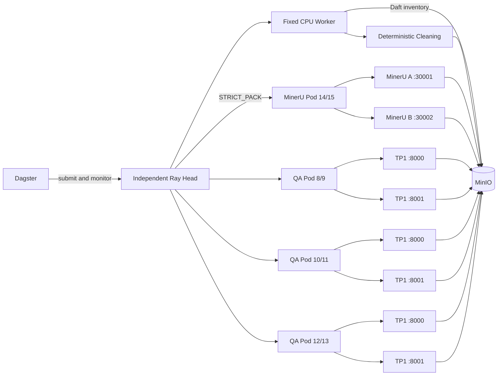

# K12 E2E Autoscale 6-vLLM No-Judge Experiment

## 1. Result

- Dagster job: `k12_e2e_autoscale_nojudge_job`
- Dagster Run ID: `d8baba09-8178-4556-9d51-e4c24726e3ec`
- Ray Job ID: `k12-autoscale-nojudge-d8baba09-817`
- Dagster status: `SUCCESS`
- Ray summary status: `success`
- Documents: `10/10` succeeded, `0` failed
- Total wall time: `1192.355 s` (`19m 52.355s`)
- MinerU batch size: `4`
- Judge: disabled
- Result status: `schema_valid_unjudged`
- Final NPU worker count: `0`

This run met the functional acceptance criteria. All ten books completed
MinerU, deterministic cleaning, schema validation, no-Judge QA/MCQ
generation, and atomic S3 output publication.

## 2. Architecture



Layer ownership:

- Dagster: outer orchestration, Launchpad configuration, Ray submission,
  progress, final probes.
- Daft: source object inventory and manifest construction.
- Ray: document stages, Actors, placement groups, request queue.
- KubeRay: independent NPU worker-group creation and scale-to-zero.
- Ascend Device Plugin: exact host chip assignment.
- MinIO: immutable input, stage outputs, progress and summary files.

## 3. Isolation And Device Placement

An independent RayCluster named `raycluster-k12-autoscale-nojudge` was used.
The existing shared RayCluster and production output prefixes were not
modified.

Worker groups:

| Group | Host chips | Min/Max pods | Actors per pod |
|---|---:|---:|---:|
| `mineru-14-15` | 14, 15 | 0/1 | 2 MinerU |
| `qa-8-9` | 8, 9 | 0/1 | 2 TP1 vLLM |
| `qa-10-11` | 10, 11 | 0/1 | 2 TP1 vLLM |
| `qa-12-13` | 12, 13 | 0/1 | 2 TP1 vLLM |

Exact physical assignment uses the Ascend Device Plugin annotation together
with `huawei.com/Ascend910` requests and limits. MinerU actors reported logical
devices 14 and 15 on the same Ray node. Each QA placement group was strictly
packed into its intended two-device pod.

No `tensor_parallel_size=2` was used. Each Qwen service is an independent TP1
model replica.

## 4. Smoke Results

### Qwen TP1

- A single chip-8 TP1 service loaded successfully.
- Approximate idle HBM: `53.75 GiB`.
- Eight simultaneous requests completed successfully.
- Observed peak HBM in this smoke: about `54.54 GiB`.
- Eight-request wall time: `18.449 s`.

### Two TP1 Services In One Pod

- Chips 8 and 9 hosted independent services on ports 8000 and 8001.
- Both models became healthy without HBM OOM, port conflict, or device mixing.
- Sixteen simultaneous requests, eight per endpoint, all succeeded.
- Combined smoke wall time: about `42.77 s`.

### Autoscaling State Machine

The synthetic scaling smoke successfully exercised:

| Transition | Observed time |
|---|---:|
| 0 -> 1 | 17.432 s |
| 1 -> 2 | 15.301 s |
| 2 -> 3 | 16.026 s |
| 3 -> 2 | 65.018 s |
| 2 -> 1 | 65.019 s |
| 1 -> 0 | 65.017 s |

The formal ten-book run scaled directly from 0 to 3 QA pods because the first
cleaned document contributed 48 pending units and configured capacity was 16
units per pod. Thus the state machine is proven, but the formal run did not
show gradual 0 -> 1 -> 2 -> 3 growth.

## 5. Formal Timeline

All timestamps are UTC on 2026-07-29.

| Event | Timestamp | Duration |
|---|---|---:|
| MinerU pod requested | 03:18:02.583 | - |
| MinerU services ready | 03:20:53.603 | 171.021 s startup |
| QA scale decision, 0 -> 3 | 03:26:13.651 | - |
| Three QA pods requested | 03:26:13.674-03:26:13.716 | - |
| Six TP1 endpoints ready | 03:33:00.768-03:33:00.797 | about 407.09 s startup |
| First book entered QA | 03:33:00.807 | - |
| Last MinerU result entered cleaning | 03:35:05.581 | - |
| Last document completed | 03:37:54.718 | - |
| QA resources released | 03:37:54.755 | 3 pods, 6 actors |
| MinerU resources released | 03:37:54.770 | 1 pod, 2 actors |

Measured MinerU/QA stage overlap was `124.774 s`. The three QA pods each lived
for about `701.1 s` from request to release and about `294.0 s` from model-ready
to release.

The formal run retained the MinerU pod until final driver shutdown. The driver
has since been corrected to release MinerU immediately after all documents
have emitted cleaning outputs; this correction does not alter the recorded
experiment.

## 6. Inputs

1. `pdf-06ab075c00ea72f24632`
2. `pdf-0060e203e21be9105143`
3. `pdf-054b5b0ca11e91b3ec5f`
4. `pdf-04711a86294f2460d3c0`
5. `pdf-02db6b2a6b60aace09c0`
6. `pdf-04ab7061e1e77834d3a5`
7. `pdf-027fd22e4cc4e6bca066`
8. `pdf-0308c393b2b253506e45`
9. `pdf-07664f2000b3860da5a0`
10. `pdf-00449534271c4dbe19d5`

## 7. Outputs And Validation

Prefixes:

```text
s3://k12-mineru-output/autoscale-nojudge/d8baba09-817/mineru/
s3://k12-cleaned-corpus/stage2/training-jsonl-collection-nojudge-autoscale-v1/runs/d8baba09-817/stage1/
s3://k12-cleaned-corpus/stage2/training-jsonl-collection-nojudge-autoscale-v1/runs/d8baba09-817/stage2/
```

Totals:

| Metric | Value |
|---|---:|
| Source blocks | 10,063 |
| Eligible blocks | 1,613 |
| QA candidates | 377 |
| QA schema-valid-unjudged | 346 |
| MCQ candidates | 374 |
| MCQ schema-valid-unjudged | 340 |
| Final schema-valid-unjudged samples | 686 |
| Rule/schema rejected records | 8,621 |

For each of ten documents the run produced:

- `qa_candidates.jsonl`
- `qa_schema_valid_unjudged.jsonl`
- `mcq_candidates.jsonl`
- `mcq_schema_valid_unjudged.jsonl`
- `sft_messages_unjudged.jsonl`
- `alpaca_format_unjudged.jsonl`
- eligibility, facts, rejection, deduplication and generation reports
- `_SUCCESS.json`

Automated post-run inspection parsed 40 final JSONL files and 2,058 rows:

- JSON parse errors: `0`
- Final sample IDs: `686`
- Missing IDs: `0`
- Duplicate IDs: `0`
- `_SUCCESS.json`: `10/10`

No `qa_verified.jsonl`, `mcq_verified.jsonl`, or Judge-derived training file is
published by this branch. No-Judge metrics have also been corrected so future
runs do not populate the compatibility fields `qa_verified` or `mcq_verified`.

## 8. Qwen Throughput

Coordinator:

- Submitted/completed logical requests: `301/301`
- Successful HTTP/model responses: `286`
- Retried attempts: `70`
- Attempt errors: `85`
- Requests exhausted after retries: `15`
- Queue wait P50/P95: `0.0/0.0 s`
- Prompt tokens: `140,289`
- Completion tokens: `209,319`

The attempt-error counter covers HTTP, timeout, response-shape, and JSON parsing
exceptions together, so it cannot be split by cause after this run.

Per-actor profile:

| Actor | Requests | P50 latency | P95 latency | Prompt tok/s* | Generation tok/s* |
|---|---:|---:|---:|---:|---:|
| pod0/actor0 | 47 | 23.644 s | 75.481 s | 90.89 | 149.61 |
| pod0/actor1 | 45 | 21.321 s | 61.815 s | 93.20 | 140.81 |
| pod1/actor0 | 59 | 22.798 s | 64.495 s | 106.16 | 148.52 |
| pod1/actor1 | 40 | 22.403 s | 76.483 s | 80.63 | 121.35 |
| pod2/actor0 | 40 | 23.881 s | 76.182 s | 104.08 | 156.33 |
| pod2/actor1 | 55 | 23.942 s | 62.911 s | 117.51 | 169.14 |

`*` Token rates use each endpoint's first-to-last request interval. The
combined generation rate over the union of active endpoint intervals was
approximately `754.18 tokens/s`.

Request-count imbalance:

- Mean: `47.67` requests/actor
- Min/max: `40/59`
- Population coefficient of variation: `15.0%`
- Maximum observed active requests per actor: `8`

Generation queue P99 and vLLM engine running/waiting distributions were not
persisted in this run. The coordinator queue was empty at P50 and P95, which
shows dispatch was not the limiting queue; endpoint latency and retries were
the dominant QA-side signals.

## 9. Effective Throughput And Comparison

| Metric | This run | Previous run | Change |
|---|---:|---:|---:|
| Total wall | 1192.355 s | 1636.438 s | 27.14% lower |
| Relative end-to-end speed | 1.372x | 1.000x | +37.24% |
| Generation tokens/s | about 754.18 | 265.351 | 2.843x |
| Final samples/minute | 34.52 | not recorded | - |
| Documents/hour | 30.19 | not recorded | - |

Batch wall divided by ten is `119.236 s/book`. Individual book lifecycle wall
times overlap heavily; their observed P50/P95 were approximately
`945.584/1021.088 s`.

This comparison is a combined effect. Judge was removed and QA capacity was
increased to six TP1 replicas at the same time, so the improvement cannot be
attributed solely to autoscaling or six-device parallelism.

## 10. Telemetry Limits

The formal run did not persist one-second NPU time series. Consequently these
requested fields cannot be reconstructed objectively:

- per-chip AICore average/P50/P95/max;
- formal-run per-chip HBM peak;
- vLLM `running` and `waiting` distributions;
- generation queue P99.

The HBM numbers in this report are from the preceding device smoke, not the
formal ten-book run. No value has been fabricated to fill the missing fields.
A subsequent performance run should scrape `npu-smi` and vLLM metrics into the
run-specific S3 prefix.

## 11. Code Map

- `dagster_defs/autoscale_nojudge_job.py`: independent job graph, Daft
  inventory, Ray submission, progress and terminal probes.
- `autoscale_nojudge/driver.py`: document state machine, MinerU batch-of-four,
  cleaning/QA overlap, resource release.
- `autoscale_nojudge/qwen_pool.py`: TP1 endpoint actor, least-inflight
  coordinator, retries, endpoint snapshots and placement-group lifecycle.
- `autoscale_nojudge/k8s/render_cluster.py`: exact chip worker groups,
  autoscaler configuration, launch scripts and resources.
- `stage2_qa/core.py`: shared Stage 2 implementation with an explicit
  `judge_enabled` switch and separate no-Judge artifacts.

The implementation reuses the existing deterministic cleaner, prompts,
schema validation, S3 client, Ray submission resource and model launch
parameters. It does not duplicate MinerU parsing or Stage 2 generation logic.

## 12. Review Findings

1. **Formal scaling jumped 0 -> 3.** The synthetic test proves every transition,
   but the production policy computes `ceil(pending_units / 16)`, and the first
   48-unit document requests all three pods. A strict gradual policy requires a
   non-blocking warm-up controller or a per-decision growth cap.
2. **Model cold start dominates.** Six parallel TP1 model loads took about
   407 seconds, 34.1% of total wall time. Warm retention or predictive
   prewarming has more leverage than increasing request concurrency.
3. **Retry rate is material.** Fifteen of 301 coordinator calls exhausted
   retries. The next revision should persist categorized exception reasons and
   invalid response snippets with sensitive content removed.
4. **Formal NPU telemetry is incomplete.** Functional correctness and
   scale-to-zero are established, but this run alone cannot support claims
   about AICore saturation.
5. **MinerU early release was late in the recorded run.** The driver is patched
   for subsequent runs to release the MinerU placement group as soon as no
   document remains in pending, MinerU, or cleaning state.

## 13. Verification

- Python compilation: passed for the new driver, Qwen pool, Dagster job and
  modified Stage 2 core.
- Dagster definition validation: passed for
  `mineru_dagster.definitions`.
- Dagster execution: 9 steps succeeded, 0 failed.
- S3 output validation: passed, 10 documents and 0 malformed final JSONL rows.
- Pytest: not run because the deployed Dagster image does not contain the
  `pytest` package.

