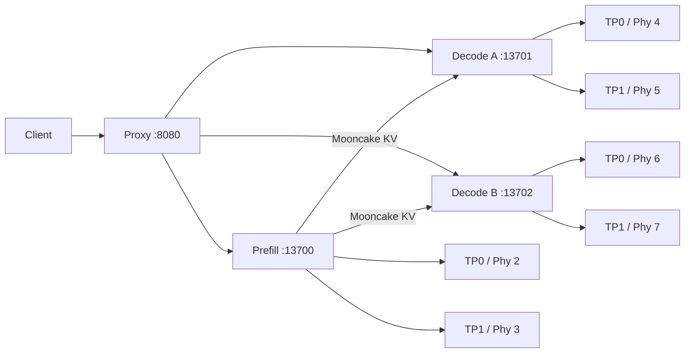

# 任务三：请求路由、KVCache 与物理 NPU 的深度观测手册

> 目标不是“看到六张卡都有利用率”，而是为一次请求建立可核验的证据链：
>
> ```text
> client request
> -> Proxy request ID 和路由决策
> -> Prefill Engine/TP rank/物理 NPU
> -> KV block 延迟释放与 Mooncake transfer
> -> Decode replica/TP rank/物理 NPU
> -> token stream 和资源回收
> ```

## 1. 当前拓扑的三个隔离层



隔离层分别是：

1. **Replica 隔离**：P、D-A、D-B 是三个独立 vLLM Engine。
2. **TP 隔离**：每个 Engine 内部有两个 Worker，通过 HCCL 执行 TP2。
3. **缓存隔离**：三个 Engine 各自拥有独立 KV/混合状态缓存池；Mooncake 迁移
   内容，不让 P 和 D 共享同一个 block ID 或 allocator。

当前容器实测映射：

| 角色 | API PID | EngineCore PID | TP Worker PID | 容器 NPU | 物理 Phy-ID |
|---|---:|---:|---|---|---|
| Prefill | 612 | 823 | 916/995 | 2/3 | 2/3 |
| Decode A | 3965 | 4088 | 4183/4262 | 4/5 | 4/5 |
| Decode B | 6909 | 7128 | 7247/7427 | 6/7 | 6/7 |

PID 只对当前 Pod 生命周期有效，Pod 重建后必须重新采集。物理编号与容器逻辑编号
本次恰好相同，不应推广成永久假设。

## 2. 一次请求的真实控制流

当前 Proxy 源码是运行镜像中的：

```text
/vllm-workspace/vllm-ascend/examples/disaggregated_prefill_v1/
load_balance_proxy_server_example.py
```

### 2.1 接收与负载估算

Proxy 读取 JSON 和原始 body：

```python
req_data = await request.json()
req_body = await request.body()
request_length = len(req_body)
```

这里的 `request_length` 是 UTF-8 JSON 字节数，不是真实 prompt token 数。中文、
转义字符、额外 JSON 字段和多轮 history 都会改变它。

Prefill 分数：

\[
S_P = (body\_bytes/4)\times0.0345+120.0745
\]

Prefill 实例优先级：

\[
priority_P=active\_tokens+0.3\times active\_kv\_cache
\]

当前只有一个 P，所以该公式只维护账本，不产生选择差异。

### 2.2 Prefill 请求被重写

Proxy 不把客户端请求原样发送给 P，而是强制：

```json
{
  "stream": false,
  "max_tokens": 1,
  "min_tokens": 1,
  "kv_transfer_params": {
    "do_remote_decode": true,
    "do_remote_prefill": false,
    "remote_engine_id": null,
    "remote_block_ids": null,
    "remote_host": null,
    "remote_port": null
  }
}
```

P 的任务是计算 Prompt 状态并返回 `kv_transfer_params`，不是完成用户所需的全部
生成。`max_tokens=1` 是完成 Prefill 协议所需的最小推进。

### 2.3 选择 Decode

P 返回后，Proxy 才选择 D：

\[
priority_D=active\_tokens
\]

但当前 `decode_score=body_bytes`，不包含 `max_tokens`。Proxy 把分数最低的 D 从
最小堆取出，分数相同时按固定 ordinal 决胜。

因此有一个重要行为：

> 串行请求每次结束后两个 D 都回到 0，固定 tie-break 会反复选择 Decode A。
> Decode B 只有在请求发生重叠、A 的负载尚未释放时才容易被选中。

“B 没有利用率”不能直接等价为 B 故障，必须先确认并发和路由账本。

### 2.4 Decode 接管

Proxy 把 P 返回的 `kv_transfer_params` 合并回原始请求，再向 D 发起流式调用。
D 根据远端 Engine 信息建立会话，在自己的缓存池中为该请求准备目标状态，等待
Mooncake 迁移完成后继续自回归 Decode。

当前两个 D 是独立 replica：

```text
Decode A: dp_size=1, tp_size=2
Decode B: dp_size=1, tp_size=2
```

它们不是一个 `data_parallel_size=2` Engine。Proxy 是 replica 级调度器。

### 2.5 释放时机

当前 Proxy 在收到 D 的第一个非空 chunk 后释放自己的 P KV 压力账本；finally
中释放 D 负载并减少全局 request count。

需要区分两种“释放”：

1. Proxy 的 `active_kv_cache` 是调度估算值。
2. vLLM Connector 的 block delayed-free 才控制真实缓存块生命周期。

实测 P 日志：

```text
Delaying free of 4 blocks for request ...
```

这证明 P 不会在 Prefill HTTP 返回时立即复用源 block。D 日志随后出现两个 TP
rank 对同一 request 的 transfer duration，全部完成后 D 才能安全 Decode。

## 3. KVCache 不是一块共享显存

### 3.1 Paged KV 的地址语义

P 和 D 的 block ID 都只是各自 allocator 的局部索引：

```text
P blocks [17,18,42] != D blocks [3,9,10]
```

Mooncake 传输描述符需要表达源地址、目标地址、长度、Engine/rank 和请求关联，
而不是简单把 P 的 block ID 发给 D。

### 3.2 当前模型是混合注意力

模型配置实测：

```text
architecture: Qwen3_5ForConditionalGeneration
layers: 64
full_attention: 16
linear_attention: 48
attention heads: 24
KV heads: 4
head_dim: 256
runtime dtype: bfloat16
```

因此不能套用“64 层全部保存逐 token K/V”的普通 Transformer 公式。16 个 full
attention 层持有 Paged KV；48 个 linear attention 层还具有不同生命周期和布局的
递归状态。运行指标同时出现：

```text
block_size=1536
mamba_block_size=32768
mamba_page_size_padded=3176448
```

这些是 vLLM Hybrid KV Cache Manager 的解析结果。不要把这里的 `1536` 直接解释
为常规模型的“每个 block 有 1536 token”，也不要仅用 HBM 差值反推传输字节。

只计算 16 个 full-attention 层时，未考虑对齐和 TP 分片的理论 K/V 总量为：

\[
bytes/token=16\times2(K,V)\times4(KVheads)\times256\times2(BF16)
=65536
\]

即所有 TP rank 合计约 64 KiB/token；每个 TP rank 约一半。最终传输量还必须加上
Hybrid state、padding、block 对齐和实现元数据，以 Connector descriptor/metrics
为准，不能只依赖理论式。

### 3.3 当前缓存容量

运行中 `/metrics` 给出：

```text
P:   num_gpu_blocks=718/rank
D-A: num_gpu_blocks=717/rank
D-B: num_gpu_blocks=717/rank
```

`vllm:kv_cache_usage_perc` 是池占用比例，不是 Mooncake 带宽，也不代表该时刻正在
传输。短请求的占用可能在一秒采样之间完成，研究单请求时需要日志事件或更细采样。

## 4. Mooncake 的控制面与数据面

每个 TP worker 初始化独立 Transfer Engine，并注册本 rank 的缓存地址。当前日志
显示 P：

```text
TP0 side channel: tcp://10.42.17.148:36000
TP1 side channel: tcp://10.42.17.148:36001
```

三个服务的 `kv_port` 分别从 36000、36100、36200 起。它们是 Connector 控制面
入口；AscendDirectTransport 的实际 P2P handshake 又使用动态端口。

一次传输至少包含：

```text
D Scheduler 识别 remote KV
-> D 为本地缓存准备目标
-> Connector 交换 engine/rank/block/address 元数据
-> 两个 TP rank 各自传输自己的 shard
-> 每个 rank 报告完成
-> D Scheduler 解除 remote-KV 等待
-> Decode 执行
```

控制语义通常称为 D pull；底层可能调用远端 write/transfer primitive。判断数据面
方向时应以当前 Connector 和 Transfer Engine 源码/descriptor 为准，不能仅凭日志
位于 P 还是 D。当前 D 日志中的 `KV cache transfer ... took ...` 能证明 D 对该次
迁移进行计时，但不单独证明 DMA 指令由哪一端发起。

当前 Transfer Engine 日志明确提示：

```text
Metrics reporting is disabled (set MC_TE_METRIC=1 to enable)
```

因此现状能看到 per-request transfer duration，但没有启用完整 TE metrics。启用
`MC_TE_METRIC=1` 必须作为一次单变量滚动实验，因为环境变量需要在三个 Engine
启动前注入；不能在运行中 `export` 后宣称已经生效。

## 5. 只读观测准备

在 `server-00`：

```bash
export KUBECONFIG=/home/admin/k3s.yaml
export NS=infra-learning
export APP=ray-vllm-pd-worker-qwen36-27b
export POD=$(kubectl -n "$NS" get pod -l app="$APP" \
  -o jsonpath='{.items[0].metadata.name}')
```

健康和调度器总览：

```bash
kubectl -n "$NS" exec "$POD" -- curl -fsS \
  http://127.0.0.1:8080/healthcheck | python3 -m json.tool
```

设备、进程和启动参数：

```bash
kubectl -n "$NS" exec "$POD" -- sh -c '
cat /var/run/qwen36-pd/service-device-map.txt
for f in /var/run/qwen36-pd/*.pid; do echo "$f=$(cat "$f")"; done
ps -eo pid,ppid,psr,pcpu,rss,cmd --forest |
  grep -E "vllm|EngineCore|VLLM::Worker|proxy_server" | grep -v grep
npu-smi info
'
```

`npu-smi` 最下方的 `Process id in container` 可以与 `VLLM::Worker_TP0/TP1` PID
直接对应；宿主机 PID 与容器 PID 不同，不能混用。

## 6. 一次请求的三终端观测法

为了让事件持续足够久，使用长 Prompt 或较长输出，并在 Prompt 中加入唯一标记。

### 终端 A：P/D/Proxy 日志

```bash
kubectl -n "$NS" exec "$POD" -- sh -c '
tail -n 0 -F \
  /var/log/qwen36-pd/proxy.log \
  /var/log/qwen36-pd/prefill.log \
  /var/log/qwen36-pd/decode-a.log \
  /var/log/qwen36-pd/decode-b.log
' | grep --line-buffered -Ei \
  'request|Delaying free|KV cache transfer|remote|recomputed|error|timeout'
```

### 终端 B：Engine 指标

```bash
watch -n 1 "kubectl -n $NS exec $POD -- sh -c '
for p in 13700 13701 13702; do
  echo ===\$p===
  curl -s http://127.0.0.1:\$p/metrics |
    grep -E \"^vllm:(num_requests_running|num_requests_waiting|num_requests_waiting_by_reason|kv_cache_usage_perc|prompt_tokens_total|generation_tokens_total|external_prefix_cache_hits_total|external_prefix_cache_queries_total)\"
done'"
```

### 终端 C：物理 NPU

```bash
watch -n 1 "kubectl -n $NS exec $POD -- npu-smi info"
```

预期时间线：

```text
Phy 2,3 AICore 上升        Prefill
P 日志 delayed-free         源状态被保留
D-A 或 D-B transfer 日志    两个 TP rank 完成迁移
Phy 4,5 或 6,7 持续活跃     Decode
P kv usage 回落             源 block 可释放
D generation_tokens 增长    输出生成
D kv usage 回落             请求结束并回收
```

## 7. 如何精确判断请求去了哪个 Decode

### 7.1 当前无需改代码的方法

对一次长输出请求，在请求前后保存两台 D 的计数器：

```bash
for p in 13701 13702; do
  kubectl -n "$NS" exec "$POD" -- curl -s \
    http://127.0.0.1:$p/metrics |
    grep -E '^vllm:(request_success_total|generation_tokens_total)'
done
```

哪个端口的 `request_success_total` 和 `generation_tokens_total` 增加，请求就由哪个
Decode 完成。再用该服务日志中的相同时间窗和 transfer request ID 交叉确认。

串行请求很可能全部进入 `13701`。要证明 `13702` 正常，应同时发出至少两个互相
重叠的长输出请求，而不是连续发送两个短请求。

### 7.2 当前可观测性缺口

Proxy 已生成 UUID，并通过 `X-Request-Id` 发给后端，但当前结构化响应没有暴露：

```text
selected_prefill
selected_decode
prefill_score/decode_score
prefill_duration
kv_transfer_params summary
decoder_first_byte
release timestamps
```

同时，vLLM/Connector 日志里的 `chatcmpl-*` ID 不应在没有验证的情况下假设与
Proxy UUID 完全相同。因此指标差分可以证明“哪台 D 工作”，但不能形成严格的
逐事件 distributed trace。

### 7.3 研究级插桩设计

建议为 Proxy 增加 JSON Lines 事件，每条都包含同一个 `trace_id`：

```json
{
  "event": "route_selected",
  "trace_id": "...",
  "body_bytes": 1234,
  "estimated_prompt_tokens": 308,
  "requested_max_tokens": 512,
  "prefill": "127.0.0.1:13700",
  "decode": "127.0.0.1:13702",
  "prefill_score": 130.7,
  "decode_score": 1234,
  "ts_ns": 0
}
```

至少记录：

```text
proxy_received
prefill_selected
prefill_sent
prefill_response
decoder_selected
decoder_sent
decoder_first_byte
prefill_accounting_released
decoder_finished
request_failed/cancelled/recomputed
```

同时增加只读 `/debug/scheduler`：

```json
{
  "prefill": [{"endpoint":"13700","active_kv_cache":0}],
  "decode": [
    {"endpoint":"13701","active_tokens":0},
    {"endpoint":"13702","active_tokens":0}
  ]
}
```

这个接口显示的是 Proxy 账本，不是 vLLM 真实 token 数；两者并列才有研究价值。

## 8. 请求级时间分解

对每个 trace 记录以下时间戳：

```text
t0 Proxy 收到请求
t1 P 被选中
t2 P HTTP 发出
t3 P 返回 kv_transfer_params
t4 D 被选中
t5 D HTTP 发出
t6 D 首字节到达
t7 客户端首 token 到达
t8 最后 token 到达
t9 资源回收完成
```

派生：

\[
T_P=t_3-t_2
\]

\[
T_{handoff}=t_6-t_3
\]

\[
TTFT_{proxy}=t_7-t_0
\]

\[
T_D=t_8-t_5
\]

`T_handoff` 不是纯 KV copy，它还包括 D 排队、block 准备、side-channel 元数据和
首个 Decode step。要得到纯 transfer，应使用每个 TP rank 的 Connector duration，
并取两个 rank 完成时间的最大值，因为 D 必须等待最慢 rank：

\[
T_{kv,critical}=\max(T_{TP0},T_{TP1})
\]

不能把两个 rank 的时间相加；它们应并行发生。

## 9. 指标的正确解释

| 指标 | 它能证明什么 | 它不能证明什么 |
|---|---|---|
| AICore | 某物理 NPU 正在执行 kernel | 请求 ID、阶段边界、传输量 |
| HBM | 模型和缓存总体占用 | 短请求 KV 的精确字节 |
| running/waiting | Engine 调度压力 | Proxy 账本和 Mooncake 阶段 |
| kv_cache_usage | 本 Engine 缓存池占用 | 网络/Direct transfer 带宽 |
| generation_tokens delta | 哪个 D 完成了生成 | P/D handoff 细节 |
| delayed-free log | P 源 block 被延迟释放 | D 已成功生成 |
| transfer duration | 某 TP rank 迁移耗时 | 完整 TTFT |
| Proxy request_num | Proxy 未完成请求数 | 各 Engine 真实 sequence 数 |

最常见的错误推理是：

```text
NPU 利用率低 -> Mooncake 慢
```

正确方法是先判断：

```text
P/D running 是否为空
-> waiting 是否积压
-> transfer critical path 是否增长
-> CPU/Proxy 是否存在 gap
-> 最后才看 AICore 是否与阶段吻合
```

## 10. 故障状态机

### P 失败

P 请求最多重试 3 次，指数退避。全部失败时必须释放 P 账本，不应选择 D。

### D 在首字节前失败

Proxy 可以重试流式请求。若 Connector 返回 `stop_reason=recomputed`，Proxy 会把
已生成内容并回输入、重新选择 P/D，并更新剩余 token 数。

### D 在已输出后失败

流已对客户端可见后不能透明重放，否则会重复 token。当前 Proxy 记录错误并结束。

### 客户端取消

Proxy 捕获 cancellation，在 finally 中释放 P/D 调度账本；仍需用 Connector 日志
和缓存回落确认真实 block 没有泄漏。

故障实验后必须验证：

```text
/healthcheck request_num 回到 0
P/D running/waiting 回到 0
kv_cache_usage 回落
没有持续 delayed-free block
健康实例未被重启
```

## 11. 本环境已经得到的证据

截至 2026-08-03：

```text
Pod 1/1 Running，restart=0
P/D-A/D-B/Proxy 全部健康
真实多轮 chat 请求成功
P 日志出现 delayed-free
D-A 两个 TP rank 出现同 request 的 transfer duration
短串行 smoke 主要落到 Decode A
Decode B 已健康，但需要并发请求证明其运行时路由
```

一次实测 transfer 中，两个 TP rank 分别约 205 ms 和 215 ms；该次 critical
transfer 应按约 215 ms 解释，而不是 420 ms。后续短请求出现 2-9 ms，说明必须
同时记录输入长度、缓存状态和 warm/cold 边界，不能只报一个平均迁移耗时。

## 12. 推荐研究顺序

```text
1. 两个并发长输出请求，证明 D-A/D-B 都被路由
2. 为 Proxy 增加结构化 trace_id 和 scheduler snapshot
3. 对齐 Proxy、P、Connector、D 四段时间线
4. 开启 MC_TE_METRIC=1 做单变量实验
5. 用不同 prompt/output 分布验证当前 body-bytes 调度器
6. 改成 token-aware + output-aware score，再做同一工作负载 A/B
7. 最后讨论更复杂的缓存感知、SLO 感知和异构 P:D 配比
```

只有完成第 2-3 步，才能从“看到卡在动”提升到“能解释每一毫秒为什么发生”。

## 参考

- [vLLM-Ascend Mooncake PD 官方教程](https://docs.vllm.ai/projects/ascend/en/latest/tutorials/features/pd_disaggregation_mooncake_multi_node.html)
- [vLLM-Ascend Disaggregated Prefill 设计说明](https://docs.vllm.ai/projects/ascend/en/latest/user_guide/feature_guide/disaggregated_prefill.html)
- [vLLM 指标说明](https://docs.vllm.ai/en/latest/design/metrics/)
- [Mooncake 项目](https://github.com/kvcache-ai/Mooncake)

