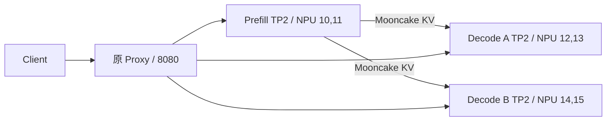

# 1P2D Decode 图执行与异步调度 A/B 实验报告

## 1. 结论

实验 Run ID：`decode-ab-20260805T011500Z`。

**D2 通过晋级门，冻结为后续 MTP 与超长 Chunked Prefill 实验的新受控基线。**

理由：

1. 18 个正式 case 全部成功，`576/576` 请求完成，错误率为 0；
2. 固定 seed 的 8 条输出在 D0、D1、D2 间 SHA256 完全一致；
3. D1 相对 D0 没有可重复的稳态收益；
4. D2 相对 D1 的 TPOT P95 在 C8/C16 三轮中均下降；
5. D2 相对 D1 的 output token/s 在 C8/C16 三轮中均上升；
6. 两路 Decode 负载仍约 50/50，waiting 基本为零，无重启、OOM、Mooncake 或引擎死亡；
7. HBM 不增加，AICore 提升约 8 个百分点。

D2 只作为**后续实验基线**，本轮没有叠加 MTP、Layerwise Connector、Prefix Cache 或其他优化，也没有修改生产 Prefill、Mooncake、Proxy、模型权重和路由策略。

## 2. 基线歧义与实验修正

审计发现生产入口没有显式传入 async 参数，但当前 vLLM-Ascend 平台会自动启用 async，生产日志已经显示 `Asynchronous scheduling is enabled`。若照字面执行“D1=FULL_DECODE_ONLY、D2=FULL_DECODE_ONLY+async”，D1 与 D2 的有效配置会相同。

因此同时保存了两种基线：

- **生产事实基线**：完整 Deployment、Pod、Service、设备映射、健康状态和有效日志快照，未作为 async 因果对照；
- **受控 D0**：显式关闭 async，使 D0→D1 和 D1→D2 都只有一个变量变化。

| 模式 | Decode cudagraph | Decode async | 因果比较 |
|---|---|---|---|
| D0 | `FULL_AND_PIECEWISE` | off | 受控起点 |
| D1 | `FULL_DECODE_ONLY` | off | D0→D1 只改图模式 |
| D2 | `FULL_DECODE_ONLY` | on | D1→D2 只改调度 |

引擎日志确认 D0/D1 为 `async_scheduling=False`，D2 为 `async_scheduling=True`；D0 的有效图模式为 `FULL_AND_PIECEWISE`，D1/D2 为 `FULL_DECODE_ONLY`。

## 3. 冻结拓扑



固定项：Qwen3.6-27B-W8A8、TP2、Prefill eager、MooncakeConnectorV1、相同 KV 参数、相同 Proxy、相同 token-aware 公平路由、Decode `max_num_seqs=64`、`max_num_batched_tokens=4096`、固定模型 seed 1024。

实验使用独立 Deployment `ray-vllm-pd-decode-ab-qwen36-27b`。因它与生产使用同一组 NPU，执行器先保存生产快照，再缩容生产、运行独立实验 Pod，最终将实验缩容到 0 并恢复生产。

## 4. 方法

- 负载：512 input / 512 output；
- 并发：C8、C16；
- 每个 case：32 requests，`request-rate=inf`；
- 随机 seed：`20260805`；
- 每模式每并发：3 轮；
- 温度：0，`ignore_eos=true`；
- SLO：TTFT ≤ 2000 ms、TPOT ≤ 80 ms、E2E ≤ 30000 ms；
- 遥测周期：1 秒；
- 输出一致性：8 条固定 prompt、固定 request seed、逐条文本 SHA256。

采集器没有调用 `ps`。它只从已知 PID 文件出发读取 `/proc/<pid>/task/<pid>/children`、`/proc/<pid>/stat` 和 `/proc/<pid>/status`，并读取 vLLM Prometheus metrics 与 `npu-smi info`。

## 5. 三轮原始核心结果

| 模式 | 负载 | output tok/s（三轮） | TPOT P95 ms（三轮） | 失败 |
|---|---:|---|---|---:|
| D0 | C8 | 215.0 / 238.3 / 237.9 | 31.40 / 31.36 / 31.42 | 0 |
| D1 | C8 | 208.5 / 238.9 / 238.7 | 31.50 / 31.21 / 31.23 | 0 |
| D2 | C8 | 237.2 / 265.9 / 277.3 | 27.87 / 27.80 / 27.82 | 0 |
| D0 | C16 | 397.9 / 445.4 / 447.9 | 33.48 / 33.75 / 33.43 | 0 |
| D1 | C16 | 398.3 / 447.5 / 448.8 | 33.50 / 33.46 / 33.42 | 0 |
| D2 | C16 | 466.5 / 464.6 / 497.4 | 29.86 / 29.92 / 29.87 | 0 |

第一轮普遍含首次真实突发负载的热化成本，所以报告保留三轮原值，并以三轮平均和逐轮方向共同判断，不删除第一轮。

## 6. 三轮平均延迟与吞吐

### C8

| 模式 | output tok/s | TTFT P50/P95/P99 ms | TPOT P50/P95/P99 ms | E2E P50/P95/P99 ms | SLO goodput req/s |
|---|---:|---|---|---|---:|
| D0 | 230.4 | 489.7 / 4092.4 / 4096.4 | 31.19 / 31.40 / 31.43 | 16372 / 20086 / 20111 | 0.336 |
| D1 | 228.7 | 1326.4 / 4019.7 / 4034.0 | 31.08 / 31.31 / 31.32 | 17199 / 19930 / 19933 | 0.327 |
| D2 | 260.1 | 1235.3 / 3426.6 / 3427.1 | 27.68 / 27.83 / 27.84 | 15387 / 17637 / 17639 | 0.389 |

D2 相对 D1：吞吐 `+13.75%`，TPOT P95 `-11.13%`，E2E P95 `-11.51%`，SLO goodput `+19.03%`。

### C16

| 模式 | output tok/s | TTFT P50/P95/P99 ms | TPOT P50/P95/P99 ms | E2E P50/P95/P99 ms | SLO goodput req/s |
|---|---:|---|---|---|---:|
| D0 | 430.4 | 1921.2 / 2089.2 / 2089.9 | 33.35 / 33.55 / 33.56 | 19024 / 19171 / 19172 | 0.606 |
| D1 | 431.5 | 1946.0 / 2096.2 / 2097.7 | 33.33 / 33.46 / 33.46 | 19004 / 19131 / 19132 | 0.608 |
| D2 | 476.2 | 1194.2 / 2812.5 / 2821.8 | 29.73 / 29.88 / 29.88 | 16422 / 18036 / 18046 | 0.655 |

D2 相对 D1：吞吐 `+10.34%`，TPOT P95 `-10.68%`，E2E P95 `-5.73%`，SLO goodput `+7.81%`。

C16 的 D2 TTFT P95 三轮为约 3657/3463/1318 ms，均值高于 D1；这不应解释为 Decode async 使 Prefill 变慢。TTFT 包含 Proxy 排队、Prefill、Mooncake 传输和 Decode 首步，且前两轮仍有突发热状态。D2 的 TPOT、E2E 和吞吐均稳定改善，说明收益主要发生在连续 Decode step，而非首 token 路径。后续若专门优化 TTFT，应拆分 Prefill/KV/Decode-first-step，而不是用本实验改变 Prefill。

## 7. Decode 平衡、队列和资源

| 模式 | 负载 | Decode A/B token share | waiting 峰值 A/B | Decode CPU 平均/实例 | Decode AICore 平均 | HBM 峰值/卡 |
|---|---:|---:|---:|---:|---:|---:|
| D0 | C8 | 49.9% / 50.1% | 0 / 3 | 3.20 cores | 60.3% | 56.7 GiB |
| D1 | C8 | 50.0% / 50.0% | 3 / 3 | 2.40 cores | 59.7% | 56.5 GiB |
| D2 | C8 | 50.0% / 50.0% | 2 / 1 | 4.19 cores | 68.5% | 56.5 GiB |
| D0 | C16 | 49.9% / 50.1% | 0 / 0 | 3.14 cores | 60.8% | 56.7 GiB |
| D1 | C16 | 50.0% / 50.0% | 0 / 0 | 2.34 cores | 59.9% | 56.5 GiB |
| D2 | C16 | 50.0% / 50.0% | 1 / 0 | 4.20 cores | 68.0% | 56.5 GiB |

CPU 百分比是整个 Decode 进程树的 `/proc` tick 增量，400% 约等于持续使用 4 个 CPU core，不是单线程利用率超界。

技术解释：D1 的 FULL_DECODE_ONLY 单独启用后，图边界变化并未成为该模型的主要瓶颈，因此吞吐几乎不动。D2 的 async scheduler 将下一 step 的 CPU 调度与当前 NPU 执行重叠，CPU 使用上升约 1.8 core/Decode，同时 AICore 上升约 8 个百分点；waiting 没有持续积压，说明收益来自减少 host-side dispatch gap，而不是简单堆积更深队列。HBM 基本不变，说明没有通过扩大 KV 容量换吞吐。

## 8. 正确性与稳定性

- 正式请求：`576/576` 完成；
- HTTP/benchmark failed：0；
- 三模式固定输出：8/8 SHA256 完全一致；
- observer 采样错误：D0=0、D1=0、D2=0；
- Pod 重启：0；
- Decode waiting：绝大多数采样为 0；
- 未见 EngineDeadError、OOM、ACL/HCCL/Mooncake 运行时故障；
- 启动日志中的 Torch graph-break `Original traceback` 是编译诊断 warning，三模式均出现，不对应请求失败。

## 9. 晋级与后续边界

D2 满足“无正确性回退、无稳定性问题、TPOT/吞吐可重复改善”的门槛。独立实验 Deployment 仍为 `replicas=0`，其手动启动默认已改为 D2：

```text
FULL_DECODE_ONLY + --async-scheduling
```

后续实验以 D2 为唯一基线，仍应保持单变量顺序：

1. D2 + MTP；
2. 若 MTP 通过，再独立测试超长 Chunked Prefill；
3. Layerwise Connector、Prefix Cache 分别另开实验，不与上两项同轮叠加；
4. 每轮继续保留输出一致性、两路 Decode 公平性和无 `ps` 遥测约束。

## 10. 结果与代码

- 完整结果：`results/decode-ab-20260805T011500Z/`
- 结构化分析：`analysis.json`
- 明细表：`benchmark_summary.csv`
- 生产快照：`baseline/`
- 独立 Deployment：`decode_graph_ab/k8s/qwen36-pd-decode-ab.yaml`
- 实验入口：`decode_graph_ab/scripts/pd-worker-entrypoint-decode-ab.sh`
- 无 ps 采集器：`decode_graph_ab/scripts/decode_ab_observer.py`
- 执行器：`decode_graph_ab/scripts/run_decode_ab_suite.sh`
- 分析器：`decode_graph_ab/scripts/analyze_decode_ab.py`

生产 Deployment 在实验结束后按原配置恢复；本轮没有把 D2 参数写入生产入口。
