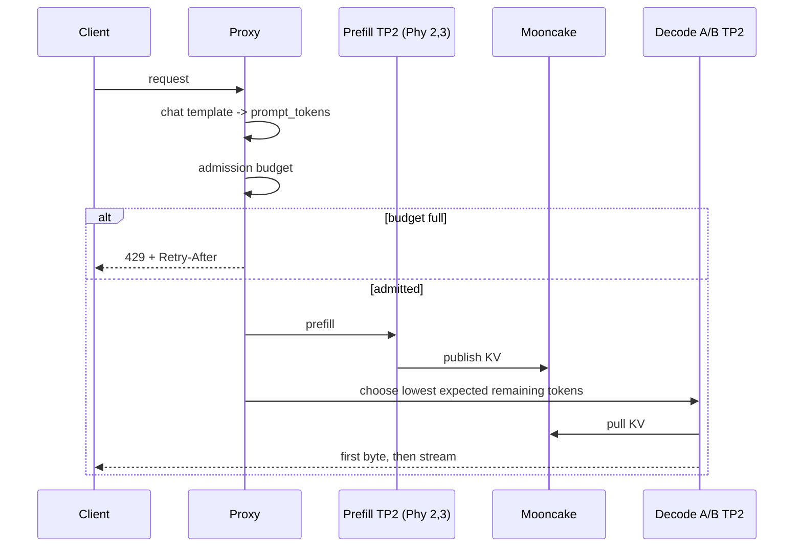

# 1P2D Proxy 调度优化与容量评审附录

> 更新日期：2026-08-04  
> 状态：2026-08-04 已按第 8 节启动并完成顺序路由、混合负载及 Prefill/Decode 容量 A/B。正式结果见 `PD_SCHEDULER_TOKEN_AWARE_EXPERIMENT_REPORT_20260804_CN.md`。

## 1. 这次改动解决什么

原始 vLLM-Ascend 示例 Proxy 把 `request.body` 的字节数当成推理成本，并把后端的
固定 `ordinal` 放进最小堆的平局次序。两个 Decode 空闲时，顺序请求每次都会得到相同
的最小 `(score, ordinal)`，因而长期落到 Decode A。

本次自定义 Proxy 位于：

```text
scripts/pd_proxy.py
```

它只替换 Proxy 调度层，仍复用现有的 vLLM HTTP API、Mooncake KV connector、Prefill
和 Decode Engine。模型、vLLM 参数、NPU 映射和 Mooncake 参数均未改变。

## 2. 新的调度规则

### 2.1 Decode 平局公平

对每个角色，先找出最小负载集合；若多个后端负载相等，在集合内轮询：

```python
candidates = all_non_tainted_backends(role)
lowest = min(load(server) for server in candidates)
ties = sort_by_stable_ordinal(server for server in candidates if load(server) == lowest)
chosen = ties[round_robin_cursor[role] % len(ties)]
round_robin_cursor[role] += 1
```

这不是随机选择，因此可复现并且不需要 seed；对于两个持续空闲的 Decode，顺序请求将
得到 `A -> B -> A -> B`。一旦 A 的活跃预计生成 token 多于 B，B 会因较小负载被优先选中。

### 2.2 Token-aware 负载

Proxy 启动时从本地模型目录加载 tokenizer：

```text
--tokenizer /models/Qwen3.6-27B-w8a8
```

对 `/v1/chat/completions`，它执行：

```python
tokenizer.apply_chat_template(messages, tokenize=True, add_generation_prompt=True)
```

对 `/v1/completions`，它对 prompt 编码；若客户端直接传入 token-id 数组，则直接使用
数组长度。于是所有成本均是模型真正看到的 token，而不是 JSON 转义、空格和字段名造成的
字节数。

| 资源池 | 计量 | 当前用途 |
|---|---|---|
| Prefill | `prompt_tokens` | Prefill KV 压力、准入预算 |
| Decode A/B | `max_completion_tokens` 或 `max_tokens` | 预计剩余生成工作和后端选择 |
| Prefill waiting | `0` | 当前选择明确 429 拒绝模式，未建立隐式内存队列 |

流式响应中，Proxy 用已经生成的文本重新编码并将新增 token 从 Decode 的预计剩余工作中扣除；
请求结束后释放余量。因此 healthcheck 可直接报告每个 Decode 的
`decode_expected_remaining_tokens`。

### 2.3 Prefill 突发保护

新的启动参数：

```text
--max-prefill-inflight-tokens 8192
```

入站规则如下：

```python
if prefill_inflight_tokens + prompt_tokens > max_prefill_inflight_tokens:
    return HTTP 429
        code = "prefill_token_budget_exhausted"
        Retry-After = "1"
else:
    reserve prompt_tokens
    send to Prefill
```

当前是**拒绝而非内部排队**模式。原因是把大 prompt 排进 Proxy 内存队列会隐藏系统的真实
过载，并可能让短请求在队尾等待。客户端、网关或后续独立队列可以依据 `429` 做退避。
若要实现有界等待队列，应单独引入：

```text
max_prefill_waiting_tokens
max_prefill_wait_seconds
shortest-prompt-first 或 FIFO 的明确公平策略
超时后 429，而不是无限排队
```

这应作为下一项独立 A/B，不与 token-aware 改动混在同一实验中。

## 3. 新的请求时间线



Proxy 日志新增三个结构化前缀：

```text
PD_ROUTE      request_id, prompt_tokens, expected_output_tokens, prefill, decode
PD_FIRST_BYTE request_id, prefill_ms, decode_first_byte_ms
PD_COMPLETE   request_id, decode, remaining_decode_tokens
```

结合 Mooncake 的按 request/TP-rank 传输日志，可用以下口径分解：

```text
TTFT = admission/proxy wait
     + Prefill RPC (PD_ROUTE/PD_FIRST_BYTE 中的 prefill_ms)
     + KV transfer critical duration (Mooncake 两个 TP rank 的 max)
     + Decode first-byte time
```

`decode_first_byte_ms` 是从 Prefill 完成后选择 Decode 到首个 Decode 字节的时间；
它包含 Decode 的接收、KV pull 和首步执行。若需要将 KV pull 与首步精确拆开，应把
Mooncake request_id 与 Proxy request_id 在 connector 层显式透传，这是下一层插桩。

## 4. 当前硬件和 Engine 映射

| Engine | 物理 NPU | TP | max context | max batched tokens | max seqs | KV 配置 |
|---|---|---:|---:|---:|---:|---|
| Prefill | 2、3 | 2 | 32768 | 8192 | 16 | Mooncake producer |
| Decode A | 4、5 | 2 | 32768 | 4096 | 64 | Mooncake consumer |
| Decode B | 6、7 | 2 | 32768 | 4096 | 64 | Mooncake consumer |

所有实例使用 `gpu_memory_utilization=0.88` 和 eager safetensors。模型为
Qwen3.6-27B W8A8 的混合注意力结构，不能将每层都当作 full-attention KV 来估算。

## 5. 已完成基线的发送模式与完整结果

| Case 组 | 形状 input/output | 发送模式 | Case 数 | 主要目的 |
|---|---|---|---:|---|
| E0 | 128 / 32 | 固定并发 C1，闭环 | 1 | 暖机 |
| E1 | 1024 / 128 | 固定并发 C1-C32，闭环突发 | 6 | 均衡饱和曲线 |
| E2 | 4096 / 16 | 固定并发 C2-C8，闭环突发 | 3 | Prefill 饱和 |
| E3 | 512 / 512 | 固定并发 C2-C32，闭环突发 | 5 | Decode 饱和 |
| E4 | 4096 / 256 | 固定并发 C4/C8，闭环突发 | 2 | 长输入长输出 |
| E5 | 512 / 128 | 开放环 0.5/1/2 RPS | 3 | 稳态到达率 |
| E6 | 256 / 512 | 顺序 C1、并发 C8 | 2 | 路由行为 |
| E7 | 512 / 128 | 开放环 0.5 RPS，30 分钟 | 1 | 稳定性 |

吞吐口径：`output tok/s` 是生成 token；`total tok/s` 是输入加输出 token。两者都保存在
`benchmark_summary.csv`。例如，E5 的完整开放环结果为：

| 到达率 | 实际 req/s | output tok/s | total tok/s | TTFT P50/P95/P99 ms | TPOT P50/P95/P99 ms | E2E P50/P95/P99 ms |
|---:|---:|---:|---:|---|---|---|
| 0.5 RPS | 0.45 | 57.75 | 288.74 | 284.65 / 517.66 / 548.60 | 25.06 / 26.67 / 26.68 | 3496.12 / 3870.19 / 3887.63 |
| 1.0 RPS | 0.87 | 111.61 | 558.06 | 347.15 / 494.84 / 519.70 | 26.15 / 27.15 / 27.22 | 3701.08 / 3903.03 / 3924.30 |
| 2.0 RPS | 1.62 | 206.91 | 1034.57 | 358.24 / 515.68 / 525.31 | 27.77 / 28.36 / 28.37 | 3900.60 / 4055.15 / 4099.70 |

这些 baseline Case 每种形状只执行一次。因此没有可报告的重复试验置信区间或波动范围；
容量评审前，应至少对选定档位做三次热态重复，并报告均值、标准差和 P95/P99 区间。

## 6. Decode A/B 独立表现

30 分钟 E7 中，Engine counter delta 为：

| Decode | generation token delta | 以 1803.45 秒计算的 output tok/s | running avg | waiting max | AICore avg（两卡） |
|---|---:|---:|---:|---:|---|
| A（Phy 4、5） | 61888 | 34.32 | 0.868 | 1 | 48.33% / 48.37% |
| B（Phy 6、7） | 53418 | 29.62 | 0.758 | 1 | 39.49% / 39.21% |

差异来自旧 Proxy 的顺序平局偏置以及随机到达时有限样本，而不是 B 不可用。新轮询策略的
验收条件是：顺序 C1 产生严格交替的 `PD_ROUTE`，混合开放环下两个 Decode 的输出 token
与 active token 差异不再长期偏向同一侧。

## 7. 混合负载实验入口

新增：

```text
scripts/mixed_pd_load.py
```

它将四种请求随机交织：

```text
short          128 / 16
balanced       512 / 128
prefill_heavy  4096 / 16
decode_heavy   512 / 512
```

启动新 Worker 后，在 Pod 内运行：

```bash
python3 /opt/qwen36-pd/mixed_pd_load.py \
  --per-shape 8 \
  --request-rate 1.0 \
  --max-concurrency 16
```

需要分别记录每类的 E2E P50/P95/P99、429 数、失败数，并将 `PD_ROUTE` 与两个 Decode
的 Engine metrics 对齐。重点判断短请求是否被 4096 输入堵塞，以及 Decode A/B 是否均衡。

## 8. 实机启动与设备映射核验

此前宿主机审计对 `npu-smi info` 的两列编号作了错误解释，现已更正：首列是板内 NPU
索引，第二列 `Phy-ID` 才是物理卡号。独立 Docker 容器的设备节点挂载虽包含
`/dev/davinci0..7`，但其活动进程对应的是 **Phy-ID 8..15**，并不占用本实验的 Phy-ID
2..7。该容器的事实记录如下：

```text
container: ba64bb959600386dc20f92e35a1da3acff6141771e3ce88658057d83428fda9c
name:      vllm
image:     quay.io/ascend/vllm-ascend:v0.21.0rc1-a3
created:   2026-07-13T04:15:43Z
started:   2026-07-29T07:48:25Z
active Phy-ID: 8..15
```

它与 Kubernetes Deployment `ray-vllm-pd-worker-qwen36-27b` 无关。Deployment 已在
2026-08-04 成功运行，Pod 为 `ray-vllm-pd-worker-qwen36-27b-7b477d6857-h57bj`，并以
`2,3 / 4,5 / 6,7` 分别运行 Prefill、Decode A、Decode B。所有 Engine 健康检查通过，
Proxy 单元测试输出 `PASS: fair Decode ties and token-aware prefill admission`。

复现实验可使用：

```bash
cd /home/admin/testpanxy/infralearning/qwen36_pd_1p2d
NPU_IDLE_CONFIRMED=YES ./start.sh

POD=$(KUBECONFIG=/home/admin/k3s.yaml kubectl -n infra-learning get pod \
  -l app=ray-vllm-pd-worker-qwen36-27b -o jsonpath='{.items[0].metadata.name}')
KUBECONFIG=/home/admin/k3s.yaml kubectl -n infra-learning exec "$POD" -- \
  python3 /opt/qwen36-pd/test_pd_proxy_scheduler.py
KUBECONFIG=/home/admin/k3s.yaml kubectl -n infra-learning exec "$POD" -- \
  python3 /tmp/mixed_pd_load.py --per-shape 8 --request-rate 1.0
```

`run_scheduler_optimization_suite.sh` 现会将所需的验证脚本复制到 Pod 的 `/tmp`，避免
误使用镜像中旧副本。容量结论仍需为目标档位至少进行三次热态重复；本轮是一轮受控证据，
不是带置信区间的容量认证。
