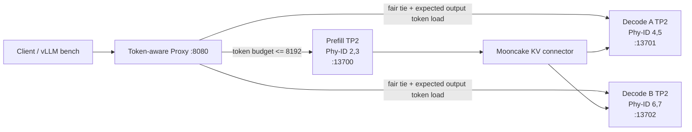

# 1P2D Token-aware Proxy 调度与容量实验报告

> 实验日期：2026-08-04（UTC）  
> 状态：完成一轮实机验证；实验结束后 Deployment 已缩容为 `replicas=0`，Worker Pod 已删除。  
> 结果目录：`results/pd-scheduler-20260804T021000Z/`、`results/pd-scheduler-fixed-20260804T022351Z/`

## 1. 结论摘要

本轮验证了三个此前没有被可靠证明的性质：

1. 顺序、同负载请求不再固定落到 Decode A。8 个请求在 Proxy 的 `PD_ROUTE` 日志中严格为
   `13701(A) -> 13702(B) -> 13701 -> 13702 -> 13701 -> 13702 -> 13701 -> 13702`。
2. Prefill 的准入控制按**真实 token**生效。三个精确的 4096-token 请求并发进入时，两个
   成功（1038、1417 ms），第三个在 12 ms 内收到 `429 prefill_token_budget_exhausted`；没有
   在 Proxy 或 Prefill 内形成隐式等待队列。
3. 在 512-input / 512-output、固定并发 16 的 Decode 容量实验中，两个 Decode 的 generation
   counter 增量为 8247 与 8250 token，差异仅 3 token（0.04%）。两组 TP2 Decode 的 AICore
   平均约为 67%/67% 与 61%/61%，说明当前主要工作确实被两路 Decode 分担，而不是单路偏置。

当前可执行的工程判断是：**调度公平与 Prefill 保护已通过功能验收；512/512 的高并发负载
仍不满足 TTFT 2 秒的 goodput 目标，因此不能仅凭双 Decode 平均利用率就判定应扩 Decode。**
应先做有界 token 队列、真实 chat-token 的混合开放环重复实验，再决定增加 Prefill 还是 Decode。

## 2. 实验对象与拓扑



| 角色 | 物理 NPU | TP | `max_num_batched_tokens` | `max_num_seqs` | 职责 |
|---|---|---:|---:|---:|---|
| Prefill | 2, 3 | 2 | 8192 | 16 | 计算输入 KV、发布 KV |
| Decode A | 4, 5 | 2 | 4096 | 64 | 拉取 KV、连续生成 |
| Decode B | 6, 7 | 2 | 4096 | 64 | 拉取 KV、连续生成 |

所有 Engine 使用 Qwen3.6-27B-A3B W8A8、`gpu_memory_utilization=0.88`、eager safetensors
加载。三组模型的稳定 HBM 占用约为 56-58 GiB/卡。实验 Pod：
`ray-vllm-pd-worker-qwen36-27b-7b477d6857-h57bj`。

### 2.1 设备映射更正

此前将 `npu-smi info` 首列误视为物理编号。Ascend 输出中的第二列 `Phy-ID` 才是物理卡号。
宿主机独立 Docker 容器 `vllm` 挂载了 `/dev/davinci0..7`，但其活跃进程实际对应 Phy-ID 8..15；
它不与本实验的 2..7 冲突。该容器创建于 `2026-07-13T04:15:43Z`，启动于
`2026-07-29T07:48:25Z`。本结论已同步更正到附录。

## 3. 这轮代码改变了什么

改动集中在 `scripts/pd_proxy.py`，没有改动模型、vLLM Engine、Mooncake 或 Kubernetes 的设备
配置。

### 3.1 平局公平与负载定义

Decode 选择不再把固定 ordinal 当作平局决胜条件，而是：

```text
candidate = 所有健康 Decode
min_load = min(预计剩余生成 token)
ties = load == min_load 的稳定排序集合
chosen = ties[round_robin_cursor % len(ties)]
```

Decode 的负载是请求 `max_tokens` 的预计剩余值。流式输出每产生 token，Proxy 就扣减一次；请求
结束时释放剩余预算。因此平局时严格轮询，有活动长输出时优先选择预计工作较少的一侧。

### 3.2 token-aware Prefill 准入

对 Chat API，Proxy 用 `apply_chat_template(..., tokenize=True)`；对 completion 文本用本地模型
tokenizer；调用方传 token-id 数组时直接使用数组长度。预算为：

```text
prefill_inflight_tokens + prompt_tokens <= 8192
```

不满足时直接返回 HTTP 429 和 `Retry-After: 1`。它是明确的背压接口，不是服务崩溃或 vLLM
失败。当前 `prefill_waiting_tokens` 固定为 0，因为尚未实现 Proxy 内部有界队列。

### 3.3 可观测性

Proxy 写出 `PD_ROUTE`、`PD_FIRST_BYTE`、`PD_COMPLETE` 三类结构日志；每秒采集三组 Engine 的
running/waiting/KV usage、Engine 进程 RSS/CPU 与 Phy-ID 2..7 的 AICore/HBM。`/healthcheck`
报告 Prefill 在途 token、429 计数和每个 Decode 的预计剩余 token。

## 4. 方法与有效性边界

### 4.1 有效实验

| 组别 | 输入/输出 | 发送模式 | 用途 |
|---|---|---|---|
| 顺序路由 | 文本（实际 402 token）/16 | C1，8 次串行 | 验证平局交替 |
| 准入 | 精确 token-id 4096/16 | 3 个并发 | 验证 8192-token 预算 |
| 混合 | 128/16、512/128、4096/16、512/512 的文本近似 | 1 RPS 开放环，4 类各 4 | 观察背压与短请求隔离 |
| P 容量 A/B | 4096/16 | 闭环突发 C2、C4 | 观察 Prefill 准入 |
| D 容量 A/B | 512/512 | 闭环突发 C8、C16 | 观察 Decode 横向分担 |

`vllm bench` 的随机数据集使用精确 `random-input-len`；混合脚本用文本生成器，因此实际经过
tokenizer 的 prompt 长度与名称不同，例如所谓 128/512 输入在日志中分别为约 402/1938 token。
这不是测量误差，恰好说明生产调度不能使用“请求体字节数”或用户标称长度。

### 4.2 无效记录的处理

早期一次自定义脚本默认 base URL 带 `/v1`，又向 `/v1/completions` 发请求，形成 `/v1/v1/completions`
并返回 404。这批记录保留在最初结果目录以便审计，但**不参与任何性能结论**。脚本已改为
`http://127.0.0.1:8080`，套件也会显式复制当前混合脚本到 Pod 的 `/tmp`。

本报告每个容量档位仅一轮热态样本；没有置信区间，也不把偶然的 P95 改善解释为因果收益。

## 5. 结果

### 5.1 顺序路由：功能 PASS

8/8 请求成功。Proxy 的实际选择序列：

```text
A, B, A, B, A, B, A, B
```

第一次请求为 2991 ms，随后 7 个为约 647-652 ms。这是启动后首个请求的缓存、图编译或服务
热态差异，不应混进调度公平结论；路由本身在全部 8 次中严格交替。

### 5.2 Prefill 突发保护：功能 PASS

| 并发请求 | token 数 | 结果 | 延迟 |
|---:|---:|---|---:|
| 1 | 4096 | 200 | 1038 ms |
| 2 | 4096 | 200 | 1417 ms |
| 3 | 4096 | 429 `prefill_token_budget_exhausted` | 12 ms |

两个 admitted 请求的 `usage.prompt_tokens` 都是 4096。健康检查在测试完成后显示
`prefill_inflight_tokens=0`、所有 Decode 预计剩余 token 为 0；采样中的 Engine waiting 最大值均为 0。

这证明预算在 Proxy 边界生效：第三个请求没有进入 Prefill 的 vLLM waiting 队列，也没有占用
Mooncake/Decode 状态。代价是客户端需要处理 429；这比无限排队更利于保护短请求的延迟上界。

### 5.3 混合开放环：短请求未被长 Prefill 隐式排队

配置为 1 req/s、最大并发 16、每个形状 4 个请求。修复脚本后的结果：

| 类型 | 成功 / 拒绝 | E2E P50 / P95 ms | 解释 |
|---|---:|---:|---|
| short | 4 / 0 | 745 / 747 | 所有短请求通过 |
| balanced | 2 / 2 | 3596 / 3827（含拒绝） | 与在途长请求竞争 P token 预算 |
| decode-heavy | 3 / 1 | 13693 / 13798（含拒绝） | Decode 512 token 的生成时间主导 |
| prefill-heavy | 0 / 4 | 49 / 50（均为拒绝） | 文本实际 token 超过 8192 或不适合当前剩余预算 |

总体为 9 成功、7 明确拒绝、0 HTTP/解析失败。这里的 P50/P95 对含 429 的类别只能表示客户端
响应时间，不能当作成功请求延迟。关键现象是：四个 short 均成功且约 0.75 秒完成；长输入没有
把它们压入不透明队尾。这验证了“拒绝模式”实现了隔离，但也暴露出下一步需要可选的**有界队列**：
对可等待的长请求直接 429 可能损失可用吞吐。

### 5.4 Prefill 容量 A/B

| Case | 完成/拒绝 | output tok/s | TTFT P50/P95 ms | P waiting max | P AICore avg（Phy 2/3） |
|---|---:|---:|---:|---:|---|
| 4096/16, C2 | 8/0 | 13.04 | 619 / 6259 | 0 | 50.0% / 44.2% |
| 4096/16, C4 | 2/14 | 20.55（仅成功请求） | 935 / 1150 | 0 | 采样窗口过短，不能解释为 0% |

C4 的 14 个“failed”来自基准工具记录的 HTTP 429，不是 Engine 崩溃。4096-token prompt 的总
预算仅容纳两个请求，所以这是预期保护行为。C2 的 P95 有 6.26 秒长尾，尽管 waiting=0；它说明
“没有 vLLM 等待队列”不等于 Prefill RPC 时间恒定，仍可能受到批处理边界、异步处理、KV 发布或
首请求热态影响。要把这些因素分开，需要按 request_id 关联 Prefill Engine trace 与 Mooncake
connector trace。

### 5.5 Decode 容量 A/B

| Case | 完成/失败 | output tok/s | TTFT P50/P95 ms | TPOT P50/P95 ms | E2E P95 ms |
|---|---:|---:|---:|---:|---:|
| 512/512, C8 | 16/0 | 223.66 | 2811 / 5459 | 27.58 / 27.97 | 19607 |
| 512/512, C16 | 32/0 | 435.52 | 3614 / 3677 | 29.58 / 29.79 | 18891 |

C16 相比 C8 的 output throughput 为 1.95 倍，接近线性增加；但 C16 的 TTFT P95 仍为 3.68 秒，
按 `ttft<=2s, tpot<=80ms, e2el<=30s` 的 goodput 口径只有 0.0797 req/s。C8 的好吞吐不等于
低交互延迟，C16 的更高并行度也不等于更低首 token 延迟。

| C16 Decode 指标 | Decode A（Phy 4/5） | Decode B（Phy 6/7） |
|---|---:|---:|
| generation token delta | 8247 | 8250 |
| AICore average | 67.22% / 66.96% | 61.35% / 61.22% |
| running P90 / max | 8 / 8 | 8 / 8 |
| waiting max | 0 | 0 |

两个 Engine counter 几乎相等，是强路由证据；两组 AICore 的差异更可能来自采样相位、各 TP rank
的具体 kernel/通信负载，而不是 A/B 单边过载。Prefill 在 C16 中完成得很快，1 秒采样多次为 0%
也符合其短寿命；不能据此说 Prefill 没有工作。

## 6. 深层技术解释

### 6.1 为什么公平修复和吞吐修复是两件事

旧的 ordinal 平局策略造成的是**全局长期偏差**：即使两路引擎都空闲，A 始终先被选择。新轮询
消除了这个确定性偏差，C16 的 token counter 证明它有效。但它不会自动缩短单个请求的 Prefill、
KV transfer 或 Decode step，因此 TTFT 仍可高于目标。

### 6.2 8192-token 预算保护的对象

这个预算限制的是请求进入 Prefill 前由输入 token 导致的在途工作，不等价于模型总 KV 容量，也不
等价于 HBM 上 56-58 GiB 的静态模型占用。它控制“突然同时到来的长 prompt”把 Prefill batch、
KV 发布以及随后的 Decode handoff 一起推入长尾的风险。当前 8192 是有意保守的运行点；它适合
保护服务，不是吞吐极值。

### 6.3 Mooncake 的可见与不可见部分

成功的 1P2D 请求已经证明 Prefill producer、Mooncake connector 与两个 Decode consumer 的基本
链路可用。当前日志给出的 `decode_first_byte_ms` 是从 Prefill 响应后到 Decode 首字节，包含：

```text
Decode 选择 + 连接建立/排队 + Mooncake KV pull + Decode 首步
```

但本轮没有在 connector 日志中稳定采到能以 request_id 关联的两 rank 传输事件，因此不能诚实地
给出“KV 传输单独 P50/P95”。下一轮应在 connector 中显式传播 Proxy request_id，并分别记录：

```text
publish begin/end, pull begin/end, bytes, rank, cache hit/miss, retry reason
```

否则把整个 `decode_first_byte_ms` 归因给 Mooncake 是错误的。

### 6.4 为什么混合文本的标称 token 不可靠

`"token0 token1 ..."` 中每个词可被词表拆成多个 token；本轮标称 128/512 的提示分别在 Proxy
测得约 402/1938 token。因此基于 HTTP body bytes 的调度会把 JSON 格式、Unicode、空格等无关
因素混入成本，无法解释为什么同样“512”有不同 Prefill 时间。tokenizer 计算虽然有少量 CPU 成本，
但它建立了可控的容量单位，是进行 token-aware admission 的前提。

## 7. 下一步：从实验到容量决策

1. **增加有界队列 A/B。** 保持 `8192` 在途 token，再加 `max_prefill_waiting_tokens` 和
   `max_prefill_wait_seconds`。分别测 FIFO 与 shortest-prompt-first，报告 short 的 P99 与长请求
   接受率，避免只用 429 数量判断好坏。
2. **做重复混合开放环。** 固定真实 token-id 的 128、512、4096 输入与 16、128、512 输出，分别在
   1 和 2 RPS 下至少重复三次，报告 P50/P95/P99、方差和每个 Decode 的 token/s。
3. **分解 TTFT。** 给 Proxy、Prefill、Mooncake、Decode 加同一个 trace ID。只有当 Prefill RPC 或
   Prefill token waiting 持续饱和时，才增加 Prefill；只有路由已均衡且两个 Decode 的 running 持续满、
   waiting 持续出现时，才增加 Decode。
4. **加入预测校正。** 当前 Decode 用 `max_tokens` 作为预计剩余量。应记录实际 completion token / 请求
   类型的历史分布，将低估、过早 EOS、流式断开纳入在线估计，但保留上界保护。
5. **把 AICore 当辅证，不当主判据。** Ascend 的 1 秒采样会遗漏短 Prefill kernel；容量主指标应是
   accepted/goodput、TTFT、per-engine running/waiting、KV usage 与 request-level trace。

## 8. 复现命令

```bash
cd /home/admin/testpanxy/infralearning/qwen36_pd_1p2d
export KUBECONFIG=/home/admin/k3s.yaml
NPU_IDLE_CONFIRMED=YES ./start.sh

POD=$(kubectl -n infra-learning get pod \
  -l app=ray-vllm-pd-worker-qwen36-27b -o jsonpath='{.items[0].metadata.name}')

kubectl -n infra-learning exec "$POD" -- \
  python3 /opt/qwen36-pd/test_pd_proxy_scheduler.py

RUN_ID=pd-scheduler-$(date -u +%Y%m%dT%H%M%SZ) \
  ./scripts/run_scheduler_optimization_suite.sh

python3 scripts/analyze_pd_results.py \
  "results/$RUN_ID"
```

服务端的正式结果路径：

```text
/home/admin/testpanxy/infralearning/qwen36_pd_1p2d/results/pd-scheduler-20260804T021000Z
/home/admin/testpanxy/infralearning/qwen36_pd_1p2d/results/pd-scheduler-fixed-20260804T022351Z
```

## 9. 实验后资源状态

实验结束后，`ray-vllm-pd-worker-qwen36-27b` 已被缩容到 `replicas=0`，对应 Pod 已删除。
A3 宿主机的 `npu-smi info` 复核显示 Phy-ID 2..7 均为 0 HBM 进程占用；Phy-ID 8..15 的独立
Docker vLLM 进程保持不变，未被本实验修改。
