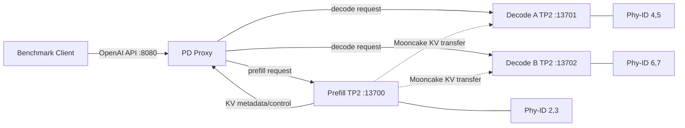
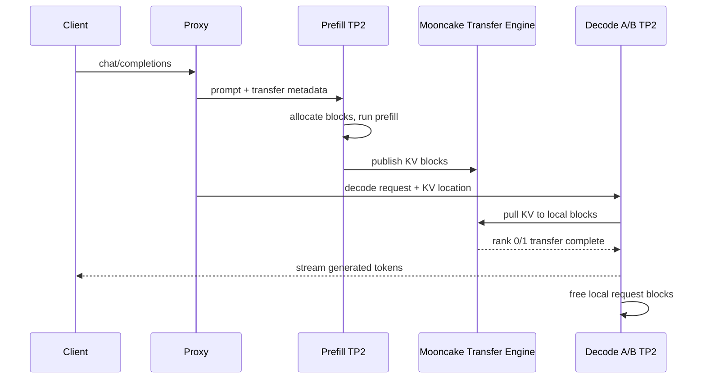

# Qwen3.6-27B W8A8 1P2D 吞吐与深度观测实验报告

> 实验 ID：`pd-research-20260803T112500Z`  
> 实验时间：2026-08-03 11:23:36 至 12:16:38 UTC  
> 实验状态：通过，23/23 Case 完成，全部推理请求成功  
> 原始结果：`results/pd-research-20260803T112500Z/`

## 1. 结论摘要

本轮在一个常驻 Qwen3.6-27B W8A8 服务上完成了吞吐、时延、路由、KVCache、
Mooncake 传输和 30 分钟稳定性实验。测试期间没有重启模型，也没有修改 Deployment。

核心结论如下：

1. **1P2D 已真实工作，不是名义上的三实例。** 并发请求同时驱动 Decode A 和
   Decode B；顺序请求因 Proxy 的平局规则全部落到 Decode A。
2. **低延迟稳态区间表现稳定。** 30 分钟以 `0.5 req/s` 输入 512、输出 128：
   `900/900` 成功，TTFT P95 `456.84 ms`，TPOT P95 `26.76 ms`，E2E P95
   `3.80 s`，Goodput `0.499 req/s`。
3. **峰值 Decode 吞吐为 784.06 output tok/s。** 该结果来自输入 512、输出 512、
   并发 32；代价是 TTFT P95 上升至 `6.07 s`，因此它是吞吐档，不是低延迟档。
4. **Prefill-heavy 已由 Prefill 卡饱和。** 输入 4096、输出 16 时，物理 2/3
   AICore 接近 `100%`，总 token 吞吐从并发 4 的 `8288.96 tok/s` 增至并发 8
   的 `8608.08 tok/s`，边际收益仅约 `3.85%`。
5. **Mooncake 不是当前主要延迟瓶颈。** Decode A/B 的热路径 KV 传输中位数分别为
   `1.92/1.75 ms`，P95 为 `9.01/7.03 ms`；所有已解析请求均收到两个 TP rank
   的完成事件，缺 rank 数为零。
6. **当前优先优化对象是 Proxy 的准入和路由模型。** 示例 Proxy 用请求体字节数
   近似负载，不理解真实 token 数和 `max_tokens`，顺序请求还会长期偏向 Decode A。
   对突发流量，应先做 token-aware 调度和 Prefill 准入，再考虑增加 Decode。

## 2. 实验拓扑



| 角色 | 端口 | 物理 NPU | 并行方式 | 调度容量 |
|---|---:|---|---|---|
| Proxy | 8080 | 无 | asyncio HTTP | 两个独立 Decode 后端 |
| Prefill | 13700 | 2、3 | TP=2 | `max_num_seqs=16`，`max_num_batched_tokens=8192` |
| Decode A | 13701 | 4、5 | TP=2，DP=1 | `max_num_seqs=64`，`max_num_batched_tokens=4096` |
| Decode B | 13702 | 6、7 | TP=2，DP=1 | `max_num_seqs=64`，`max_num_batched_tokens=4096` |

这不是一个 `DP=2` 的 Decode Engine，而是两个各自拥有 Engine、KV block allocator、
HTTP 服务和健康状态的单副本 Decode。Proxy 在它们之间做请求级选择。

Pod 资源为 `cpu=64`、`memory=256Gi`、六个逻辑 Ascend910 设备；三个模型实例均使用
`gpu_memory_utilization=0.88`、`max_model_len=32768` 和 eager safetensors 加载。

## 3. 软件与模型基线

| 组件 | 实测版本 |
|---|---|
| vLLM | `0.22.1+empty` |
| vLLM-Ascend | `0.22.1rc1` |
| PyTorch distribution | `2.10.0+cpu` |
| torch-npu | `2.10.0` |
| transformers | `5.5.4` |
| NPU driver CLI | `npu-smi 26.0.rc1` |
| 模型 | `/models/Qwen3.6-27B-w8a8` |

`vllm 0.22.1+empty` 是 Ascend 源码构建常见的 distribution 标记，不表示空实现；
实际设备后端由 `vllm-ascend` 和 `torch-npu` 提供。模型为混合注意力架构，64 层中
包含 16 层 full attention 和 48 层 linear attention，因此仅用传统全 attention
模型的 KV 字节公式解释它会失真。

## 4. 方法与质量口径

### 4.1 测试矩阵

本轮共执行 23 个 Case：

- E0：暖机和正确性；
- E1：输入 1024、输出 128，并发 1/2/4/8/16/32；
- E2：输入 4096、输出 16，并发 2/4/8；
- E3：输入 512、输出 512，并发 2/4/8/16/32；
- E4：输入 4096、输出 256，并发 4/8；
- E5：输入 512、输出 128，开放环 0.5/1/2 req/s；
- E6：顺序与并发请求的 Decode 路由对照；
- E7：0.5 req/s、900 请求、30 分钟稳态。

每个 Case 前后抓取三个 Engine 的 Prometheus counter 和 Proxy 状态；测试中持续采样：

```text
Engine: running / waiting / KV cache usage
Proxy:  request_num / health
Process: CPU / RSS
NPU:    Phy-ID 2..7 的 AICore / HBM
Mooncake: 每个 request、每个 TP rank 的 transfer duration
```

采样目标周期为 1 秒。由于一次 `npu-smi` 调用本身有开销，实测 1873 条记录覆盖约
53 分钟，平均周期约 1.7 秒。因此亚秒级 Prefill 脉冲可能落在两个采样点之间；
请求 counter delta 和基准测试端时延不受这一限制。

### 4.2 Goodput SLO

本轮 Goodput 使用以下约束：

```text
TTFT < 2000 ms
TPOT < 80 ms
E2E  < 30000 ms
```

吞吐和 Goodput 必须一起看：Output tok/s 表示完成了多少生成工作，Goodput 表示其中
有多少请求仍满足服务目标。

## 5. 吞吐实验结果

### 5.1 E1：均衡负载饱和曲线

固定输入 1024、输出 128。

| 并发 | req/s | output tok/s | Goodput req/s | TTFT P95 ms | TPOT P95 ms | P wait max |
|---:|---:|---:|---:|---:|---:|---:|
| 1 | 0.29 | 37.04 | 0.29 | 298.04 | 24.99 | 0 |
| 2 | 0.57 | 73.28 | 0.57 | 395.60 | 25.04 | 0 |
| 4 | 0.98 | 125.65 | 0.89 | 3035.45 | 26.34 | 0 |
| 8 | 1.47 | 188.75 | 0.86 | 3596.59 | 28.60 | 0 |
| 16 | 2.64 | 337.93 | 1.98 | 6782.76 | 31.04 | 6 |
| 32 | 4.55 | 581.95 | 3.03 | 6636.34 | 33.46 | 14 |

并发 2 相比并发 1，output tok/s 增加约 `97.85%`，TPOT 基本不变。这是两个 Decode
副本同时承担生成的直接收益。并发继续增加仍能提高吞吐，但 Prefill 突发排队使 TTFT
在并发 4 后越过 2 秒 SLO。因而：

- `C2` 是偏低时延档；
- `C16-C32` 是吞吐档；
- 单看 C32 的 581.95 tok/s 会掩盖 6.64 秒 TTFT P95。

### 5.2 E2：Prefill-heavy

固定输入 4096、输出 16。

| 并发 | req/s | total tok/s | Goodput req/s | TTFT P95 ms | NPU 2/3 AICore avg | P wait max |
|---:|---:|---:|---:|---:|---|---:|
| 2 | 1.80 | 7416.65 | 1.80 | 936.58 | 100% / 99% | 0 |
| 4 | 2.02 | 8288.96 | 1.76 | 2029.10 | 100% / 100% | 0 |
| 8 | 2.09 | 8608.08 | 0.20 | 3389.35 | 100% / 99.5% | 4 |

并发从 4 增至 8，总 token 吞吐只增加约 `3.85%`，而 Goodput 从 1.76 降至
0.20 req/s。物理 2/3 已饱和，Decode 卡并非瓶颈。对此负载继续增加 Decode 实例
不会改善 TTFT；有效方向是增加 Prefill 容量、缩短 prompt 或做 admission control。

### 5.3 E3：Decode-heavy

固定输入 512、输出 512。

| 并发 | req/s | output tok/s | Goodput req/s | TTFT P95 ms | TPOT P95 ms | D wait max A/B |
|---:|---:|---:|---:|---:|---:|---|
| 2 | 0.15 | 78.61 | 0.15 | 433.45 | 24.85 | 0 / 0 |
| 4 | 0.27 | 140.29 | 0.22 | 2837.89 | 27.09 | 0 / 0 |
| 8 | 0.52 | 266.52 | 0.44 | 3073.94 | 28.51 | 0 / 0 |
| 16 | 0.90 | 462.09 | 0.43 | 3184.25 | 31.74 | 0 / 2 |
| 32 | 1.53 | **784.06** | 0.67 | 6073.36 | 34.36 | 0 / 6 |

C32 的 Decode A/B AICore 均值约 `66%/71%`，四个 Decode 逻辑设备的 P90 为
`71%-74%`。输出吞吐仍在增长，TPOT P95 也仅从 C2 的 24.85 ms 增至 34.36 ms；
但突发请求在 Prefill 形成最高 15 的等待队列，TTFT 明显恶化。

### 5.4 E4：长输入长输出

固定输入 4096、输出 256。

| 并发 | req/s | output tok/s | total tok/s | TTFT P95 ms | TPOT P95 ms |
|---:|---:|---:|---:|---:|---:|
| 4 | 0.49 | 126.04 | 2142.62 | 1852.34 | 26.93 |
| 8 | 0.86 | 221.25 | 3761.29 | 3811.02 | 28.97 |

C4 仍接近低延迟边界；C8 吞吐提高约 75.5%，但 TTFT P95 超过 3.8 秒。

### 5.5 E5：开放环到达率

固定输入 512、输出 128。

| 配置到达率 | 实际 req/s | Goodput req/s | output tok/s | TTFT P95 ms | TPOT P95 ms |
|---:|---:|---:|---:|---:|---:|
| 0.5 | 0.45 | 0.45 | 57.75 | 517.66 | 26.67 |
| 1.0 | 0.87 | 0.87 | 111.61 | 494.84 | 27.15 |
| 2.0 | 1.62 | 1.62 | 206.91 | 515.68 | 28.36 |

三档请求均 100% 满足本轮 SLO。它们与 E1 的差异说明，系统对平均负载并不脆弱，
长尾主要由“同一时刻注入大量请求”的突发形态触发。

### 5.6 E7：30 分钟稳态

配置为输入 512、输出 128、`0.5 req/s`、最大并发 16。

| 指标 | 结果 |
|---|---:|
| 成功 / 失败 | **900 / 0** |
| 持续时间 | 1803.45 s |
| 实际吞吐 / Goodput | 0.499 / 0.499 req/s |
| output / total token throughput | 63.88 / 319.39 tok/s |
| TTFT P50 / P95 / P99 | 316.84 / 456.84 / 532.29 ms |
| TPOT P50 / P95 / P99 | 25.34 / 26.76 / 27.25 ms |
| E2E P50 / P95 / P99 | 3.54 / 3.80 / 3.92 s |
| Proxy 并发 P50 / P95 / max | 2 / 4 / 9 |

稳态期间 Prefill `waiting max=0`；Decode A/B 仅偶发 `waiting max=1`，非零采样占比
分别为 `1.04%/0.95%`。Decode KV 使用峰值分别为 `2.8%/2.2%`，没有持续增长。

## 6. 请求究竟去了哪一个 Decode

### 6.1 顺序请求

E6 顺序发送 4 个输入 256、输出 512 的请求：

```text
Decode A generation counter delta: 2058
Decode B generation counter delta: 0
Phy-ID 4/5 AICore avg: 67.4% / 67.1%
Phy-ID 6/7 AICore avg: 0% / 0%
```

这不是 Decode B 故障。当前 Proxy 在负载分数相同的情况下按后端序号破平局；下一个
请求到来前，上一个请求已经结束，于是每次都再次选择 A。

### 6.2 并发请求

E6 同时发送 8 个同规格请求：

```text
Decode A generation counter delta: 2649
Decode B generation counter delta: 1692
Phy-ID 4/5 AICore avg: 60.9% / 61.4%
Phy-ID 6/7 AICore avg: 62.9% / 62.6%
```

counter 的采样边界包含少量相邻请求，不能把 2649:1692 当成严格的业务分片比例；
但 Engine counter 与四张卡同步活跃足以证明两路 Decode 都参与了生成。

## 7. KVCache 与 Mooncake 观测

### 7.1 生命周期

一次请求的关键状态为：



Prefill 与 Decode 并不共享同一块 HBM。Prefill 先在自身 block allocator 中生成 KV，
Mooncake 按传输元数据把内容复制到目标 Decode 已分配的本地 block；Decode 消费的仍是
自己的地址空间。请求结束后，两端依据各自生命周期回收块。

### 7.2 传输分布

这里的 critical duration 是同一请求两个 TP rank 传输时间的最大值，而不是求和。

| 后端 | TP rank events | 完整请求 | P50 | P90 | P95 | P99 | max | 缺 rank 请求 |
|---|---:|---:|---:|---:|---:|---:|---:|---:|
| Decode A | 1756 | 878 | 1.92 ms | 4.54 ms | 9.01 ms | 19.43 ms | 215.16 ms | **0** |
| Decode B | 1490 | 745 | 1.75 ms | 3.76 ms | 7.03 ms | 17.27 ms | 217.91 ms | **0** |

约 215-218 ms 的最大值出现在早期冷连接/首次路径，热路径中位数约 2 ms。与突发实验
数秒级 TTFT P95 相比，Mooncake 传输不是主要贡献项；主要时间在 Prefill 排队和计算。

本轮未开启 `MC_TE_METRIC=1`，因此没有采集链路带宽、RDMA operation queue 等更底层
Transfer Engine counter。现有日志足以证明按请求、按 TP rank 的完成性和耗时，但不能
据此反推物理链路瞬时带宽。

## 8. CPU、HBM 与稳定性

30 分钟稳态中的进程资源：

| 角色 | CPU avg / P95 / max | RSS peak |
|---|---|---:|
| Prefill | 23.5% / 29.3% / 29.8% | 29.05 GiB |
| Decode A | 66.4% / 84.5% / 86.0% | 33.76 GiB |
| Decode B | 53.8% / 68.9% / 70.2% | 33.43 GiB |
| Proxy | 0.2% / 0.2% / 0.2% | 56.28 MiB |

NPU HBM 在整个采样中基本稳定：Prefill 物理 2/3 峰值约
`57,849/57,619 MiB`，Decode 4/5 为 `56,699/56,462 MiB`，Decode 6/7 为
`56,705/56,454 MiB`。没有逐请求上升，也没有 HBM OOM。

稳态 AICore 均值体现了稀疏到达率下的职责差异：

```text
Prefill 2/3: 5.26% / 5.57%（短脉冲，P95 约 51%）
Decode A 4/5: 48.33% / 48.37%
Decode B 6/7: 39.49% / 39.21%
```

结束时：

```text
Pod:     1/1 Running, RESTARTS=0
Proxy:   status=ok, prefill_instances=1, decode_instances=2
Queue:   request_num=0
Samples: 1873 records, parse_errors=0
```

日志搜索发现两类历史 traceback：Proxy 曾收到一次人工无效 JSON 并返回 500；Decode B
启动时 torch compile cache load miss 后自动重新编译。二者均发生在实验请求之外，23 个
benchmark Case 的 `failed` 均为零，不能算作本轮服务故障。

## 9. 瓶颈判断

### 9.1 当前瓶颈不是单一位置

| 负载形态 | 主瓶颈 | 证据 |
|---|---|---|
| 4096/16 Prefill-heavy | Prefill TP2 | NPU 2/3 约 100%，C4→C8 增益仅 3.85% |
| 512/512 Decode-heavy | Decode 吞吐 + Prefill 突发 | D 卡持续 66%-71%，输出到 784 tok/s；P wait max=15 |
| 512/128 开放环 ≤2 RPS | 无明显排队瓶颈 | Goodput=实际吞吐，TTFT P95 约 0.5 s |
| 1024/128 闭环 C16-C32 | Prefill admission | P wait 6-14，TTFT P95 6.6-6.8 s |

### 9.2 Proxy 是下一阶段最高价值改造点

当前示例 Proxy 的负载估计使用请求 body bytes：

```text
prefill_score ~= body_bytes / 4 * 0.0345 + 120.0745
decode_score  ~= body_bytes
```

它不知道 tokenizer 后的实际 prompt tokens，也没有把 `max_tokens`、当前 running tokens、
waiting requests 和历史 TPOT 纳入代价。因此两个文本字节数相近、输出长度完全不同的
请求可能得到相同路由判断；顺序平局又固定偏向 Decode A。

建议改为：

```text
prefill_cost = prompt_tokens * measured_prefill_ms_per_token + P_queue_delay
decode_cost  = expected_output_tokens * replica_tpot + D_queue_delay
```

并为后端维护 EWMA 服务时间和 least-loaded 的随机平局策略。这样比继续盲目提高
`max_num_seqs` 更可能同时改善利用率与长尾。

## 10. 推荐运行档位

### 低延迟档

面向在线服务，建议先以开放环 `1-2 req/s` 或均衡负载并发 2 为准入起点。本轮在
2 req/s 下 TTFT P95 `515.68 ms`、TPOT P95 `28.36 ms`，所有请求满足 SLO。

### 吞吐档

离线批处理且可接受首 token 等待时，Decode-heavy 并发 16-32 可达到
`462-784 output tok/s`。应显式标注其 TTFT P95 为 `3.18-6.07 s`，不可与在线 SLA
混用。

### 长输入档

4096 token 输入建议并发不高于 4，或先增加 Prefill 副本/准入队列。并发 8 已使
Prefill 进入饱和区，继续加 Decode 没有意义。

## 11. 下一轮研究建议

按收益和可解释性排序：

1. **请求级 trace。** Proxy 生成 `request_id`，记录 prompt tokens、max tokens、P/D
   选择、各队列进入/离开、Mooncake rank 完成和首 token 时间。
2. **token-aware Proxy A/B。** 与当前 body-byte score 做同一组 E1/E2/E3 对照，主要看
   TTFT P95/P99 和两个 Decode 的负载偏差。
3. **Prefill admission control。** 对 P waiting 设置阈值，以排队换取可预测的拒绝或
   背压，检验 Goodput 而非仅检验峰值吞吐。
4. **受控开启 `MC_TE_METRIC=1`。** 只改这一个变量，采集 KV bytes、操作耗时和错误；
   不要与并发、batch 参数同时调整。
5. **资源等价的 1P1D 对照。** 当前报告证明 1P2D 内部行为，但没有做相同 NPU 数量下
   的 1P1D/1P2D 因果比较，不能宣称“PD 比非 PD 快多少”。

## 12. 复现实验与查看结果

在 server-00：

```bash
cd /home/admin/testpanxy/infralearning/qwen36_pd_1p2d

# 查看完整实验分析
python3 -m json.tool \
  results/pd-research-20260803T112500Z/analysis.json | less

# 查看逐 Case 汇总
column -s, -t < \
  results/pd-research-20260803T112500Z/benchmark_summary.csv | less -S

# 查看当前服务
KUBECONFIG=/home/admin/k3s.yaml kubectl -n infra-learning get pod \
  -l app=ray-vllm-pd-worker-qwen36-27b
```

重新执行一套相同实验：

```bash
cd /home/admin/testpanxy/infralearning/qwen36_pd_1p2d
RUN_ID="pd-research-$(date -u +%Y%m%dT%H%M%SZ)" \
RUN_STEADY=1 \
./scripts/run_pd_experiment_suite.sh
```

脚本按 Case 保存 checkpoint；同一 `RUN_ID` 重跑时，已通过的 Case 会跳过，可用于中断
恢复。观测和分析入口分别是：

```text
scripts/pd_observer.py
scripts/analyze_pd_results.py
```

## 13. 证据索引

| 文件 | 内容 |
|---|---|
| `analysis.json` | 23 个 Case 的 benchmark、Engine、CPU、NPU、Mooncake 聚合 |
| `benchmark_summary.csv` | 逐 Case 的扁平结果表 |
| `observations.jsonl` | 1873 条时间序列原始采样 |
| `benchmarks/*.json` | vLLM benchmark 原始输出 |
| `metrics/*-before.prom` | Case 前 Engine counter |
| `metrics/*-after.prom` | Case 后 Engine counter |
| `logs/prefill.log` | Prefill 与 Mooncake 日志 |
| `logs/decode-a.log` | Decode A 与 Mooncake rank 日志 |
| `logs/decode-b.log` | Decode B 与 Mooncake rank 日志 |
| `final-health.json` | 实验结束后的 Proxy 健康状态 |
| `pod.yaml` | 本轮实际 Kubernetes 配置快照 |
| `runtime-baseline.txt` | PID、版本和实验前设备状态 |

本地保存了报告、`analysis.json` 和 `benchmark_summary.csv`；完整原始时间序列和日志保留
在 server-00 的：

```text
/home/admin/testpanxy/infralearning/qwen36_pd_1p2d/results/
pd-research-20260803T112500Z/
```

## 14. 官方参考

- vLLM benchmark serving：<https://docs.vllm.ai/en/latest/cli/bench/serve/>
- vLLM-Ascend 单节点 Mooncake PD：<https://docs.vllm.ai/projects/ascend/en/latest/tutorials/features/pd_disaggregation_mooncake_single_node.html>
- vLLM-Ascend 多实例 Mooncake PD：<https://docs.vllm.ai/projects/ascend/en/latest/tutorials/features/pd_disaggregation_mooncake_multi_node.html>

