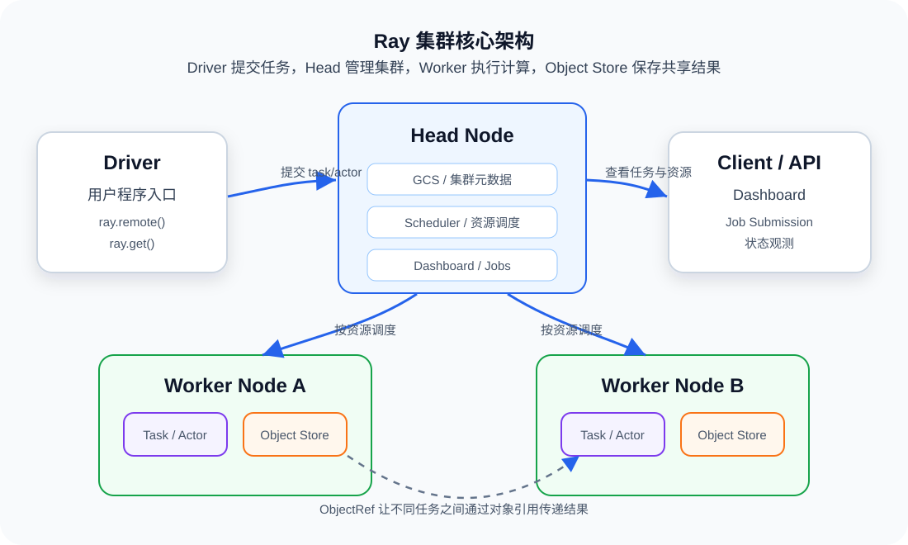
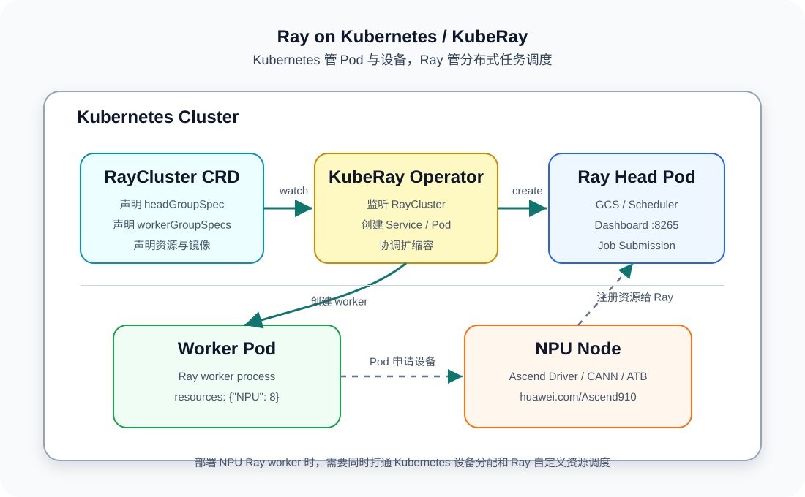

# Ray 基础知识整理

Ray 是一个面向 Python 的分布式计算框架。它的核心价值是：尽量保留本地 Python 编程体验，同时把函数、类、数据处理、训练和在线服务扩展到多机集群。




## 1. Ray 解决什么问题

单机 Python 程序通常会遇到三个瓶颈：CPU/GPU/NPU 算力不够、内存放不下中间数据、任务之间缺少统一的调度和容错机制。Ray 的作用是把这些问题抽象成更容易使用的分布式原语：

- 用 task 表示无状态并行函数。
- 用 actor 表示有状态的长期服务或模型实例。
- 用 object store 管理跨进程、跨节点传递的数据对象。
- 用 resource scheduler 按 CPU、GPU、NPU 等资源约束调度任务。
- 用 Dashboard、Job Submission、KubeRay 等工具管理集群运行。

换句话说，Ray 不只是负责“把代码跑起来”，还负责把分布式程序中最容易出错的调度、对象传递、资源标记和运行状态管理统一起来。

## 2. 核心概念

| 概念 | 含义 | 为什么重要 |
| --- | --- | --- |
| Driver | 提交 Ray 程序的入口进程 | 创建 task/actor，并通过 `ray.get()` 获取结果 |
| Head node | 集群控制节点 | 保存集群元数据、Dashboard、Job Submission 入口 |
| Worker node | 执行计算的节点 | 运行 Ray worker 进程，真正执行 task/actor |
| Task | 用 `@ray.remote` 标记的无状态函数 | 适合批量并行、数据预处理、独立推理任务 |
| Actor | 用 `@ray.remote` 标记的有状态类 | 适合模型常驻内存、参数服务器、队列消费者 |
| ObjectRef | Ray 对远程结果的引用 | 任务提交后立即返回，结果可以异步获取 |
| Object store | 节点上的共享对象存储 | 减少进程间复制，支持跨任务传递大对象 |
| Runtime env | 任务运行环境声明 | 分发代码、pip 依赖、环境变量等轻量运行配置 |
| Custom resources | 自定义资源，例如 `NPU` | 让 Ray 按特殊硬件或业务资源调度任务 |

## 3. Task 和 Actor

Task 适合“输入明确、执行完就结束”的计算。Ray 会把每次调用调度到集群中可用的 worker 上。

```python
import ray


@ray.remote
def square(x):
    return x * x


ray.init()
refs = [square.remote(i) for i in range(10)]
print(ray.get(refs))
```

Actor 适合“需要长期保存状态”的计算，例如加载一次模型，然后反复处理请求。

```python
import ray


@ray.remote
class Counter:
    def __init__(self):
        self.value = 0

    def inc(self):
        self.value += 1
        return self.value


ray.init()
counter = Counter.remote()
print(ray.get(counter.inc.remote()))
```

Task 和 Actor 的区别可以简单理解为：task 像一次性函数调用，actor 像运行在集群里的长期对象。

## 4. Ray 的执行流程

一个 Ray 程序从提交到执行，大致经过以下步骤：

1. Driver 创建远程 task 或 actor。
2. Ray 立即返回 `ObjectRef`，调用方不用阻塞等待结果。
3. Ray scheduler 根据资源需求选择合适节点。
4. Worker 进程执行实际 Python 代码。
5. 结果写入 object store。
6. Driver 或下游任务通过 `ray.get()` 或依赖引用读取结果。

这种方式的好处是，业务代码只需要表达“要做什么”和“需要什么资源”，任务放到哪台机器、对象如何传递、多个任务如何排队由 Ray 统一处理。

## 5. 资源模型

Ray 调度任务时会读取资源声明。常见资源包括 CPU、GPU，也可以使用自定义资源，例如 NPU。

```python
import ray


@ray.remote(num_cpus=2, resources={"NPU": 1})
def run_inference(batch):
    return batch
```

这里的 `resources={"NPU": 1}` 只告诉 Ray “这个任务需要一个名为 NPU 的资源”。Ray 本身不会安装 NPU 驱动，也不会自动创建 Kubernetes 设备资源。因此在 K8s/KubeRay 场景中需要同时满足两件事：

- Kubernetes Pod 申请真实设备，例如 `huawei.com/Ascend910: "8"`。
- Ray worker 启动时注册自定义资源，例如 `resources: '{"NPU": 8}'`。

这也是 README 中同时配置 Kubernetes `resources` 和 Ray `rayStartParams.resources` 的原因。

## 6. Ray 生态

Ray 的生态可以分为两层：

- Ray Core：提供 task、actor、object store、resource scheduling 等底层分布式能力。
- Ray Libraries：基于 Ray Core 构建的数据处理、训练、调参和服务框架。

常见库包括：

| 模块 | 主要用途 |
| --- | --- |
| Ray Data | 分布式数据读取、转换、批处理 |
| Ray Train | 分布式模型训练 |
| Ray Tune | 超参数搜索和实验管理 |
| Ray Serve | 在线推理服务部署 |
| RLlib | 强化学习训练 |
| KubeRay | 在 Kubernetes 上管理 RayCluster |

## 7. Ray 与 Kubernetes

Kubernetes 负责容器生命周期和硬件设备分配，Ray 负责 Python 分布式任务调度。KubeRay 把两者连接起来：用户提交 `RayCluster` 资源后，KubeRay Operator 会创建 head Pod、worker Pod、Service，并在需要时协助扩缩容。




在 Kubernetes 中使用 Ray 时，可以把责任边界理解为：

- Kubernetes 决定 Pod 在哪台机器上运行。
- Device plugin 决定容器能看到哪些硬件设备。
- KubeRay 决定 Ray head 和 worker 如何创建。
- Ray 决定 task/actor 在哪些 worker 进程上执行。

对于 NPU 场景，最容易混淆的是“Pod 拿到 NPU”和“Ray task 使用 NPU”不是同一件事。前者依赖 Kubernetes 扩展资源，后者依赖 Ray 自定义资源。两层资源声明都正确，任务才能稳定落到 NPU worker 上。

## 8. 常用命令

本地或容器中启动一个 head 节点：

```bash
ray start --head --dashboard-host=0.0.0.0
```

查看集群资源：

```bash
ray status
```

通过 Job Submission 提交任务：

```bash
ray job submit --address http://127.0.0.1:8265 -- python app.py
```

在 Kubernetes 中查看 RayCluster：

```bash
kubectl get raycluster -A
kubectl get pods -n ray-demo -o wide
kubectl logs -n ray-demo -l ray.io/node-type=head --tail=100
```

## 9. 学习路径建议

建议按下面顺序理解 Ray：

1. 先在单机上掌握 `ray.init()`、task、actor、`ray.get()`。
2. 再理解 `ObjectRef` 和 object store，避免把大对象反复复制回 driver。
3. 学习资源声明，明确 CPU、GPU、NPU、自定义资源分别由谁提供、由谁调度。
4. 使用 `runtime_env` 分发轻量代码和依赖，把系统级依赖放进镜像。
5. 最后再上 KubeRay，把 RayCluster、Pod 调度、镜像分发和硬件设备管理串起来。

掌握这条链路后，回到 NPU worker 部署时就会更清楚：镜像解决运行环境一致性，Kubernetes 解决容器和设备，Ray 解决分布式任务调度。
